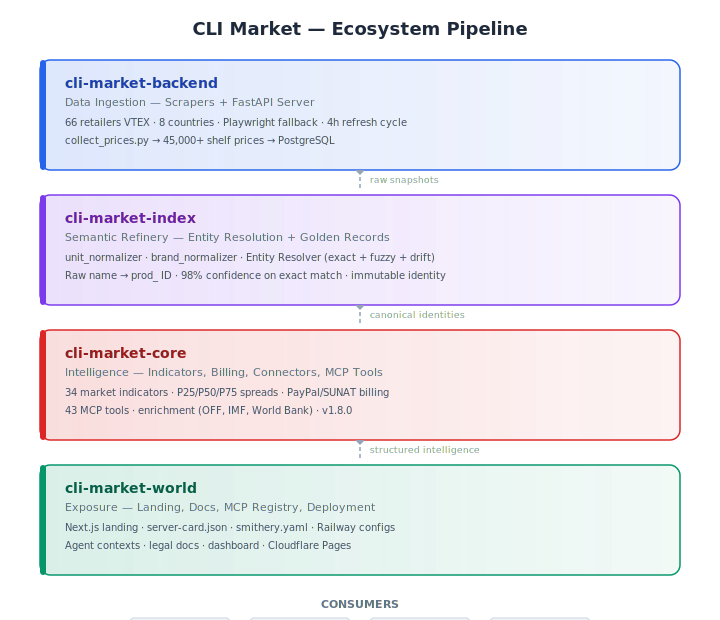

mcp-name: io.github.Treevu-ai/cli-market-world

# 🛒 CLI Market

[](https://github.com/Treevu-ai/cli-market-world/actions/workflows/ci.yml)
[](https://pepy.tech/projects/cli-market)

**🌐 [Español](#-español) · [English](#-english)**

---

## 🇪🇸 Español

### Infraestructura de comercio para agentes de IA — un solo `pip install`, una API, cero scraping.

> **Stripe convirtió los pagos en APIs. CLI Market convierte el comercio en una.**

Los agentes de IA todavía no pueden comprar en el mundo real. Cada retailer exige su propia autenticación, su propia lógica de búsqueda y no comparten carrito — así que los agentes fallan antes de la primera consulta.

**CLI Market lo resuelve.** Un solo `pip install`. Una llamada a la API que cubre **68 retailers (38 verificados activos)** en **8 países**. Un único esquema JSON.

- 🌍 **68 retailers (38 verificados activos) · 8 países · 4 plataformas · 43 herramientas MCP · 34 indicadores**
- 💰 **Más de 49,000+ precios de góndola verificados**, normalizados por kg/L, actualizados cada 4 horas
- 💳 **Pago con PayPal + Mercado Pago + QR (Yape/Plin)** integrado

#### ✨ ¿Por qué CLI Market?

- 🔎 **Busca** cualquier producto en 68 retailers (38 verificados activos) de 8 países
- 📊 **Compara** precios transfronterizos — PEN, ARS, BRL, MXN, COP, CLP, EUR, USD — normalizados por kg/L cuando es posible
- 🧺 **Canasta** — compara tu carrito completo entre retailers (p. ej. Carrefour vs Jumbo vs Vea en AR)
- 📈 **Inflación** — sigue cambios reales de precios desde la góndola, actualizados cada 4 horas
- 🧠 **Enriquecimiento** — 34 indicadores de mercado a partir de datos de góndola + APIs públicas (OFF, Wikimedia, IMF, Eurostat, BCB, Banco Mundial)
- 🛍️ **Compra** — checkout con PayPal o QR (Yape / Plin)
- 🏗️ **Construye** — foso de datos con spreads filtrados por calidad, matching de canasta y dashboard en vivo

🌐 [cli-market.dev](https://cli-market.dev) · 📚 [Docs de API](https://cli-market-production.up.railway.app/docs) · 📊 [Dashboard](https://cli-market-production.up.railway.app/dashboard)

#### 🚀 Inicio rápido

```bash
pip install cli-market
market hello   # post-instalación: estadísticas + próximos pasos

export MARKET_API_URL=https://cli-market-production.up.railway.app
market login
market search "leche" --country PE
market compare "aceite de girasol 900ml" --country AR
market basket "arroz:1 aceite:1 leche:1" --country AR
market checkout --payment yape
market ask "compra arroz al mejor precio"
market indicators --country PE
market enrichment --refresh -c PE
```

#### 💵 Planes

| Plan | Free | Starter | Pro | Builder | Enterprise |
|------|------|---------|-----|---------|------------|
| **Precio** | $0 | $29/mes | $79/mes | $149/mes | A medida |
| **Solicitudes/día** | 1,000 | 5,000 | 10,000 | 50,000 | Ilimitadas |
| **Solicitudes/min** | 60 | 120 | 300 | 600 | Ilimitadas |
| **API keys** | 1 | 3 | 10 | 25 | Ilimitadas |
| **Agente intel** | — | 50 consultas/mes | Ilimitado | Ilimitado | Ilimitado + white-label |
| **Alertas de precio** | — | — | ✅ Hasta 10 (email) | ✅ Hasta 50 (email) | Ilimitadas (email + webhook) |
| **Historial de precios** | 7 días | 30 días | 12 meses | 12 meses | Completo |
| **Exportar datos** | — | CSV básico (10k filas) | CSV ilimitado + cron | CSV ilimitado + cron | Feed directo S3/webhook |
| **Checkout** | — | — | ✅ PayPal / Yape / Plin | ✅ PayPal / Yape / Plin | ✅ |
| **Soporte** | Comunidad | Email 48h | Email 4h | Email 4h | 24/7 + SLA escrito |
| **Anual** | — | $290/año | $790/año | — | — |

---

## 🇬🇧 English

### Commerce infrastructure for AI agents — one `pip install`, one API, zero scraping.

> **Stripe turned payments into APIs. CLI Market turns commerce into one.**

AI agents still can't shop in the real world. Every retailer means separate auth, separate search logic, no shared cart — so agents fail before the first query.

**CLI Market fixes that.** One `pip install`. One API call across **66 retailers (38 verified active)** in **8 countries**. One JSON schema.

- 🌍 **66 retailers (38 verified active) · 8 countries · 3 platforms · 43 MCP tools · 34 indicators**
- 💰 **49,000+ verified shelf prices**, normalized per kg/L, refreshed every 4 hours
- 💳 **PayPal + Mercado Pago + QR (Yape/Plin)** checkout built in

#### ✨ Why CLI Market?

- 🔎 **Search** any product across 66 retailers (38 verified active) in 8 countries
- 📊 **Compare** cross-border prices — PEN, ARS, BRL, MXN, COP, CLP, EUR, USD — normalized per kg/L where parseable
- 🧺 **Basket** — compare your full cart across retailers (e.g. Carrefour vs Jumbo vs Vea in AR)
- 📈 **Inflation** — track real shelf-price changes, updated every 4 hours
- 🧠 **Enrichment** — 34 market indicators from shelf data + public APIs (OFF, Wikimedia, IMF, Eurostat, BCB, World Bank)
- 🛍️ **Buy** — checkout with PayPal or QR (Yape / Plin)
- 🏗️ **Build** — data moat with quality-filtered spreads, basket matching, and live dashboard

🌐 [cli-market.dev](https://cli-market.dev) · 📚 [API docs](https://cli-market-production.up.railway.app/docs) · 📊 [Dashboard](https://cli-market-production.up.railway.app/dashboard)

#### 🚀 Quick start

```bash
pip install cli-market
market hello   # post-install: stats + next steps

export MARKET_API_URL=https://cli-market-production.up.railway.app
market login
market search "leche" --country PE
market compare "aceite de girasol 900ml" --country AR
market basket "arroz:1 aceite:1 leche:1" --country AR
market checkout --payment yape
market ask "buy rice at the best price"
market indicators --country PE
market enrichment --refresh -c PE
```

#### 💵 Pricing

| Plan | Free | Starter | Pro | Builder | Enterprise |
|------|------|---------|-----|---------|------------|
| **Price** | $0 | $29/mo | $79/mo | $149/mo | Custom |
| **Requests/day** | 1,000 | 5,000 | 10,000 | 50,000 | Unlimited |
| **Requests/min** | 60 | 120 | 300 | 600 | Unlimited |
| **API keys** | 1 | 3 | 10 | 25 | Unlimited |
| **Intel agent** | — | 50 queries/month | Unlimited | Unlimited | Unlimited + white-label |
| **Price alerts** | — | — | ✅ Up to 10 (email) | ✅ Up to 50 (email) | Unlimited (email + webhook) |
| **Price history** | 7 days | 30 days | 12 months | 12 months | Full dataset |
| **Export** | — | CSV basic (10k rows) | CSV unlimited + cron | CSV unlimited + cron | Direct S3/webhook feed |
| **Checkout** | — | — | ✅ PayPal / Yape / Plin | ✅ PayPal / Yape / Plin | ✅ |
| **Support** | Community | Email 48h | Email 4h | Email 4h | 24/7 + written SLA |
| **Annual** | — | $290/yr | $790/yr | — | — |

---

## 📖 Learn more

- **[Use Cases](docs/use-cases.md)** — AI agent builders, data scientists, retailers. Who is this for?
- **[Terminal Demo](docs/demo-walkthrough.md)** — 8-command walkthrough: search → compare → basket → checkout.

---

## 🏗️ Ecosystem architecture



CLI Market is composed of 4 specialized repositories, each with a single responsibility:

```
cli-market-backend   Data ingestion — VTEX scrapers, FastAPI server, 66 retailers, 45k prices
       |
       v  raw snapshots
cli-market-index     Semantic Refinery — entity resolution, Golden Records (prod_ IDs)
       |
       v  canonical identities
cli-market-core      Intelligence — indicators, stats, billing, connectors, 43 MCP tools
       |
       v  structured intelligence
cli-market-world     Exposure — landing, docs, MCP registry, deployment configs (THIS REPO)
```

| Repo | GitHub | Role |
|---|---|---|
| `cli-market-backend` | [Treevu-ai/cli-market-backend](https://github.com/Treevu-ai/cli-market-backend) | Scrapers + FastAPI API |
| `cli-market-index` | [Treevu-ai/cli-market-index](https://github.com/Treevu-ai/cli-market-index) | Entity resolution engine |
| `cli-market-core` | [Treevu-ai/cli-market-core](https://github.com/Treevu-ai/cli-market-core) | Intelligence + MCP tools |
| `cli-market-world` | [Treevu-ai/cli-market-world](https://github.com/Treevu-ai/cli-market-world) | Landing + docs (this repo) |

---

## 📊 Dashboard auditability

Every price in CLI Market is traceable and verifiable. The [live dashboard](https://cli-market-production.up.railway.app/dashboard) exposes:

- **Cobertura 7 días** — `coverage_7d_pct` per retailer: what % of each store's catalog refreshed in the last week
- **Normalización por kg/L** — unit price visible next to shelf price (e.g. `PEN 4.20/kg`), with counter of non-parseable names
- **Confianza por snapshot** — `ok` vs `suspect` distribution from scrape-quality heuristics
- **Percentiles P25/P50/P75** — median replaces mean in category comparisons; eliminates outlier distortion (e.g. ARS 230K in departamentales)
- **Trazabilidad de outliers** — group size, band (`median ± k·IQR`), acceptable bounds, scraper health state, capture timestamp
- **Foso de datos** — `inventory_daily[]` time series + growth stats (total snapshots, daily avg, days tracked)

All six capabilities are backed by the same 46,000+, refreshed every 4 hours by the collector daemon.

---

## 🔧 43 MCP tools · 34 indicators

`market_login` `market_lines` `market_search` `market_compare` `market_add` `market_cart` `market_cart_update` `market_cart_remove` `market_checkout` `market_orders` `market_reorder` `market_ask` `market_basket` `market_inflation` `market_indicators` `market_scores` `market_intel_refresh` `market_enrichment` `market_enrichment_subcategories` `market_enrichment_refresh` `market_analytics_indicators` `market_categories` `market_barcode` `market_enrich` `market_stores` `market_countries` `market_ticket` `market_voice` `market_price_history` `market_stats` `market_alerts` `market_whoami` `market_preferences` `market_subscription` `market_export` `market_trending` `market_scan` `market_stock` `market_notify` `market_brands` `market_favorites` `market_exchange` `market_delivery`


---

**SINAPSIS INNOVADORA S.A.C.** — RUC 20613045563 — Lima, Peru  
MIT License · [cli-market.dev](https://cli-market.dev)
