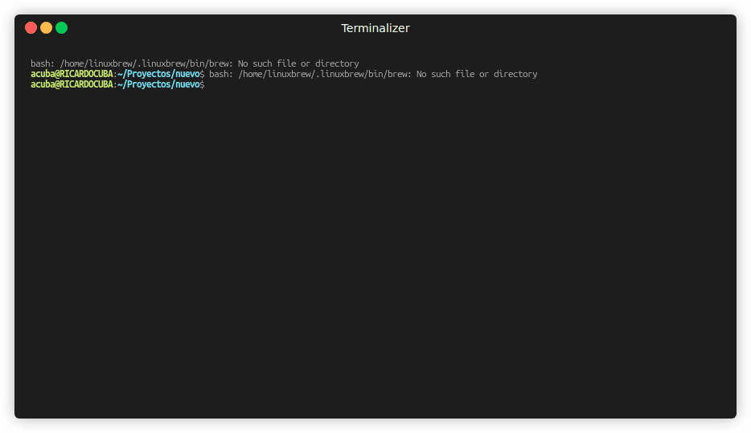

# CLI AGENTIC MARKET · v1.0

**Infrastructure layer — supermarkets as programmable commerce.**

Stripe transformed payments into APIs.  
We transform supermarkets into APIs for AI agents.

---

## The problem

- E-commerce is optimized for **clicks**, not **agents**.
- Retailers are not ready for autonomous commerce.
- No standardized AI-native supermarket layer exists in LATAM.
- Supermarket APIs are fragmented or nonexistent.

## The solution

| Human-friendly | Agent-friendly |
|---|---|
| Terminal CLI | REST API |
| Rich tables | MCP Tools |
| Spanish commands | JSON parseable |
| Interactive flow | Autonomous workflows |

## Quick start

```bash
pip install agentic-market

# Terminal 1 — backend
market-server

# Terminal 2 — CLI
market login
market search "leche"
market compare "aceite de oliva"
market add 5834 --price 45.50 --store metro --name "Tollo de Leche" --qty 2
market cart
market checkout --payment yape
market orders
```

## Agent mode

```bash
market ask "compra arroz"
market ask "compara aceite"
market ask "repite la última compra"

# Machine-readable for LLMs
market --json
```

## Supported supermarkets (VTEX API)

| Store | Group | Status |
|---|---|---|
| Wong | Cencosud | ✅ |
| Metro | Cencosud | ✅ |
| Plaza Vea | SPSA | ✅ |

Add your store: edit `STORES` in `market_server.py`.

## Commands

```bash
market login              # Authenticate
market search "leche"     # Search across 3 stores
market compare "aceite"   # Price comparison table
market add <id> --qty 2   # Add to cart
market cart               # View cart
market checkout           # Complete purchase
market orders             # Order history
market reorder            # Repeat last order
market ask "compra X"     # Natural language
market preferences        # Purchase profile
market about              # Business model
market --json             # Agent-readable output
```

## Architecture

```
Retailers LATAM (VTEX APIs)
        │
CLI AGENTIC MARKET
        │
APIs + MCP + Agent Layer
        │
LLMs / AI Agents / Assistants
```

## MCP Server

```bash
python market_mcp.py
```

9 tools: `market_login`, `market_search`, `market_compare`, `market_add`, `market_cart`, `market_checkout`, `market_orders`, `market_reorder`, `market_ask`.

Compatible with DeepSeek TUI, Claude, and any MCP client.

## Business model

**SaaS B2B:** Starter $499/mo · Growth $1,999/mo · Enterprise custom  
**API usage:** Per-request pricing for AI agents  
**Transaction fee:** 1-5% per completed order  
**White-label:** Retailers deploy under their own brand

## LATAM expansion

- **Phase 1:** Peru · Chile · Colombia
- **Phase 2:** Mexico · Brazil · Argentina

## Demo

[](demo.gif)

```bash
asciinema rec demo.cast --command "bash demo.sh"
```

---

**"Estamos convirtiendo supermercados en infraestructura consumible por inteligencia artificial."**
