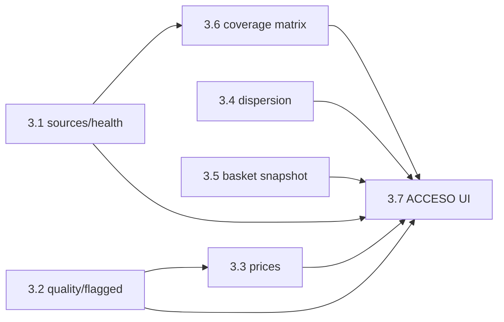

# Dashboard Data Moat — Rediseño por capas

Plan operativo alineado con `docs/dashboard-content-spec.md`. La fuente de verdad en runtime sigue siendo **`GET /dashboard/data` → `dashboard_view`**.

**Principio rector:** confianza verificable + acceso programático, estética terminal (sin marketing ni emojis en el panel).

---

## Diagnóstico (sin cambios)

- Buen inventario mal presentado (~43k precios, ~97% frescura).
- ~20 secciones del mismo peso, duplicados (canasta ×3, scraping ×2).
- Datos sucios al mismo nivel que insights verificados.
- El filtrado estricto no se visualiza como embudo.

---

## Arquitectura — 4 capas + fase 0

### Fase 0 · Confianza base ✅

| Tarea | Estado |
|-------|--------|
| `collector.status`: `healthy` → `ok` | ✅ `routers/dashboard.py`, `routers/health.py` |
| Dejar de renderizar tablas duplicadas | ✅ `dashboard_renderer.py` (un solo renderer) |
| Consumir `dashboard_view` + `metric_glossary` | ✅ |
| `ops.collapsed_default`, `hero.sticky` | ✅ `<details>` + CSS sticky |

### Capa 0 · Barra global (sticky) ✅

`COLLECTOR ok | FRESH 97.2% <24h | UTC HH:MM | [?] glosario`

- Bloque: `dashboard_view.blocks.global_bar`
- Sin emojis; estados `ok / partial / stale / dead / running / unknown`

### Capa 1 · Portada ✅

Tres tarjetas + bloque ACCESO con curls existentes.

- Bloque: `dashboard_view.blocks.portada`

### Capa 2 · Calidad y confianza ✅ (parcial)

Embudo `captured → flagged → clean → citable` + salud scraping unificada.

- JSON: `quality_funnel` en `/dashboard/data`
- Bloque: `dashboard_view.blocks.quality_funnel`
- **Pendiente Fase 4:** contadores de outlier a nivel DB (hoy: discount SQL + muestra outliers)

### Capa 3 · Exploración filtrable ✅ (parcial)

- Toggle **solo dato limpio** (default ON) — oculta `.dirty-section`
- Insights verificados arriba (`price_spreads` antes de canasta)
- Canasta unificada (una sección)
- Precios por categoría con moneda
- Brechas sospechosas colapsadas en `<details>`

- Bloque: `dashboard_view.blocks.exploration`

### Capa 4 · Activo temporal + ops

| Sección | Estado |
|---------|--------|
| Inflación medida en tienda | Bloqueado — `measuring` hasta 2ª captura |
| API `/v1/*` granular | Fase 3 |
| Mapa cobertura país × categoría | Fase 3–4 |
| Ops del collector | Colapsado en `blocks.ops` |

---

## Fases pendientes

### Fase 3 · API granular + Capa 4 parcial

Objetivo: paginar el payload monolítico, alinear canasta snapshot vs live, y enriquecer ACCESO + mapa de cobertura.

**Orden sugerido:** 3.1 → 3.2 → 3.5 → 3.3 → 3.4 → 3.6 → 3.7

---

#### Ticket 3.1 — `GET /v1/sources/health`

**Por qué:** unifica `store_health`, `failing_stores` y `freshness` que hoy el dashboard mezcla en tres bloques. Base para la tabla «Salud scraping» sin duplicar lógica.

**Contrato propuesto**

```
GET /v1/sources/health
  ?store=wong          # opcional, filtra una tienda
  &catalog_only=1      # default true — solo DEFAULT_STORES
```

**Respuesta (200)**

```json
{
  "generated_at": "ISO8601",
  "summary": { "ok": 30, "partial": 3, "dead": 2, "total": 35 },
  "stores": [
    {
      "store": "wong",
      "store_name": "Wong",
      "country": "PE",
      "success_pct": 98.2,
      "consecutive_failures": 0,
      "state": "ok",
      "last_success": "2026-05-29T12:00:00+00:00",
      "last_error": null,
      "last_seen": "2026-05-29T11:55:00+00:00",
      "fresh_24h": true
    }
  ]
}
```

**Reglas**

- `state`: `dead` si `success_pct < 30` · `ok` si `≥ 80` · else `partial`
- `last_seen` = `MAX(queried_at)` en `price_snapshots` para esa tienda
- `fresh_24h` = `last_seen >= now - 24h`
- Misma semántica que `dashboard_view.blocks.quality_funnel.scraping_health`

**Criterios de aceptación**

- [ ] Endpoint registrado en router (`routers/health.py` o `routers/data_v1.py`)
- [ ] `summary.ok + summary.partial + summary.dead == len(stores)` cuando `catalog_only=1`
- [ ] Conteos `ok/dead` coinciden con filas renderizadas en `/dashboard` (±0)
- [ ] OpenAPI documenta query params y enum `state`
- [ ] Test: fixture DB con 3 tiendas (ok, partial, dead) → estados correctos
- [ ] Test regresión: `/health/collector` no se rompe

**No incluye:** historial de `collector_runs` (sigue en `/health/collector`).

---

#### Ticket 3.2 — `GET /v1/quality/flagged`

**Por qué:** expone anomalías con paginación; hoy `suspect_discounts` y `outliers` están capados (20/10) dentro de `/dashboard/data`.

**Contrato propuesto**

```
GET /v1/quality/flagged
  ?reason=discount|outlier|spread   # opcional, filtra motivo
  &limit=50                         # default 50, max 200
  &offset=0
```

**Respuesta (200)**

```json
{
  "total": 847,
  "limit": 50,
  "offset": 0,
  "filters_applied": ["discount>=90%", "spread>10x", "median_outlier_5x"],
  "items": [
    {
      "name": "Producto X",
      "store": "metro",
      "store_name": "Metro",
      "reason": "discount>=90%",
      "discount_pct": 99.0,
      "price": 0.50,
      "list_price": 50.00,
      "currency": "PEN",
      "line_name": "Supermercados",
      "confidence": "suspect"
    }
  ]
}
```

**Reglas**

- Reutilizar `discount_is_scrape_error`, `find_median_outliers`, `spread_confidence` (`price_confidence.py`)
- `reason=spread`: filas de `dispersion` con `status=crit` (>10x), no precios individuales
- `total` debe ser ≥ suma usada en `quality_funnel.flagged` (documentar si outlier total es estimado hasta Fase 4)

**Criterios de aceptación**

- [ ] Paginación estable (`offset` + `limit`, orden determinista por `reason`, luego `discount_pct` desc)
- [ ] Ningún ítem con `discount_pct` entre 5–80 aparece en `reason=discount`
- [ ] `GET /v1/quality/flagged?limit=1` devuelve `total` sin cargar todos los ítems en memoria (COUNT SQL separado)
- [ ] Test: seed con descuento 99% → aparece; descuento 50% → no
- [ ] Test: coherencia `total` ≥ `len(suspect_discounts)` del dashboard para mismo DB

**No incluye:** columna `confidence` persistida (Fase 4).

---

#### Ticket 3.3 — `GET /v1/prices?clean=1`

**Por qué:** listado paginado para analistas; sustituye leer `by_line` / tablas crudas del payload monolítico.

**Contrato propuesto**

```
GET /v1/prices
  ?clean=1              # default 1 — excluye flagged (discount≥90, outlier 5x)
  &country=PE
  &line=supermercados
  &currency=PEN
  &store=wong
  &limit=100            # max 500
  &offset=0
```

**Respuesta (200)**

```json
{
  "total": 12000,
  "limit": 100,
  "offset": 0,
  "clean": true,
  "items": [
    {
      "product_id": "…",
      "name": "…",
      "store": "wong",
      "store_name": "Wong",
      "price": 12.50,
      "currency": "PEN",
      "line": "supermercados",
      "line_name": "Supermercados",
      "queried_at": "2026-05-29T12:00:00+00:00",
      "discount_pct": null,
      "confidence": "ok"
    }
  ]
}
```

**Reglas**

- `clean=1`: excluir snapshots con `discount_pct >= 90` y precios fuera de banda mediana ±5x en su grupo `(line, currency, name fuzzy)` — misma lógica que embudo
- `clean=0`: devolver todo en rango retail (`price > 0 AND price < 999999`)
- Moneda siempre presente en cada fila

**Criterios de aceptación**

- [ ] Con `clean=1`, ningún ítem tiene `discount_pct >= 90`
- [ ] Filtros `country/line/currency/store` son combinables y reflejados en SQL (no filtro post-query masivo)
- [ ] `total` correcto vía COUNT con mismos filtros
- [ ] Test: comparar conteo `clean=1` vs `quality_funnel.clean` (tolerancia documentada si outlier es muestral)
- [ ] Performance: query con `LIMIT 100` no escanea tabla completa sin índice — documentar índices mínimos

**Depende de:** 3.2 (definición compartida de «flagged»).

---

#### Ticket 3.4 — `GET /v1/dispersion?clean=1`

**Por qué:** brechas por subcategoría sin mezclar `dispersion` crudo con `marketing_spreads` en el panel.

**Contrato propuesto**

```
GET /v1/dispersion
  ?clean=1              # default 1 — excluye status=crit (>10x)
  &line=supermercados
  &currency=PEN
  &limit=50
  &offset=0
```

**Respuesta (200)**

```json
{
  "total": 42,
  "clean": true,
  "grouping": "line+currency+subcategory",
  "items": [
    {
      "line": "Supermercados",
      "subcategory": "aceite",
      "currency": "PEN",
      "spread_ratio": 3.2,
      "status": "warn",
      "stores": 4,
      "avg_price": 18.50,
      "price_basis": "unit_per_kg"
    }
  ]
}
```

**Reglas**

- Reutilizar `build_spread_analytics` / `compute_dispersion` (`market_spread.py`)
- `clean=1`: solo `status` in (`ok`, `warn`) — excluye `crit`
- `clean=0`: incluye `crit`; marcar `"suspect": true` en ítems crit

**Criterios de aceptación**

- [ ] Con `clean=1`, ningún ítem tiene `spread_ratio > 10` ni `status=crit`
- [ ] Ítems con `spread_ratio ≥ 2.5` y reglas marketing siguen solo en `/dashboard/data` → `marketing_spreads`, no duplicados aquí salvo que pasen filtro dispersion
- [ ] Coherente con toggle «solo dato limpio» del HTML (mismos ítems ocultos)
- [ ] Test: grupo sintético 15x → aparece con `clean=0`, ausente con `clean=1`

**Depende de:** lógica existente en `market_spread.py` (sin cambios de umbral).

---

#### Ticket 3.5 — `GET /v1/basket` (snapshot, alineado con dashboard)

**Por qué:** hoy `POST /v1/basket/compare` hace **live scrape**; `canasta_basica` en dashboard usa **snapshots DB** — dos verdades.

**Contrato propuesto**

```
GET /v1/basket
  ?stores=wong,metro     # opcional
  &min_items=3           # default 3 — igual que backend actual
```

**Respuesta (200)**

```json
{
  "source": "snapshot",
  "snapshot_at": "2026-05-29T12:00:00+00:00",
  "items_total": 10,
  "partial_threshold": 6,
  "stores": [
    {
      "store_name": "Wong",
      "items_found": 8,
      "completeness_pct": 80,
      "comparable": true,
      "total": 435.20,
      "currency": "PEN"
    }
  ]
}
```

**Reglas**

- Misma query y reglas que `_dashboard_data()` → `canasta_basica` + enriquecimiento `dashboard_view.blocks.canasta`
- `comparable = items_found >= 6` (60%)
- **`POST /v1/basket/compare` sin cambios** — añadir header/campo `"source": "live"` en respuesta existente (ticket 3.5b opcional)

**Criterios de aceptación**

- [ ] `GET /v1/basket` y `dashboard_view.blocks.canasta.stores` tienen mismos `store_name`, `items_found`, `total` (± redondeo)
- [ ] Campo `source: "snapshot"` siempre presente
- [ ] Documentar en ACCESO: snapshot vs live
- [ ] Test regresión: canasta HTML no cambia al añadir endpoint
- [ ] Test: tienda con 3 ítems incluida; con 2 excluida si `min_items=3`

**Depende de:** ninguno (extrae lógica existente a función compartida, p. ej. `market_basket.py`).

---

#### Ticket 3.6 — Mapa cobertura `country × line`

**Por qué:** Capa 4 parcial — visualizar huecos sin expandir `/dashboard/data`.

**Contrato propuesto**

```
GET /v1/coverage/matrix
  ?line=supermercados    # opcional
```

**Respuesta (200)**

```json
{
  "lines": ["supermercados", "farmacia"],
  "countries": ["PE", "AR", "CL"],
  "cells": [
    { "line": "supermercados", "country": "PE", "stores": 12 },
    { "line": "supermercados", "country": "BO", "stores": 0 }
  ],
  "gaps": ["farmacia×BO"]
}
```

**Criterios de aceptación**

- [ ] Datos idénticos a `line_country_matrix` en `/dashboard/data`
- [ ] Bloque nuevo en `dashboard_view.blocks.coverage_map` o sección en `exploration`
- [ ] Renderer: tabla compacta bajo exploración, colapsada por default
- [ ] Test: celda 0 tiendas → aparece en `gaps`

**Depende de:** 3.1 (opcional, para enriquecer celdas con `state` por tienda).

---

#### Ticket 3.7 — ACCESO + bloque `portada.acceso` en dashboard

**Por qué:** el dev copia un curl y obtiene datos coherentes con la pantalla.

**Criterios de aceptación**

- [ ] `dashboard_view.blocks.portada.acceso` lista solo endpoints **existentes tras 3.1–3.6**
- [ ] Cada entrada: `cmd`, `desc`, `source_field` (JSON path que alimenta la UI)
- [ ] Ejemplo mínimo post-Fase 3:

  ```bash
  curl -s $BASE/v1/sources/health | jq '.summary'
  curl -s '$BASE/v1/quality/flagged?limit=5'
  curl -s '$BASE/v1/prices?clean=1&country=PE&limit=10'
  curl -s '$BASE/v1/dispersion?clean=1&limit=10'
  curl -s $BASE/v1/basket | jq '.stores[]|{store_name,comparable,total}'
  curl -s $BASE/v1/coverage/matrix | jq '.gaps'
  ```

- [ ] `spec_version` bump → `1.2` cuando ACCESO referencia `/v1/*`
- [ ] Test view model: `acceso` contiene al menos 6 entradas con paths válidos

**Depende de:** 3.1–3.6.

---

### Resumen de dependencias Fase 3



### Definición de done — Fase 3 completa

- [ ] Los 6 endpoints responden 200 en CI con DB fixture
- [ ] Ningún endpoint devuelve emojis ni copy de marketing
- [ ] Toggle «solo dato limpio» del HTML es coherente con `?clean=1` en prices y dispersion
- [ ] `quality_funnel.flagged` documentado vs `GET /v1/quality/flagged` `total`
- [ ] Canasta dashboard etiquetada `source: snapshot`; live compare etiquetado `source: live`
- [ ] Payload `/dashboard/data` no crece (endpoints absorben tablas ops/exploración)

---

### Fase 4 · Activo temporal

- Gráfica inflación por tienda/país (post 2ª captura)
- `inventory_daily[]`
- Columna `confidence` en DB (opcional)

---

## Criterios de éxito

1. Visitante técnico entiende volumen, frescura y rigor en ~10 s (portada + embudo).
2. Embudo visible explica por qué se filtró.
3. Toggle ON → cero dispersion/sospechosos en viewport principal.
4. `curl` de ACCESO devuelve datos coherentes con pantalla.
5. Contadores auditables sin acceso a ops.

---

## Archivos

| Archivo | Rol |
|---------|-----|
| `dashboard_view_model.py` | Genera bloques render-ready (spec 1.1) |
| `dashboard_renderer.py` | HTML único desde view + glossary |
| `dashboard_quality.py` | `quality_funnel` counters |
| `routers/dashboard.py` | `/dashboard`, `/dashboard/data` |
| `tests/test_dashboard_*.py` | View model + funnel + regresión HTML |

---

## Riesgos

| Riesgo | Mitigación |
|--------|------------|
| Payload monolítico | Fase 3: endpoints paginados |
| Toggle sin flags DB | Suficiente Fase 2; Fase 4 confidence |
| Dos verdades canasta (DB vs live) | Etiquetar fuente / unificar Fase 3 |
| Drift spec ↔ HTML | Un solo renderer (`dashboard_renderer.py`) |
