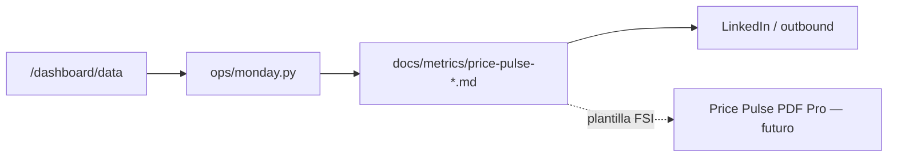

# Data Moat — De métricas operativas a informe

Puente entre el **moat operativo** ([[data-moat-strategy]]) y la **entrega externa** (Price Pulse, LinkedIn, partners, inversores).  
No reemplaza el collector ni el dashboard: define **qué exportar**, **cómo contarlo** y **qué plantillas FSI reutilizar** (sin vendor el repo completo).

Referencia externa (instalar aparte, no en este repo): [anthropics/claude-for-financial-services](https://github.com/anthropics/claude-for-financial-services).

---

## Flujo semanal



| Paso | Comando / artefacto | Rol |
|------|---------------------|-----|
| 1 | `curl …/dashboard/data` | Fuente única verificable |
| 2 | `python3 ops/monday.py` | Ops interno + borrador semanal |
| 3 | `docs/metrics/price-pulse-YYYY-WW.md` | Registro GTM + gate LinkedIn |
| 4 | Skills FSI (opcional) | Formato deck/memo para Pro o inversores |

Regla heredada de [[linkedin/data-gate]]: si no está en dashboard o en el JSON exportado, **no va a copy público**.

---

## Mapa: sección Price Pulse → campo dashboard

### Bloque «Collector / salud del moat»

| Sección Price Pulse | Campo JSON | Capa moat | Uso marketing |
|---------------------|------------|-----------|---------------|
| Precios indexados | `kpis.total_indexed` | Inventario | ✅ headline |
| Refresh 24h | `kpis.snapshots_24h` | Frescura | ✅ “precios frescos esta semana” |
| Tiendas fresh 24h | `moat_summary.stores_fresh_24h` | Frescura | ✅ |
| Coverage 7d | `moat_summary.coverage_7d_pct` | Cobertura | ✅ gate ≥ 80% |
| Moat stale | `moat_summary.collector_stale` | Frescura | ✅ alerta interna |
| Último ciclo collector | `collector.prices_collected`, `collector.stores_succeeded` | Ops | ⚠️ ops, no lifetime |
| Store success % lifetime | `kpis.store_success_pct` | Ops | ❌ no marketing |
| Por país | `by_country` | Inventario | ✅ mapa LATAM |

### Bloque «Data stories»

| Historia | Fuente reproducible | Export guardado |
|----------|---------------------|-----------------|
| Arroz PE (Day 8) | `market compare arroz` / query API | `docs/metrics/query-arroz-pe.json` |
| Canasta básica | `dashboard/data` → `canasta_basica` | mismo snapshot semanal |
| Inflación por línea | `inflation[]` | ⚠️ solo si hay 7+ días; no INEI/INDEC |
| Dispersión precios | `dispersion[]` (`spread_ratio`) | ✅ “misma categoría, distinto precio” |
| Movers 24h | `top_risers`, `top_fallers` | ⚠️ product_id técnico; humanizar en copy |

### Bloque «Marketing / producto» (manual)

Completar a mano en la plantilla de [[metrics/README]]: LinkedIn impressions, PyPI, MRR, outbound. No vienen del moat.

---

## KPIs propios — retail price intelligence

Estas son las métricas que **definen vuestro moat**. No están en las plantillas FSI de retail (same-store sales, etc.): hay que usarlas explícitamente en informes.

| KPI | Definición | Umbral / nota |
|-----|------------|---------------|
| **total_indexed** | Filas útiles en `price_snapshots` (último precio por product_id + store) | Crece con catálogo + feedback loop |
| **snapshots_24h** | Observaciones con `queried_at` < 24h | 0 con inventario > 0 = moat envejeciendo |
| **coverage_7d_pct** | % de `DEFAULT_STORES` con ≥1 snapshot en 7d | Gate marketing: **≥ 80%** |
| **fresh_24h_pct** | % tiendas activas con refresh < 24h | Complemento a coverage |
| **spread_ratio** | max/min precio comparable en una línea | >10x = revisar outliers / moneda |
| **canasta_match_rate** | `items/10` en `canasta_basica` por tienda | Honestidad en copy (“3/10 ítems”) |
| **inflation_delta_pct** | Δ promedio 7d por línea (collector) | Siempre “según nuestro collector” |
| **stores_succeeded / run** | Tiendas con precios en último ciclo | Ops; no confundir con coverage 7d |
| **reproducibility** | Mismo número vía CLI + curl + monday | Regla de oro del moat |

---

## Qué tomar de Financial Services (y qué ignorar)

Instalar solo lo necesario fuera del repo (`claude plugin install financial-analysis@claude-for-financial-services`, etc.).

### Usar (formato y método)

| Skill FSI | Para qué en CLI Market | Entrada |
|-----------|------------------------|---------|
| `equity-research/sector-overview` | Price Pulse “vista sector LATAM retail” | `by_line`, `by_country`, `line_country_matrix` |
| `financial-analysis/competitive-analysis` | Deck “landscape agent commerce / price intel” | Posicionamiento CLI Market vs alternativas |
| `private-equity/dd-meeting-prep` | Preguntas moat para conversación con inversor | `moat_guide`, KPIs de reproducibilidad |
| `pptx-author` / `xlsx-author` | Export PDF Pro (Pilar 3 PRD) | Markdown semanal + JSON de queries |

### No usar (dominio distinto)

| FSI vertical | Por qué no aplica ahora |
|--------------|-------------------------|
| Wealth management, KYC, fund admin | ICP = retailers VTEX, no banca |
| Comps / DCF / LBO | No valoráis retailers como tickers |
| MCP FactSet, CapIQ, Morningstar | No leen vuestro Postgres / API |
| Métricas retail FSI (same-store sales) | No las medís; usad tabla KPIs propia arriba |

---

## Plantilla Price Pulse enriquecida

Copiar a `docs/metrics/price-pulse-YYYY-WW.md` después de `ops/monday.py`:

```markdown
## Moat (automático desde /dashboard/data)
- Indexado: {total_indexed} · Refresh 24h: {snapshots_24h}
- Coverage 7d: {coverage_7d_pct}% · Gate LI: {pass/fail}
- Último ciclo: {prices_collected} precios · {stores_succeeded}/{stores_attempted} tiendas

## Señales de mercado (solo claims verificados)
- Inflación 7d: [tabla inflation o "sin serie"]
- Data story: [producto] — fuente: docs/metrics/query-*.json
- Canasta: [tienda] {items}/10 — {currency} {total}

## Moat narrative (1 párrafo — opcional FSI sector-overview)
[Qué cambió esta semana en cobertura/frescura y una historia de precio con fuente]

## Marketing / outbound (manual)
…
```

---

## Audiencias

| Audiencia | Entregable | Métricas clave | Plantilla |
|-----------|------------|----------------|-----------|
| LinkedIn / build in public | Post + gate | coverage, snapshots_24h, data story JSON | [[linkedin/data-gate]] |
| Retailers (outbound) | Dato día 7 | canasta, compare, competidor onboard | [[outbound-sequences]] |
| Ops interno | `ops/monday.py` + `ops/reports/` | store_health, freshness, críticas | — |
| Pro / partners (futuro) | Price Pulse PDF | moat_summary + inflation + dispersion | FSI sector-overview |
| Inversores (futuro) | Memo 1-pager moat | reproducibility, coverage, agent_surfaces | FSI dd-meeting-prep + competitive-analysis |

---

## Checklist antes de publicar o enviar PDF

- [ ] Números sacados de `/dashboard/data` o export JSON el mismo día
- [ ] `coverage_7d_pct` citado si hablas de “cobertura del catálogo”
- [ ] Inflación/producto con disclaimer “según nuestro collector”
- [ ] Canasta con `items/10` si aplica
- [ ] Sin `store_success_pct` lifetime en copy externo
- [ ] Query reproducible guardada en `docs/metrics/` si es data story

---

Ver también: [[data-moat-strategy]] · [[metrics/price-pulse-2026-W22]] · [[cli-market-prd-v2#3. Three Pillars]]
