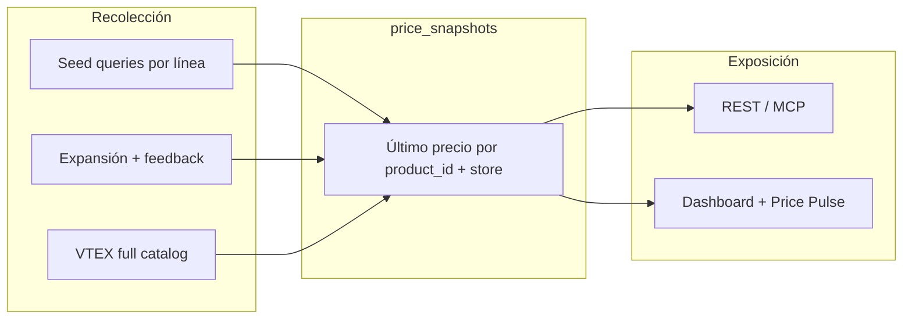

# Data Moat — Para qué existe

CLI Market no indexa precios como vanity metric. El **data moat** existe para que **agentes de compra** (CLI, MCP, API) puedan tomar decisiones verificables sin depender de scraping ad hoc en cada sesión.

## Propósito final (agent commerce)

| Decisión del agente | Qué necesita del moat | Superficie de producto |
|---------------------|----------------------|------------------------|
| Comparar precios cross-retailer | Mismo SKU o producto comparable, misma ventana temporal | `market compare`, `/v1/search`, MCP `market_search` |
| Armar canasta / basket | Precios mínimos por ítem × tienda, moneda local | `market basket`, dashboard `canasta_basica` |
| Detectar inflación / movers | Delta de precio en N días, por línea y país | `/v1/intel/inflation`, dashboard `inflation` |
| Confiar en la respuesta | Freshness (<24h), cobertura por país, health por tienda | `/dashboard/data` → `moat_summary` |

**Regla de oro:** si un dato no puede reproducirse con un comando exportable (`market compare`, `curl /dashboard/data`, `ops/monday.py`), no va a LinkedIn ni a copy comercial.

## Capas del moat

1. **Seed queries** — canasta real (leche, arroz, paracetamol, celular, etc.) alineadas a línea de negocio, no términos genéricos que fallen en tiendas de marca.
2. **Feedback loop** — nombres de producto que ya aparecen en el moat alimentan la siguiente corrida (más superficie sin adivinar).
3. **Freshness** — upsert por `(product_id, store)`; cada corrida actualiza `queried_at`.
4. **Health** — tienda “sana” = contribuyó datos en las últimas 24h y tiene snapshots en ventana rolling 7d.

## Métricas que importan (vs las que no)

| Métrica | Uso | Marketing |
|---------|-----|-----------|
| `moat_summary.stores_fresh_24h` | Tiendas con datos <24h | ✅ “N retailers con refresh 8h” |
| `moat_summary.coverage_7d_pct` | % catálogo activo con datos 7d | ✅ gate semana 2 |
| `kpis.total_indexed` | Precios en el moat (tabla actual) | ✅ headline dashboard |
| `kpis.snapshots_24h` | Observaciones últimas 24h | ✅ refresh; puede ser 0 si collector pausado |
| `canasta_basica` | Canasta reproducible | ✅ Day 9 |
| `inflation` por línea | Trend interno | ⚠️ “según nuestro collector”, no INEI/INDEC |
| `store_health.success_pct` (lifetime) | Ops / outreach | ❌ no marketing — sesgo histórico |

**Gate LinkedIn semana 2:** `coverage_7d_pct` ≥ **80%** del catálogo activo (`DEFAULT_STORES`), no el lifetime `success_pct`.

## Catálogo activo vs aspiracional

- **31 tiendas activas** (`DEFAULT_STORES`) — VTEX/Magento probadas, alimentan el moat hoy.
- **29 deshabilitadas** — Shopify POC, Magento sin token, farmacias SPA. No contaminan health ni KPIs.
- Probe: `python3 ops/store_probe.py` — query por **marca/línea**, no “televisor” en Motorola.
- **BR expansion (2026-05):** Aramis, Ri Happy, Oster, Decathlon, Drogaria Globo, Miess — VTEX público verificado.

## Operación

| Comando | Rol |
|---------|-----|
| `python collect_prices.py --daemon` | Corrida cada 4h (Railway) |
| `python3 ops/store_probe.py` | Pre-enable / post-cambio catálogo |
| `python3 ops/monday.py` | Price Pulse semanal → `docs/metrics/` |
| `curl …/dashboard/data` | Fuente única para gates |

## Narrativa para posts (después del collector)

1. **Semana 1 (D1–7):** producto, MCP, checkout — sin claims de inflación específicos.
2. **Semana 2 (D8–14):** solo claims respaldados en [[linkedin/data-gate]] con query JSON guardada en `docs/metrics/`.
3. **Build in public:** mostrar `coverage_7d_pct` y freshness, no lifetime health.

Ver también: [[linkedin/data-gate]] · [[alpha-gates-2026-06-01]] · [[metrics/price-pulse-2026-W22]]
