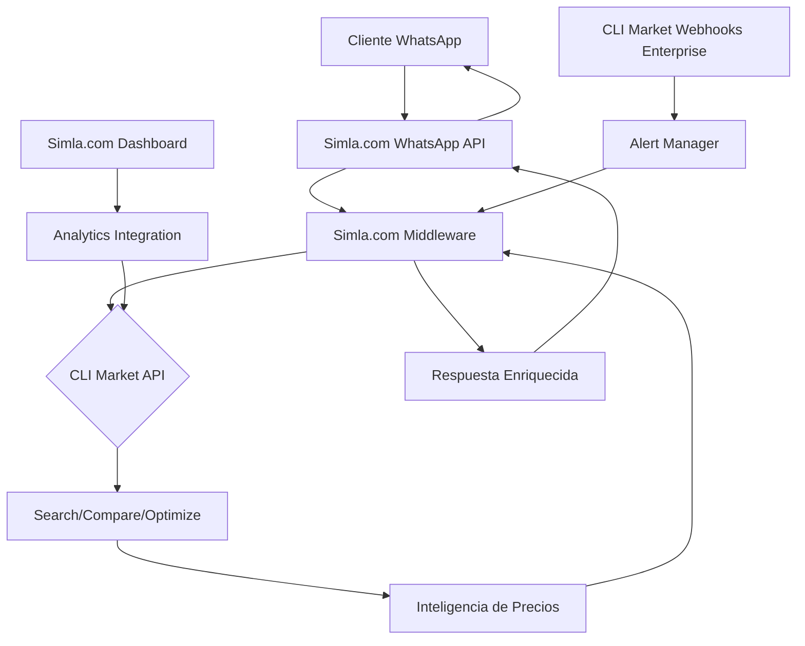
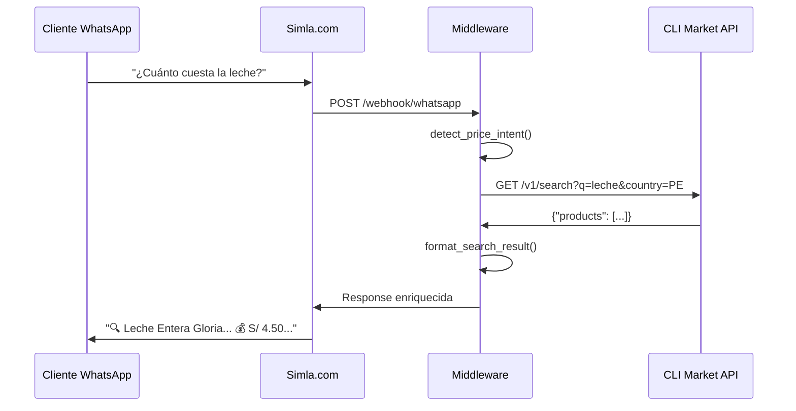
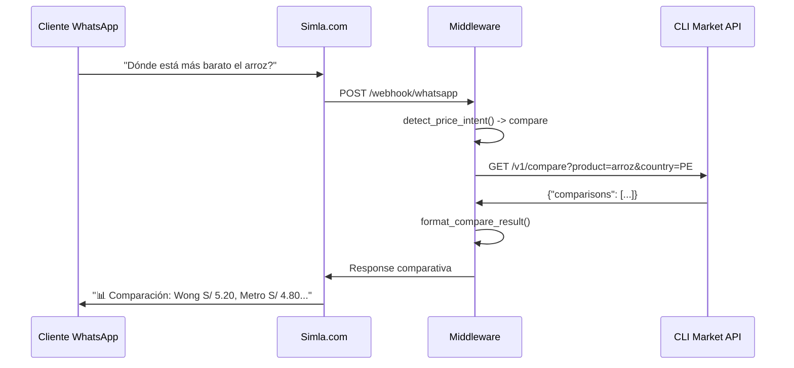
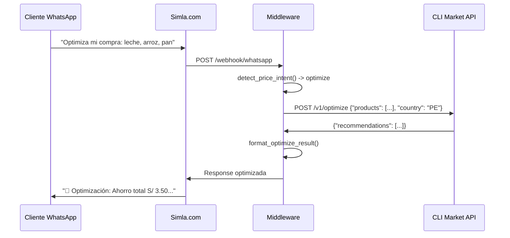

# Arquitectura Técnica: Simla.com + CLI Market (WhatsApp Perú)

**Versión:** 1.0  
**Fecha:** 2026-07-31  
**Prioridad:** #1 - Línder WhatsApp Perú + eCommerce

---

## 🎯 Objetivo de la Integración

Integrar inteligencia de precios de CLI Market en las conversaciones de ventas por WhatsApp de Simla.com, permitiendo:

1. **Respuestas competitivas en tiempo real** durante conversaciones de ventas
2. **Optimización de canastas** sugeridas dentro del chat de WhatsApp
3. **Alertas de precios** para productos específicos de eCommerce peruano
4. **Benchmarking de precios** contra retailers peruanos (Wong, Metro, Plaza Vea, etc.)

---

## 🏗️ Arquitectura General



---

## 🔌 Componentes de la Integración

### 1. **CLI Market API Client (Python)**
```python
# cli_market_client.py
import httpx
import os
from typing import Dict, List, Optional

class CLIMarketClient:
    def __init__(self):
        self.api_url = os.getenv("CLI_MARKET_API_URL", "https://cli-market-api.fly.dev")
        self.api_key = os.getenv("CLI_MARKET_API_KEY")
        self.headers = {
            "Authorization": f"Bearer {self.api_key}",
            "Content-Type": "application/json"
        }
    
    async def search_product(self, query: str, country: str = "PE") -> Dict:
        """Buscar productos — POST /products/search (API real)."""
        async with httpx.AsyncClient() as client:
            response = await client.post(
                f"{self.api_url}/products/search",
                headers=self.headers,
                json={"query": query, "country": country, "limit": 10},
            )
            return response.json()

    async def compare_prices(self, product: str, country: str = "PE") -> Dict:
        """Comparar precios — POST /products/compare."""
        async with httpx.AsyncClient() as client:
            response = await client.post(
                f"{self.api_url}/products/compare",
                headers=self.headers,
                json={"query": product, "country": country, "limit": 20},
            )
            return response.json()

    async def optimize_basket(self, products: List[str], country: str = "PE") -> Dict:
        """Canasta — POST /v1/basket/compare (tier Pro+)."""
        async with httpx.AsyncClient() as client:
            response = await client.post(
                f"{self.api_url}/v1/basket/compare",
                headers=self.headers,
                json={
                    "items": [{"query": p, "qty": 1} for p in products],
                    "country": country,
                    "live": False,
                },
            )
            return response.json()

    async def get_price_history(self, product_id: str, country: str = "PE") -> Dict:
        """Historial — GET /analytics/price-history."""
        async with httpx.AsyncClient() as client:
            response = await client.get(
                f"{self.api_url}/analytics/price-history",
                headers=self.headers,
                params={"product_id": product_id, "country": country, "limit": 30},
            )
            return response.json()
```

> **Implementación de referencia:** `simla-cli-market-prototype/` (cliente + middleware FastAPI).


### 2. **Simla.com Middleware (WhatsApp Message Handler)**
```python
# simla_middleware.py
from fastapi import FastAPI, BackgroundTasks, HTTPException
from pydantic import BaseModel
from typing import List
import asyncio
from cli_market_client import CLIMarketClient

app = FastAPI()
cli_market = CLIMarketClient()

class WhatsAppMessage(BaseModel):
    phone_number: str
    message: str
    conversation_id: str
    metadata: dict = {}

class PriceIntent(BaseModel):
    product: str
    action: str  # "search", "compare", "optimize"
    context: str = "general"

def detect_price_intent(message: str) -> Optional[PriceIntent]:
    """Detectar intención de consulta de precios en mensaje"""
    message_lower = message.lower()
    
    # Patrones de búsqueda de precios
    price_keywords = ["precio", "cuánto cuesta", "costo", "vale", "tarifa"]
    compare_keywords = ["comparar", "dónde está más barato", "mejor precio"]
    optimize_keywords = ["optimizar", "canasta", "lista de compras"]
    
    if any(keyword in message_lower for keyword in price_keywords):
        # Extraer producto del mensaje
        product = extract_product_name(message)
        if product:
            action = "compare" if any(kw in message_lower for kw in compare_keywords) else "search"
            return PriceIntent(product=product, action=action)
    
    return None

def extract_product_name(message: str) -> str:
    """Extraer nombre del producto del mensaje"""
    # Lógica de NLP para extraer producto
    # Por ahora, una implementación simple
    words = message.split()
    # Filtrar palabras comunes y devolver el sustantivo más probable
    # Aquí iría un NLP más sofisticado
    return " ".join([w for w in words if len(w) > 3])[:50]

async def process_price_query(intent: PriceIntent, phone_number: str) -> str:
    """Procesar consulta de precios con CLI Market"""
    
    if intent.action == "search":
        result = await cli_market.search_product(intent.product)
        return format_search_result(result)
    
    elif intent.action == "compare":
        result = await cli_market.compare_prices(intent.product)
        return format_compare_result(result)
    
    elif intent.action == "optimize":
        # Para optimización, necesitamos una lista de productos
        # Esto podría venir de contexto de conversación previa
        products = [intent.product]  # Simplificado
        result = await cli_market.optimize_basket(products)
        return format_optimize_result(result)
    
    return "No pude procesar tu consulta de precios."

def format_search_result(result: dict) -> str:
    """Formatear resultado de búsqueda para WhatsApp"""
    if not result.get("products"):
        return "No encontré ese producto en los retailers peruanos."
    
    top_product = result["products"][0]
    response = f"🔍 *{top_product['name']}*\n\n"
    response += f"💰 Mejor precio: S/ {top_product['price']}\n"
    response += f"🏪 En: {top_product['store']}\n"
    response += f"📅 Actualizado: {top_product['last_updated']}\n\n"
    response += "¿Quieres que compare con otras tiendas?"
    
    return response

def format_compare_result(result: dict) -> str:
    """Formatear resultado de comparación para WhatsApp"""
    if not result.get("comparisons"):
        return "No encontré precios para comparar."
    
    response = f"📊 *Comparación de precios:*\n\n"
    
    for comp in result["comparisons"][:5]:  # Top 5 retailers
        response += f"🏪 {comp['store']}: S/ {comp['price']}\n"
    
    if result.get("best_price"):
        response += f"\n✅ *Mejor opción:* {result['best_price']['store']} - S/ {result['best_price']['price']}"
    
    return response

def format_optimize_result(result: dict) -> str:
    """Formatear resultado de optimización para WhatsApp"""
    if not result.get("recommendations"):
        return "No pude optimizar tu canasta."
    
    response = f"🛒 *Optimización de canasta:*\n\n"
    
    for rec in result["recommendations"]:
        response += f"• {rec['product']}: S/ {rec['optimized_price']}\n"
        response += f"  Ahorro: S/ {rec['savings']}\n"
    
    if result.get("total_savings"):
        response += f"\n💰 *Ahorro total: S/ {result['total_savings']}*"
    
    return response

@app.post("/webhook/whatsapp")
async def whatsapp_webhook(message: WhatsAppMessage, background_tasks: BackgroundTasks):
    """Webhook principal de Simla.com para procesar mensajes WhatsApp"""
    
    # Detectar intención de consulta de precios
    intent = detect_price_intent(message.message)
    
    if intent:
        # Procesar consulta de precios
        response = await process_price_query(intent, message.phone_number)
        
        # Enviar respuesta a través de Simla.com API
        background_tasks.add_task(
            send_whatsapp_response,
            message.phone_number,
            response,
            message.conversation_id
        )
        
        return {"status": "processed", "intent": "price_query"}
    
    # Si no hay intención de precios, pasar al flujo normal
    return {"status": "no_price_intent"}

async def send_whatsapp_response(phone_number: str, response: str, conversation_id: str):
    """Enviar respuesta de vuelta a Simla.com WhatsApp API"""
    # Implementar llamada a la API de Simla.com para enviar respuesta
    # Esto depende de la API específica de Simla.com
    pass
```

### 3. **Configuración de Variables de Entorno**
```bash
# .env
CLI_MARKET_API_URL=https://cli-market-api.fly.dev
CLI_MARKET_API_KEY=sk-your-api-key-here
SIMLA_API_KEY=your-simla-api-key
SIMLA_WEBHOOK_SECRET=your-webhook-secret
```

---

## 🔄 Flujos de Datos Específicos

### Flujo 1: Búsqueda de Producto


### Flujo 2: Comparación de Precios


### Flujo 3: Optimización de Canasta


---

## 🎯 Casos de Uso Específicos Perú

### Caso 1: eCommerce de Abarrotes
```python
# Contexto: Cliente pregunta precio de aceite en WhatsApp
message = "¿Cuánto cuesta el aceite de girasol?"

# Middleware detecta intención
intent = detect_price_intent(message)
# Resultado: PriceIntent(product="aceite de girasol", action="search")

# CLI Market responde
response = await process_price_query(intent, "+51912345678")
# Respuesta formateada:
"""
🔍 *Aceite de Girasol 1L*

💰 Mejor precio: S/ 8.90
🏪 En: Metro
📅 Actualizado: hace 2 horas

¿Quieres que compare con otras tiendas?
"""
```

### Caso 2: Cliente con Lista de Compras
```python
# Contexto: Cliente envía lista de compras
message = "Necesito: leche, arroz, azúcar, detergente"

# Middleware optimiza canasta
products = ["leche", "arroz", "azúcar", "detergente"]
result = await cli_market.optimize_basket(products)

# Respuesta optimizada:
"""
🛒 *Optimización de canasta:*

• Leche Entera 1L: S/ 4.20
  Ahorro: S/ 0.30 vs. Wong
• Arroz Costeño 1kg: S/ 4.50
  Ahorro: S/ 0.70 vs. Plaza Vea
• Azúcar Blanca 1kg: S/ 3.80
  Ahorro: S/ 0.20 vs. Metro
• Detergente 1L: S/ 7.50
  Ahorro: S/ 1.00 vs. Wong

💰 *Ahorro total: S/ 2.20*
🏪 *Mejor opción: Comprar en Metro*
"""
```

### Caso 3: Alerta de Promoción
```python
# Contexto: Cliente quiere alertas de leche
# Configurar alerta a través de WhatsApp
message = "Avísame cuando la leche baje de S/ 4.00"

# Middleware configura alerta
await cli_market.set_price_alert(
    product="leche",
    threshold=4.00,
    phone_number="+51912345678"
)

# Cuando el precio baja, webhook envía alerta
alert_message = """
🔔 *Alerta de precio!*

💰 Leche ahora: S/ 3.80
🏪 En: Metro
📉 Bajó S/ 0.20

¿Quieres agregar a tu carrito?
"""
```

---

## 🔐 Seguridad y Autenticación

### 1. **Validación de Webhooks**
```python
# webhook_security.py
import hmac
import hashlib

def verify_simla_webhook(payload: bytes, signature: str, secret: str) -> bool:
    """Verificar que el webhook viene de Simla.com"""
    expected_signature = hmac.new(
        secret.encode(),
        payload,
        hashlib.sha256
    ).hexdigest()
    
    return hmac.compare_digest(expected_signature, signature)

@app.post("/webhook/whatsapp")
async def whatsapp_webhook(request: Request):
    # Verificar firma del webhook
    signature = request.headers.get("X-Simla-Signature")
    payload = await request.body()
    
    if not verify_simla_webhook(payload, signature, os.getenv("SIMLA_WEBHOOK_SECRET")):
        raise HTTPException(status_code=401, detail="Invalid webhook signature")
    
    # Procesar mensaje...
```

### 2. **Rate Limiting**
```python
# rate_limiting.py
from slowapi import Limiter
from slowapi.util import get_remote_address

limiter = Limiter(key_func=get_remote_address)

@app.post("/webhook/whatsapp")
@limiter.limit("20/minute")  # 20 requests por minuto por IP
async def whatsapp_webhook(request: Request, message: WhatsAppMessage):
    # Procesar mensaje...
```

---

## 📊 Monitoreo y Analytics

### 1. **Métricas Clave**
```python
# metrics.py
from prometheus_client import Counter, Histogram

# Contadores
price_queries_total = Counter(
    'cli_market_price_queries_total',
    'Total de consultas de precios CLI Market',
    ['action', 'product_category']
)

price_query_duration = Histogram(
    'cli_market_price_query_duration_seconds',
    'Duración de consultas de precios CLI Market'
)

whatsapp_responses_total = Counter(
    'simla_whatsapp_responses_total',
    'Total de respuestas WhatsApp enviadas',
    ['response_type']
)

# Uso en el middleware
@app.post("/webhook/whatsapp")
async def whatsapp_webhook(message: WhatsAppMessage):
    with price_query_duration.time():
        if intent:
            price_queries_total.labels(
                action=intent.action,
                product_category=intent.product
            ).inc()
            # Procesar consulta...
```

### 2. **Dashboard de Monitoreo**
```python
# monitoring_dashboard.py
from fastapi import FastAPI
from prometheus_client import generate_latest

@app.get("/metrics")
async def metrics():
    """Endpoint para Prometheus metrics"""
    return generate_latest()

# Métricas específicas de la integración
@app.get("/health/integration")
async def integration_health():
    """Health check específico de la integración"""
    cli_market_health = await check_cli_market_health()
    simla_health = await check_simla_health()
    
    return {
        "status": "healthy" if all([cli_market_health, simla_health]) else "degraded",
        "cli_market_api": cli_market_health,
        "simla_api": simla_health,
        "timestamp": datetime.utcnow().isoformat()
    }
```

---

## 🚀 Implementación

### Paso 1: Configuración Inicial
```bash
# 1. Clonar repositorio
git clone https://github.com/your-org/simla-cli-market-integration.git
cd simla-cli-market-integration

# 2. Crear entorno virtual
python -m venv venv
source venv/bin/activate  # o venv\Scripts\activate en Windows

# 3. Instalar dependencias
pip install fastapi uvicorn httpx slowapi prometheus-client python-dotenv

# 4. Configurar variables de entorno
cp .env.example .env
# Editar .env con tus API keys
```

### Paso 2: Configurar Simla.com Webhook
```bash
# En el dashboard de Simla.com:
# 1. Ir a Settings > Webhooks
# 2. Agregar nuevo webhook:
#    URL: https://tu-server.com/webhook/whatsapp
#    Secret: tu-webhook-secret
#    Events: message.received
```

### Paso 3: Desplegar Middleware
```bash
# Usando Docker
docker build -t simla-cli-market-middleware .
docker run -p 8000:8000 --env-file .env simla-cli-market-middleware

# O usando uvicorn directamente
uvicorn main:app --host 0.0.0.0 --port 8000
```

---

## 📈 Escalabilidad y Rendimiento

### 1. **Caching de Respuestas**
```python
# caching.py
from functools import lru_cache
from datetime import timedelta
import redis

redis_client = redis.Redis(host='localhost', port=6379, db=0)

def cache_key(product: str, action: str) -> str:
    return f"cli_market:{action}:{product}"

async def get_cached_response(product: str, action: str) -> Optional[dict]:
    """Obtener respuesta cacheada"""
    cached = redis_client.get(cache_key(product, action))
    if cached:
        return json.loads(cached)
    return None

async def cache_response(product: str, action: str, response: dict, ttl: int = 3600):
    """Cachear respuesta por 1 hora"""
    redis_client.setex(
        cache_key(product, action),
        ttl,
        json.dumps(response)
    )

# Uso en el middleware
async def process_price_query(intent: PriceIntent, phone_number: str) -> str:
    # Verificar cache primero
    cached = await get_cached_response(intent.product, intent.action)
    if cached:
        return format_result(cached)
    
    # Si no está en cache, consultar CLI Market
    result = await cli_market_query(intent)
    await cache_response(intent.product, intent.action, result)
    return format_result(result)
```

### 2. **Async Processing para Heavy Queries**
```python
# async_processing.py
from fastapi import BackgroundTasks
import asyncio

async def process_heavy_query_async(intent: PriceIntent, phone_number: str):
    """Procesar consultas pesadas en background"""
    # Para consultas que toman más tiempo (optimización de canasta grande)
    result = await cli_market.optimize_basket(intent.products)
    
    # Enviar respuesta cuando esté lista
    await send_whatsapp_response(phone_number, format_result(result))

@app.post("/webhook/whatsapp")
async def whatsapp_webhook(message: WhatsAppMessage, background_tasks: BackgroundTasks):
    intent = detect_price_intent(message.message)
    
    if intent and intent.action == "optimize":
        # Procesar en background
        background_tasks.add_task(
            process_heavy_query_async,
            intent,
            message.phone_number
        )
        return {"status": "processing_background"}
    
    # Para consultas rápidas, procesar sincrónicamente
    # ...
```

---

## 🧪 Testing

### 1. **Unit Tests**
```python
# tests/test_cli_market_client.py
import pytest
from cli_market_client import CLIMarketClient

@pytest.mark.asyncio
async def test_search_product():
    client = CLIMarketClient()
    result = await client.search_product("leche", "PE")
    
    assert "products" in result
    assert len(result["products"]) > 0
    assert result["products"][0]["name"] is not None

@pytest.mark.asyncio
async def test_compare_prices():
    client = CLIMarketClient()
    result = await client.compare_prices("arroz", "PE")
    
    assert "comparisons" in result
    assert len(result["comparisons"]) > 0

# tests/test_middleware.py
import pytest
from simla_middleware import detect_price_intent, extract_product_name

def test_detect_price_intent():
    message = "¿Cuánto cuesta la leche?"
    intent = detect_price_intent(message)
    
    assert intent is not None
    assert intent.action == "search"
    assert "leche" in intent.product.lower()

def test_extract_product_name():
    message = "¿Cuánto cuesta el aceite de girasol de 1 litro?"
    product = extract_product_name(message)
    
    assert "aceite" in product.lower()
```

### 2. **Integration Tests**
```python
# tests/test_integration.py
import pytest
from httpx import AsyncClient
from main import app

@pytest.mark.asyncio
async def test_whatsapp_webhook():
    async with AsyncClient(app=app, base_url="http://test") as client:
        response = await client.post(
            "/webhook/whatsapp",
            json={
                "phone_number": "+51912345678",
                "message": "¿Cuánto cuesta la leche?",
                "conversation_id": "test-conv-123"
            }
        )
        
        assert response.status_code == 200
        assert response.json()["status"] in ["processed", "no_price_intent"]
```

---

## 📝 Documentación API

### Endpoint: POST /webhook/whatsapp
**Propósito:** Recibir mensajes de WhatsApp desde Simla.com

**Request Body:**
```json
{
  "phone_number": "+51912345678",
  "message": "¿Cuánto cuesta la leche?",
  "conversation_id": "conv-abc-123",
  "metadata": {
    "customer_id": "cust-456",
    "store_id": "store-789"
  }
}
```

**Response:**
```json
{
  "status": "processed",
  "intent": "price_query",
  "response_type": "search",
  "timestamp": "2026-07-31T10:30:00Z"
}
```

### Endpoint: GET /health/integration
**Propósito:** Health check de la integración

**Response:**
```json
{
  "status": "healthy",
  "cli_market_api": true,
  "simla_api": true,
  "timestamp": "2026-07-31T10:30:00Z"
}
```

---

## 🎯 Métricas de Éxito

### KPIs de la Integración
- **Respuesta tiempo:** < 3 segundos para consultas de búsqueda
- **Precisión de detección de intención:** > 85%
- **Satisfacción del cliente:** > 4.0/5.0 en encuestas post-interacción
- **Ahorro promedio por cliente:** S/ 5-10 por canasta optimizada
- **Tasa de conversión:** Incremento del 15% en conversiones vía WhatsApp

---

## 🔄 Mantenimiento y Soporte

### Logs y Debugging
```python
# logging_config.py
import logging
from pythonjsonlogger import jsonlogger

formatter = jsonlogger.JsonFormatter()
handler = logging.StreamHandler()
handler.setFormatter(formatter)

logger = logging.getLogger("simla_cli_market")
logger.setLevel(logging.INFO)
logger.addHandler(handler)

# Uso en el middleware
logger.info(
    "price_query_processed",
    extra={
        "phone_number": message.phone_number,
        "intent": intent.action,
        "product": intent.product,
        "duration_ms": duration
    }
)
```

### Alertas
```python
# alerts.py
from prometheus_client import Gauge

integration_errors = Gauge(
    'cli_market_integration_errors',
    'Errores en la integración CLI Market'
)

# Monitorear errores
try:
    result = await cli_market.search_product(product)
except Exception as e:
    integration_errors.inc()
    logger.error("cli_market_api_error", extra={"error": str(e)})
    # Enviar alerta a Slack/PagerDuty
```

---

## 📚 Recursos Adicionales

- **Documentación CLI Market API:** https://cli-market.dev/docs
- **Documentación Simla.com API:** [Documentación oficial Simla.com]
- **GitHub Repository:** [Repositorio de la integración]
- **Slack Support:** #cli-market-integrations

---

**Próxima versión:** Implementación de webhooks enterprise para alertas proactivas de precios.