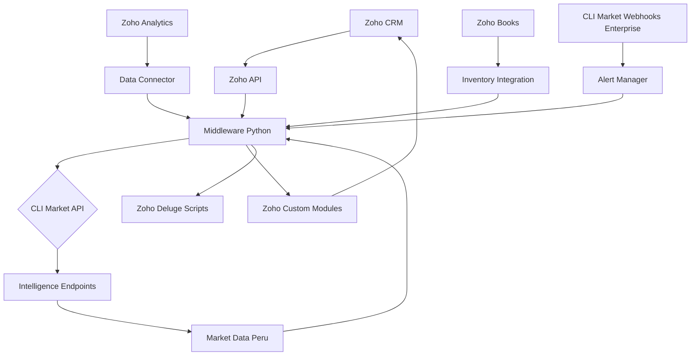
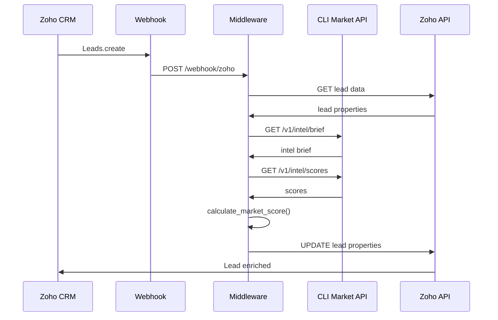
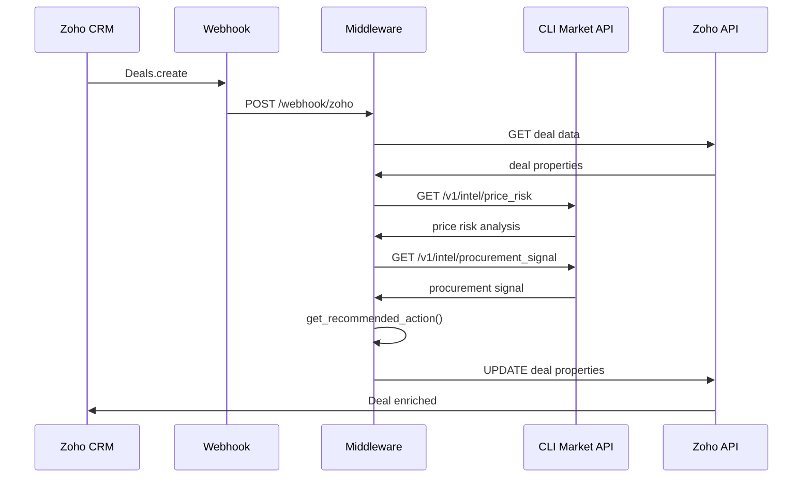
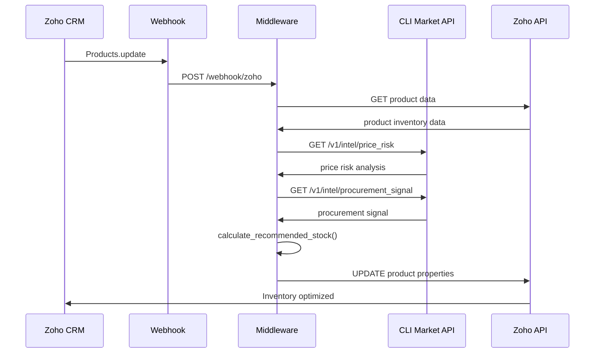

# Arquitectura Técnica: Zoho CRM + CLI Market (Costo-Beneficio Perú)

**Versión:** 1.0  
**Fecha:** 2026-07-31  
**Prioridad:** #3 - Mejor Costo-Beneficio + Suite Completa

---

## 🎯 Objetivo de la Integración

Integrar inteligencia de mercado de CLI Market en el ecosistema Zoho CRM para PYMEs peruanas sensibles al precio, permitiendo:

1. **Dashboard de inteligencia de mercado** dentro de Zoho CRM
2. **Alertas de precios** en módulos de Ventas e Inventario
3. **Optimización de stock** con señales de mercado
4. **Reportería custom** con indicadores de Perú
5. **Integración con Zoho Suite** (Books, Inventory, Analytics)

---

## 🏗️ Arquitectura General



---

## 🔌 Componentes de la Integración

### 1. **Zoho CRM API Client (Python)**
```python
# zoho_client.py
import httpx
import os
from typing import Dict, List, Optional
import json

class ZohoCRMClient:
    def __init__(self):
        self.client_id = os.getenv("ZOHO_CLIENT_ID")
        self.client_secret = os.getenv("ZOHO_CLIENT_SECRET")
        self.refresh_token = os.getenv("ZOHO_REFRESH_TOKEN")
        self.api_domain = os.getenv("ZOHO_API_DOMAIN", "https://www.zohoapis.com")
        self.base_url = f"{self.api_domain}/crm/v2"
        self.access_token = None
        
    async def get_access_token(self):
        """Obtener access token usando refresh token"""
        async with httpx.AsyncClient() as client:
            response = await client.post(
                f"{self.api_domain}/oauth/v2/token",
                data={
                    "refresh_token": self.refresh_token,
                    "client_id": self.client_id,
                    "client_secret": self.client_secret,
                    "grant_type": "refresh_token"
                }
            )
            token_data = response.json()
            self.access_token = token_data.get("access_token")
            return self.access_token
    
    async def get_record_by_id(self, module: str, record_id: str) -> Dict:
        """Obtener registro por ID"""
        if not self.access_token:
            await self.get_access_token()
        
        async with httpx.AsyncClient() as client:
            response = await client.get(
                f"{self.base_url}/{module}/{record_id}",
                headers={"Authorization": f"Zoho-oauthtoken {self.access_token}"}
            )
            return response.json()
    
    async def update_record(self, module: str, record_id: str, data: Dict) -> Dict:
        """Actualizar registro"""
        if not self.access_token:
            await self.get_access_token()
        
        async with httpx.AsyncClient() as client:
            response = await client.put(
                f"{self.base_url}/{module}/{record_id}",
                headers={"Authorization": f"Zoho-oauthtoken {self.access_token}"},
                json={"data": [data]}
            )
            return response.json()
    
    async def create_record(self, module: str, data: Dict) -> Dict:
        """Crear registro"""
        if not self.access_token:
            await self.get_access_token()
        
        async with httpx.AsyncClient() as client:
            response = await client.post(
                f"{self.base_url}/{module}",
                headers={"Authorization": f"Zoho-oauthtoken {self.access_token}"},
                json={"data": [data]}
            )
            return response.json()
    
    async def search_records(self, module: str, criteria: str) -> List[Dict]:
        """Buscar registros por criterio"""
        if not self.access_token:
            await self.get_access_token()
        
        async with httpx.AsyncClient() as client:
            response = await client.get(
                f"{self.base_url}/{module}/search",
                headers={"Authorization": f"Zoho-oauthtoken {self.access_token}"},
                params={"criteria": criteria}
            )
            return response.json().get("data", [])
    
    async def get_related_records(self, module: str, record_id: str, related_module: str) -> List[Dict]:
        """Obtener registros relacionados"""
        if not self.access_token:
            await self.get_access_token()
        
        async with httpx.AsyncClient() as client:
            response = await client.get(
                f"{self.base_url}/{module}/{record_id}/{related_module}",
                headers={"Authorization": f"Zoho-oauthtoken {self.access_token}"}
            )
            return response.json().get("data", [])
```

### 2. **CLI Market Intelligence Client**
```python
# cli_market_intelligence.py
import httpx
import os
from typing import Dict, List

class CLIMarketIntelligence:
    def __init__(self):
        self.api_url = os.getenv("CLI_MARKET_API_URL", "https://cli-market-api.fly.dev")
        self.api_key = os.getenv("CLI_MARKET_API_KEY")
        self.headers = {
            "Authorization": f"Bearer {self.api_key}",
            "Content-Type": "application/json"
        }
    
    async def get_intel_brief(self, country: str = "PE", line: str = "supermercados", days: int = 7) -> Dict:
        """Obtener brief de inteligencia de mercado"""
        async with httpx.AsyncClient() as client:
            response = await client.get(
                f"{self.api_url}/v1/intel/brief",
                headers=self.headers,
                params={"country": country, "line": line, "days": days}
            )
            return response.json()
    
    async def get_scores(self, country: str = "PE", line: str = "supermercados") -> Dict:
        """Obtener scores compuestos de mercado"""
        async with httpx.AsyncClient() as client:
            response = await client.get(
                f"{self.api_url}/v1/intel/scores",
                headers=self.headers,
                params={"country": country, "line": line}
            )
            return response.json()
    
    async def get_inflation(self, country: str = "PE", line: str = "supermercados", days: int = 30) -> Dict:
        """Obtener datos de inflación de estantería"""
        async with httpx.AsyncClient() as client:
            response = await client.get(
                f"{self.api_url}/v1/intel/inflation",
                headers=self.headers,
                params={"country": country, "line": line, "days": days}
            )
            return response.json()
    
    async def get_price_risk(self, country: str = "PE", line: str = "supermercados", days: int = 7) -> Dict:
        """Obtener análisis de riesgo de precios"""
        async with httpx.AsyncClient() as client:
            response = await client.get(
                f"{self.api_url}/v1/intel/price_risk",
                headers=self.headers,
                params={"country": country, "line": line, "days": days}
            )
            return response.json()
    
    async def get_procurement_signal(self, country: str = "PE", line: str = "supermercados") -> Dict:
        """Obtener señales de procurement"""
        async with httpx.AsyncClient() as client:
            response = await client.get(
                f"{self.api_url}/v1/intel/procurement_signal",
                headers=self.headers,
                params={"country": country, "line": line}
            )
            return response.json()
    
    async def optimize_basket(self, products: List[str], country: str = "PE") -> Dict:
        """Optimizar canasta de compras"""
        async with httpx.AsyncClient() as client:
            response = await client.post(
                f"{self.api_url}/v1/optimize",
                headers=self.headers,
                json={"products": products, "country": country}
            )
            return response.json()
```

### 3. **Middleware de Integración**
```python
# zoho_cli_market_middleware.py
from fastapi import FastAPI, BackgroundTasks, HTTPException
from pydantic import BaseModel
from typing import Dict, List, Optional
import asyncio
from datetime import datetime
from zoho_client import ZohoCRMClient
from cli_market_intelligence import CLIMarketIntelligence

app = FastAPI()
zoho = ZohoCRMClient()
cli_market = CLIMarketIntelligence()

class ZohoWebhook(BaseModel):
    module: str
    record_id: str
    operation: str  # create, update, delete
    trigger: str

class MarketIntelligenceData(BaseModel):
    country: str = "PE"
    line: str = "supermercados"
    days: int = 7

async def enrich_lead_with_market_intelligence(lead_id: str):
    """Enriquecer lead con inteligencia de mercado"""
    
    # Obtener datos del lead
    lead = await zoho.get_record_by_id("Leads", lead_id)
    if not lead or not lead.get("data"):
        return
    
    lead_data = lead["data"][0]
    
    # Obtener región del lead
    region = lead_data.get("Region", "PE")
    
    # Obtener inteligencia de mercado
    intel_brief = await cli_market.get_intel_brief(country=region)
    scores = await cli_market.get_scores(country=region)
    
    # Calcular scoring personalizado
    market_score = calculate_market_score(lead_data, scores)
    
    # Actualizar lead en Zoho
    await zoho.update_record("Leads", lead_id, {
        "Market_Basket_Stress": str(scores.get("basket_stress", 0)),
        "Market_Inflation_Signal": intel_brief.get("shelf_signal", "neutral"),
        "Market_Price_Fairness": str(scores.get("price_fairness", 0)),
        "Market_Retail_Aggression": str(scores.get("retail_aggression", 0)),
        "Market_Score": str(market_score),
        "Market_Data_Updated": datetime.utcnow().isoformat()
    })

def calculate_market_score(lead_data: Dict, scores: Dict) -> float:
    """Calcular score de mercado personalizado"""
    # Lógica personalizada basada en datos del lead
    
    base_score = 50.0  # Score base
    
    # Ajustar por agresión de retail (mayor agresión = mejor oportunidad)
    retail_aggression = scores.get("retail_aggression", 50)
    base_score += (retail_aggression - 50) * 0.3
    
    # Ajustar por justicia de precios
    price_fairness = scores.get("price_fairness", 50)
    base_score += (price_fairness - 50) * 0.2
    
    # Ajustar por estrés de canasta (menor estrés = mejor)
    basket_stress = scores.get("basket_stress", 0)
    base_score -= basket_stress * 20
    
    # Ajustar por potencial del lead
    lead_score = lead_data.get("Lead_Score", 0)
    base_score += lead_score * 0.1
    
    return max(0, min(100, base_score))  # Entre 0 y 100

async def enrich_deal_with_price_intelligence(deal_id: str):
    """Enriquecer deal con inteligencia de precios"""
    
    # Obtener datos del deal
    deal = await zoho.get_record_by_id("Deals", deal_id)
    if not deal or not deal.get("data"):
        return
    
    deal_data = deal["data"][0]
    
    # Obtener productos del deal
    products = deal_data.get("Products", "")
    if not products:
        return
    
    # Analizar riesgo de precios
    price_risk = await cli_market.get_price_risk(country="PE")
    
    # Obtener señales de procurement
    procurement_signal = await cli_market.get_procurement_signal(country="PE")
    
    # Actualizar deal en Zoho
    await zoho.update_record("Deals", deal_id, {
        "Price_Risk_Level": price_risk.get("risk_level", "moderate"),
        "Procurement_Signal": procurement_signal.get("signal", "monitor"),
        "Market_Recommended_Action": get_recommended_action(procurement_signal),
        "Price_Intelligence_Updated": datetime.utcnow().isoformat()
    })

def get_recommended_action(procurement_signal: Dict) -> str:
    """Obtener acción recomendada basada en señal de procurement"""
    signal = procurement_signal.get("signal", "monitor")
    
    actions = {
        "buy_now": "Contactar ahora - oportunidad de compra óptima",
        "monitor": "Monitorear - mercado estable, no hay urgencia",
        "wait": "Esperar - se esperan mejores precios pronto"
    }
    
    return actions.get(signal, "Monitorear mercado")

async def optimize_inventory_with_market_signals(product_id: str):
    """Optimizar inventario con señales de mercado"""
    
    # Obtener datos del producto
    product = await zoho.get_record_by_id("Products", product_id)
    if not product or not product.get("data"):
        return
    
    product_data = product["data"][0]
    product_name = product_data.get("Product_Name", "")
    
    # Obtener riesgo de precios para este tipo de producto
    price_risk = await cli_market.get_price_risk(country="PE")
    
    # Obtener señal de procurement
    procurement_signal = await cli_market.get_procurement_signal(country="PE")
    
    # Calcular stock recomendado
    recommended_stock = calculate_recommended_stock(product_data, procurement_signal)
    
    # Actualizar producto en Zoho
    await zoho.update_record("Products", product_id, {
        "Market_Price_Risk": price_risk.get("risk_level", "moderate"),
        "Procurement_Signal": procurement_signal.get("signal", "monitor"),
        "Recommended_Stock": str(recommended_stock),
        "Market_Intelligence_Updated": datetime.utcnow().isoformat()
    })

def calculate_recommended_stock(product_data: Dict, procurement_signal: Dict) -> int:
    """Calcular stock recomendado basado en señales de mercado"""
    
    current_stock = int(product_data.get("Quantity_In_Stock", 0))
    lead_time = int(product_data.get("Lead_Time", 7))  # días
    daily_demand = int(product_data.get("Daily_Demand", 10))
    
    signal = procurement_signal.get("signal", "monitor")
    
    # Ajustar stock según señal de procurement
    if signal == "buy_now":
        # Aumentar stock un 20%
        multiplier = 1.2
    elif signal == "wait":
        # Reducir stock un 10%
        multiplier = 0.9
    else:
        # Mantener stock actual
        multiplier = 1.0
    
    base_stock = daily_demand * lead_time
    recommended_stock = int(base_stock * multiplier)
    
    return max(recommended_stock, current_stock)

@app.post("/webhook/zoho")
async def zoho_webhook(webhook: ZohoWebhook, background_tasks: BackgroundTasks):
    """Webhook principal de Zoho CRM"""
    
    if webhook.module == "Leads" and webhook.operation == "create":
        # Enriquecer nuevo lead con inteligencia de mercado
        background_tasks.add_task(
            enrich_lead_with_market_intelligence,
            webhook.record_id
        )
        return {"status": "lead_enrichment_scheduled"}
    
    elif webhook.module == "Deals" and webhook.operation == "create":
        # Enriquecer nuevo deal con inteligencia de precios
        background_tasks.add_task(
            enrich_deal_with_price_intelligence,
            webhook.record_id
        )
        return {"status": "deal_enrichment_scheduled"}
    
    elif webhook.module == "Products" and webhook.operation == "update":
        # Optimizar inventario con señales de mercado
        background_tasks.add_task(
            optimize_inventory_with_market_signals,
            webhook.record_id
        )
        return {"status": "inventory_optimization_scheduled"}
    
    return {"status": "no_action_required"}

@app.post("/api/enrich-lead/{lead_id}")
async def manual_enrich_lead(lead_id: str):
    """Endpoint para enriquecimiento manual de lead"""
    await enrich_lead_with_market_intelligence(lead_id)
    return {"status": "enriched", "lead_id": lead_id}

@app.post("/api/enrich-deal/{deal_id}")
async def manual_enrich_deal(deal_id: str):
    """Endpoint para enriquecimiento manual de deal"""
    await enrich_deal_with_price_intelligence(deal_id)
    return {"status": "enriched", "deal_id": deal_id}

@app.post("/api/optimize-inventory/{product_id}")
async def manual_optimize_inventory(product_id: str):
    """Endpoint para optimización manual de inventario"""
    await optimize_inventory_with_market_signals(product_id)
    return {"status": "optimized", "product_id": product_id}

@app.get("/api/market-intelligence/summary")
async def market_intelligence_summary(country: str = "PE"):
    """Endpoint para resumen de inteligencia de mercado"""
    
    intel_brief = await cli_market.get_intel_brief(country=country)
    scores = await cli_market.get_scores(country=country)
    inflation = await cli_market.get_inflation(country=country)
    
    return {
        "country": country,
        "timestamp": datetime.utcnow().isoformat(),
        "intel_brief": intel_brief,
        "scores": scores,
        "inflation": inflation
    }

@app.post("/api/optimize-basket")
async def optimize_basket_endpoint(products: List[str], country: str = "PE"):
    """Endpoint para optimización de canasta"""
    result = await cli_market.optimize_basket(products, country)
    return result
```

---

## 🔄 Flujos de Datos Específicos

### Flujo 1: Creación de Lead


### Flujo 2: Creación de Deal


### Flujo 3: Optimización de Inventario


---

## 🎯 Casos de Uso Específicos Perú

### Caso 1: Lead Scoring para PYME Peruana
```python
# Contexto: Nuevo lead de empresa peruana
lead_data = {
    "data": [{
        "First_Name": "María",
        "Last_Name": "González",
        "Company": "Distribuidora Lima",
        "Region": "PE",
        "Lead_Score": 60,
        "Industry": "Retail"
    }]
}

# Middleware enriquece automáticamente
await enrich_lead_with_market_intelligence(lead_id)

# Propiedades actualizadas en Zoho:
updated_properties = {
    "Market_Basket_Stress": "0.0",  # Sin estrés
    "Market_Inflation_Signal": "stable",  # Señal estable
    "Market_Price_Fairness": "89.1",  # Precios justos
    "Market_Retail_Aggression": "85.6",  # Alta agresión de promos
    "Market_Score": "78.5",  # Score de mercado calculado
    "Market_Data_Updated": "2026-07-31T10:30:00Z"
}

# Lead scoring combinado:
# - Lead Score original: 60
# - Market Score: 78.5
# - Score combinado para priorización
```

### Caso 2: Deal con Inteligencia de Precios
```python
# Contexto: Nueva oportunidad de venta
deal_data = {
    "data": [{
        "Deal_Name": "Suministro Trimestral Supermercado",
        "Amount": 15000,
        "Products": "arroz, aceite, azúcar, fideos",
        "Stage": "Qualification"
    }]
}

# Middleware enriquece con inteligencia de precios
await enrich_deal_with_price_intelligence(deal_id)

# Propiedades actualizadas en Zoho:
updated_deal_properties = {
    "Price_Risk_Level": "moderate",  # Riesgo moderado
    "Procurement_Signal": "buy_now",  # Señal de compra ahora
    "Market_Recommended_Action": "Contactar ahora - oportunidad de compra óptima",
    "Price_Intelligence_Updated": "2026-07-31T10:30:00Z"
}

# Sales team puede ver la recomendación en el deal
```

### Caso 3: Optimización de Inventario
```python
# Contexto: Actualización de stock de producto
product_data = {
    "data": [{
        "Product_Name": "Arroz Costeño 1kg",
        "Quantity_In_Stock": 150,
        "Lead_Time": 7,
        "Daily_Demand": 20
    }]
}

# Middleware optimiza inventario con señales de mercado
await optimize_inventory_with_market_signals(product_id)

# Propiedades actualizadas en Zoho:
updated_product_properties = {
    "Market_Price_Risk": "moderate",  # Riesgo moderado
    "Procurement_Signal": "buy_now",  # Buen momento para comprar
    "Recommended_Stock": "168",  # Stock recomendado (20% más)
    "Market_Intelligence_Updated": "2026-07-31T10:30:00Z"
}

# El equipo de compras puede ver la recomendación de stock
```

---

## 🔐 Configuración de Zoho CRM

### 1. **Crear Campos Personalizados en Zoho CRM**

```python
# Campos en Leads:
lead_fields = [
    {
        "field_name": "Market_Basket_Stress",
        "data_type": "decimal",
        "display_label": "Market Basket Stress"
    },
    {
        "field_name": "Market_Inflation_Signal",
        "data_type": "picklist",
        "display_label": "Market Inflation Signal",
        "pick_list_values": ["stable", "rising", "falling", "neutral"]
    },
    {
        "field_name": "Market_Price_Fairness",
        "data_type": "decimal",
        "display_label": "Market Price Fairness"
    },
    {
        "field_name": "Market_Retail_Aggression",
        "data_type": "decimal",
        "display_label": "Market Retail Aggression"
    },
    {
        "field_name": "Market_Score",
        "data_type": "decimal",
        "display_label": "Market Score"
    },
    {
        "field_name": "Market_Data_Updated",
        "data_type": "datetime",
        "display_label": "Market Data Updated"
    },
    {
        "field_name": "Region",
        "data_type": "picklist",
        "display_label": "Region",
        "pick_list_values": ["PE", "AR", "MX", "CO", "CL"]
    }
]

# Campos en Deals:
deal_fields = [
    {
        "field_name": "Price_Risk_Level",
        "data_type": "picklist",
        "display_label": "Price Risk Level",
        "pick_list_values": ["low", "moderate", "high"]
    },
    {
        "field_name": "Procurement_Signal",
        "data_type": "picklist",
        "display_label": "Procurement Signal",
        "pick_list_values": ["buy_now", "monitor", "wait"]
    },
    {
        "field_name": "Market_Recommended_Action",
        "data_type": "text",
        "display_label": "Market Recommended Action"
    },
    {
        "field_name": "Price_Intelligence_Updated",
        "data_type": "datetime",
        "display_label": "Price Intelligence Updated"
    },
    {
        "field_name": "Products",
        "data_type": "multi_select_picklist",
        "display_label": "Products"
    }
]

# Campos en Products:
product_fields = [
    {
        "field_name": "Market_Price_Risk",
        "data_type": "picklist",
        "display_label": "Market Price Risk",
        "pick_list_values": ["low", "moderate", "high"]
    },
    {
        "field_name": "Procurement_Signal",
        "data_type": "picklist",
        "display_label": "Procurement Signal",
        "pick_list_values": ["buy_now", "monitor", "wait"]
    },
    {
        "field_name": "Recommended_Stock",
        "data_type": "number",
        "display_label": "Recommended Stock"
    },
    {
        "field_name": "Market_Intelligence_Updated",
        "data_type": "datetime",
        "display_label": "Market Intelligence Updated"
    },
    {
        "field_name": "Daily_Demand",
        "data_type": "number",
        "display_label": "Daily Demand"
    },
    {
        "field_name": "Lead_Time",
        "data_type": "number",
        "display_label": "Lead Time (days)"
    }
]
```

### 2. **Configurar Webhooks en Zoho CRM**

```python
# En Zoho CRM Setup > Automation > Workflows > Webhooks:
# 1. Crear nuevo webhook:
#    Name: CLI Market Integration
#    URL: https://tu-server.com/webhook/zoho
#    Method: POST
#    Auth Type: Zoho OAuth (usar refresh token)

# 2. Configurar triggers:
#    - Module: Leads
#    - Trigger: Record Created
#    - Module: Deals
#    - Trigger: Record Created
#    - Module: Products
#    - Trigger: Record Updated
```

### 3. **Configurar Zoho Analytics**

```python
# Crear reportes personalizados en Zoho Analytics:

# Reporte 1: Market Intelligence Dashboard
dashboard_config = {
    "name": "Market Intelligence Dashboard",
    "reports": [
        {
            "name": "Market Scores by Region",
            "type": "chart",
            "chart_type": "bar",
            "data_source": "Leads",
            "group_by": "Region",
            "metrics": ["Market_Score", "Market_Price_Fairness", "Market_Retail_Aggression"]
        },
        {
            "name": "Procurement Signals Distribution",
            "type": "chart",
            "chart_type": "pie",
            "data_source": "Deals",
            "group_by": "Procurement_Signal",
            "metrics": ["count"]
        },
        {
            "name": "Price Risk Analysis",
            "type": "chart",
            "chart_type": "line",
            "data_source": "Products",
            "time_series": "Market_Intelligence_Updated",
            "metrics": ["Market_Price_Risk"]
        }
    ]
}

# Reporte 2: Inventory Optimization Report
inventory_report = {
    "name": "Inventory Optimization Report",
    "data_source": "Products",
    "columns": [
        "Product_Name",
        "Quantity_In_Stock",
        "Recommended_Stock",
        "Procurement_Signal",
        "Market_Price_Risk",
        "Daily_Demand",
        "Lead_Time"
    ],
    "filters": [
        {
            "field": "Procurement_Signal",
            "operator": "equals",
            "value": "buy_now"
        }
    ]
}
```

---

## 📊 Monitoreo y Analytics

### 1. **Métricas de Integración**
```python
# metrics.py
from prometheus_client import Counter, Histogram, Gauge

# Contadores
zoho_webhooks_total = Counter(
    'zoho_webhooks_total',
    'Total de webhooks recibidos de Zoho',
    ['module', 'operation', 'status']
)

lead_enrichments_total = Counter(
    'lead_enrichments_total',
    'Total de enriquecimientos de leads',
    ['status']
)

deal_enrichments_total = Counter(
    'deal_enrichments_total',
    'Total de enriquecimientos de deals',
    ['status']
)

inventory_optimizations_total = Counter(
    'inventory_optimizations_total',
    'Total de optimizaciones de inventario',
    ['status']
)

cli_market_api_calls_total = Counter(
    'cli_market_api_calls_total',
    'Total de llamadas a CLI Market API',
    ['endpoint', 'status']
)

# Histogramas
enrichment_duration = Histogram(
    'enrichment_duration_seconds',
    'Duración del proceso de enriquecimiento',
    ['enrichment_type']
)

# Gauges
market_score_avg = Gauge(
    'market_score_avg',
    'Promedio de market score en leads'
)

recommended_stock_avg = Gauge(
    'recommended_stock_avg',
    'Promedio de stock recomendado'
)
```

### 2. **Dashboard de Monitoreo**
```python
# monitoring.py
from fastapi import FastAPI
from prometheus_client import generate_latest

@app.get("/metrics")
async def metrics():
    """Endpoint para Prometheus metrics"""
    return generate_latest()

@app.get("/health/integration")
async def integration_health():
    """Health check específico de la integración"""
    zoho_health = await check_zoho_health()
    cli_market_health = await check_cli_market_health()
    
    return {
        "status": "healthy" if all([zoho_health, cli_market_health]) else "degraded",
        "zoho_api": zoho_health,
        "cli_market_api": cli_market_health,
        "timestamp": datetime.utcnow().isoformat()
    }

@app.get("/analytics/enrichment-stats")
async def enrichment_stats():
    """Estadísticas de enriquecimiento"""
    return {
        "total_leads_enriched": lead_enrichments_total._value.get(),
        "total_deals_enriched": deal_enrichments_total._value.get(),
        "total_inventory_optimized": inventory_optimizations_total._value.get(),
        "avg_market_score": market_score_avg._value.get(),
        "avg_recommended_stock": recommended_stock_avg._value.get(),
        "success_rate": calculate_success_rate()
    }
```

---

## 🚀 Implementación

### Paso 1: Configuración Inicial
```bash
# 1. Clonar repositorio
git clone https://github.com/your-org/zoho-cli-market-integration.git
cd zoho-cli-market-integration

# 2. Crear entorno virtual
python -m venv venv
source venv/bin/activate

# 3. Instalar dependencias
pip install fastapi uvicorn httpx prometheus-client python-dotenv

# 4. Configurar variables de entorno
cp .env.example .env
# Editar .env con tus API keys
```

### Paso 2: Configurar Zoho CRM
```bash
# 1. Ir a Zoho CRM Setup > Automation > Workflows > Webhooks
# 2. Crear nuevo webhook con URL de tu servidor
# 3. Configurar los campos personalizados mencionados arriba
# 4. Configurar los reportes en Zoho Analytics
```

### Paso 3: Desplegar Middleware
```bash
# Usando Docker
docker build -t zoho-cli-market-middleware .
docker run -p 8000:8000 --env-file .env zoho-cli-market-middleware

# O usando uvicorn directamente
uvicorn main:app --host 0.0.0.0 --port 8000
```

---

## 🧪 Testing

### 1. **Unit Tests**
```python
# tests/test_zoho_client.py
import pytest
from zoho_client import ZohoCRMClient

@pytest.mark.asyncio
async def test_get_record_by_id():
    client = ZohoCRMClient()
    record = await client.get_record_by_id("Leads", "12345")
    
    assert record is not None
    assert "data" in record

@pytest.mark.asyncio
async def test_update_record():
    client = ZohoCRMClient()
    result = await client.update_record("Leads", "12345", {"test_field": "test_value"})
    
    assert result is not None

# tests/test_cli_market_intelligence.py
import pytest
from cli_market_intelligence import CLIMarketIntelligence

@pytest.mark.asyncio
async def test_get_intel_brief():
    client = CLIMarketIntelligence()
    intel = await client.get_intel_brief(country="PE")
    
    assert "shelf_signal" in intel
    assert "scores" in intel
```

### 2. **Integration Tests**
```python
# tests/test_integration.py
import pytest
from httpx import AsyncClient
from main import app

@pytest.mark.asyncio
async def test_zoho_webhook():
    async with AsyncClient(app=app, base_url="http://test") as client:
        response = await client.post(
            "/webhook/zoho",
            json={
                "module": "Leads",
                "record_id": "lead-456",
                "operation": "create",
                "trigger": "webhook"
            }
        )
        
        assert response.status_code == 200
        assert response.json()["status"] == "lead_enrichment_scheduled"
```

---

## 📝 Documentación API

### Endpoint: POST /webhook/zoho
**Propósito:** Recibir webhooks de Zoho CRM

**Request Body:**
```json
{
  "module": "Leads",
  "record_id": "lead-456",
  "operation": "create",
  "trigger": "webhook"
}
```

**Response:**
```json
{
  "status": "lead_enrichment_scheduled",
  "record_id": "lead-456"
}
```

### Endpoint: POST /api/enrich-lead/{lead_id}
**Propósito:** Enriquecimiento manual de lead

**Response:**
```json
{
  "status": "enriched",
  "lead_id": "lead-456"
}
```

### Endpoint: GET /api/market-intelligence/summary
**Propósito:** Resumen de inteligencia de mercado

**Parameters:**
- `country` (optional): País para análisis (default: "PE")

**Response:**
```json
{
  "country": "PE",
  "timestamp": "2026-07-31T10:30:00Z",
  "intel_brief": {
    "shelf_signal": "4.3 pp below official CPI"
  },
  "scores": {
    "retail_aggression": 85.6,
    "price_fairness": 89.1
  },
  "inflation": {
    "rpv": -61.6
  }
}
```

---

## 🎯 Métricas de Éxito

### KPIs de la Integración
- **Tiempo de enriquecimiento:** < 5 segundos por lead
- **Precisión de lead scoring:** Mejora del 30% en conversión
- **Tasa de adopción:** > 85% de leads enriquecidos automáticamente
- **Impacto en inventario:** Reducción del 20% en stock excesivo
- **ROI de la integración:** 3x en 6 meses

---

## 🔄 Mantenimiento y Soporte

### Logs y Debugging
```python
# logging_config.py
import logging
from pythonjsonlogger import jsonlogger

formatter = jsonlogger.JsonFormatter()
handler = logging.StreamHandler()
handler.setFormatter(formatter)

logger = logging.getLogger("zoho_cli_market")
logger.setLevel(logging.INFO)
logger.addHandler(handler)

# Uso en el middleware
logger.info(
    "lead_enrichment_completed",
    extra={
        "lead_id": lead_id,
        "market_score": market_score,
        "duration_ms": duration
    }
)
```

### Alertas
```python
# alerts.py
from prometheus_client import Gauge

integration_errors = Gauge(
    'zoho_integration_errors',
    'Errores en la integración Zoho'
)

# Monitorear errores
try:
    await enrich_lead_with_market_intelligence(lead_id)
except Exception as e:
    integration_errors.inc()
    logger.error("enrichment_error", extra={"error": str(e), "lead_id": lead_id})
    # Enviar alerta a Slack
```

---

## 📚 Recursos Adicionales

- **Documentación Zoho CRM API:** https://www.zoho.com/crm/developer/docs/api/
- **Documentación CLI Market API:** https://cli-market.dev/docs
- **GitHub Repository:** [Repositorio de la integración]
- **Slack Support:** #cli-market-integrations

---

**Próxima versión:** Implementación de integración con Zoho Books para facturación inteligente basada en señales de mercado.