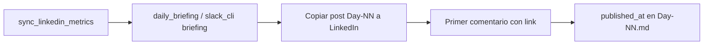

# Publicar desde Día 1 — plan de recuperación

El producto avanzó mucho en 48h **antes** de la primera publicación en LinkedIn. El calendario original asumía **Día 1 = 2026-05-01**; si no cambiamos nada, el briefing de hoy apuntaría al **Día 29**.

## Decisión recomendada

| Concepto | Valor |
|----------|--------|
| **Nuevo inicio de campaña** | `LINKEDIN_CAMPAIGN_START=2026-05-29` |
| **Hoy** | Día **1** — publicar `docs/linkedin/Day-01.md` |
| **Ritmo** | 1 post / día · 13:00 UTC (ver [[linkedin-calendar]]) |
| **Métricas** | Ejecutar `python3 ops/sync_linkedin_metrics.py` antes de posts con cifras |

## Qué NO hacer

- No publicar en LinkedIn el copy del **Día 29** solo porque es 29 de mayo.
- No usar cifras de `data-gate` o Day-07 de hace 48h sin sincronizar (moat pasó de ~19K a **41K+** indexados).
- No marcar días 1–28 como `published_at` retroactivamente si no se publicaron.

## Flujo diario (humano + scripts)



1. `python3 ops/sync_linkedin_metrics.py` — alinea data-gate y posts con `/dashboard/data`.
2. `LINKEDIN_CAMPAIGN_START=2026-05-29 python3 ops/slack_cli.py briefing` — reporte + Slack (si hay token).
3. Publicar en LinkedIn el post del día N.
4. Editar frontmatter: `published_at: YYYY-MM-DD` en el `Day-NN.md` correspondiente.

## Semana 1 acelerada (opcional)

Si querés “poner al día” narrativa de producto sin 30 días calendario:

| Opción | Descripción |
|--------|-------------|
| **A — Estricta (recomendada)** | 30 días reales: Día 1 hoy, Día 2 mañana, etc. Copy ya escrito en `Day-01`…`Day-30`. |
| **B — Compresión** | Publicar 2 posts/día solo semana 1 (días 1–7 en 4 días). Riesgo: saturación de audiencia. |
| **C — Salto** | Saltar días muy “launch” (1–6) y arrancar en Día 7 con data brag actualizado. Pierde arco narrativo. |

Default del repo tras este reset: **opción A** con `LINKEDIN_CAMPAIGN_START=2026-05-29`.

## Recomponer scripts / copy

| Herramienta | Cuándo |
|-------------|--------|
| `ops/sync_linkedin_metrics.py` | Tras saltos de moat, tiendas o coverage |
| `ops/generate_linkedin_days.py` | Regenerar borradores días 8–30 desde calendario |
| `ops/monday.py` | `docs/metrics/price-pulse-YYYY-WW.md` semanal |
| `docs/linkedin/STYLE-es.md` | Tono castellano estándar (no voseo) |

## Variables de entorno

```bash
# .env o export antes del briefing
LINKEDIN_CAMPAIGN_START=2026-05-29
SLACK_BOT_TOKEN=xoxb-...
```

GitHub Actions: añadir `LINKEDIN_CAMPAIGN_START` en repo **Variables** o Secrets si el cron debe usar el nuevo inicio.

## ¿Puedo pedir esto en el canal de Slack del bot?

**No.** El bot solo **envía** mensajes (`chat.postMessage`). No escucha el canal, no ejecuta Python ni Cursor.

| Dónde pedir | Qué pasa |
|-------------|----------|
| Canal Slack del bot | Solo otro humano lee; **no dispara** scripts |
| Chat de **Cursor** | El agente corre `ops/slack_cli.py` / `daily_briefing.py` |
| Terminal local | Mismos comandos |
| GitHub Actions → Daily Briefing | Cron 13:00 UTC con `SLACK_BOT_TOKEN` en Secrets |

Para “reestructurar desde nuestro status”, escribí en **Cursor** (o en esta conversación Cloud Agent), no en Slack.

[[docs/ops/cursor-slack]] · [[docs/ops/daily-briefing]] · [[linkedin/data-gate]]
