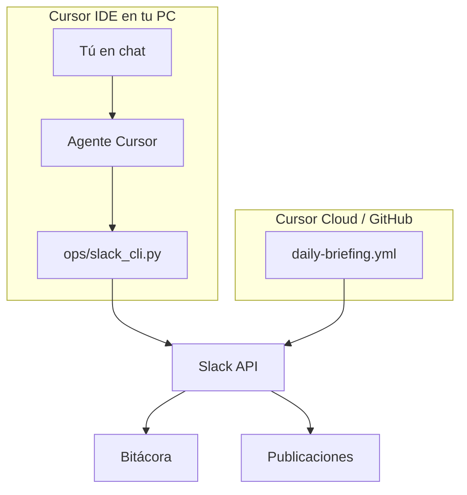

# Cursor + Slack — cómo trabajar juntos

CLI Market ya envía **briefings diarios** a Slack. Esta guía explica cómo pedirle a **Cursor** que te ayude en los mismos canales sin pegar tokens en el chat.

## Canales

| Canal | ID | Contenido |
|-------|-----|-----------|
| Bitácora (producto) | `C0B6V3Y9ZSP` | KPIs, tiendas críticas, collector |
| Publicaciones (redes) | `C0B6ZJ1B9B8` | Post LinkedIn del día, hooks, checklist |

Bot: `cli_market_dev_bot` — debe estar invitado: `/invite @cli_market_dev_bot`

## 1. Token en tu máquina (para Cursor local)

Crea `.env` en la raíz del repo (no se sube a git):

```bash
SLACK_BOT_TOKEN=xoxb-tu-token
SLACK_CHANNEL_BITACORA=C0B6V3Y9ZSP
SLACK_CHANNEL_PUBLICACIONES=C0B6ZJ1B9B8
```

En **PowerShell**:

```powershell
$env:SLACK_BOT_TOKEN = "xoxb-..."
```

En **bash / WSL**:

```bash
export SLACK_BOT_TOKEN=xoxb-...
```

## 2. Qué pedirle a Cursor en el chat

Ejemplos de instrucciones:

- «Ejecutá el briefing diario y envialo a Slack»
- «Publicá en bitácora un resumen de las tiendas críticas de hoy»
- «Mandá a publicaciones el post del Day 29»
- «Verificá que Slack siga funcionando»

Cursor usará la regla `.cursor/rules/slack-ops.mdc` y estos comandos:

| Pedido | Comando |
|--------|---------|
| Briefing completo | `python3 ops/slack_cli.py briefing` |
| Solo archivos, sin Slack | `python3 ops/slack_cli.py briefing --dry-run` |
| Mensaje corto bitácora | `python3 ops/slack_cli.py post --bitacora "..."` |
| Archivo a publicaciones | `python3 ops/slack_cli.py post --publicaciones --file ops/daily/YYYY-MM-DD-content.md` |
| Test de token | `python3 ops/slack_cli.py verify --send-test` |

## 3. Automático sin Cursor (GitHub Actions)

- Workflow: `.github/workflows/daily-briefing.yml`
- Cron: **13:00 UTC** todos los días
- Secret en repo: `SLACK_BOT_TOKEN`
- Manual: Actions → **Daily Briefing** → Run workflow

## 4. Cursor Cloud Agent (background)

El agente en la nube **no** lee tu `.env` local. Para que postee a Slack:

1. `SLACK_BOT_TOKEN` debe estar en **GitHub Secrets** del repo.
2. El workflow `daily-briefing` (o uno que dispares) hace el envío.
3. Pedí al agente: «al terminar, asegurate de que el workflow Daily Briefing pueda correr» o «commitea los reportes en ops/daily».

## 5. Qué Cursor no hace solo

- No reemplaza la **app de Slack** para conversar con el equipo.
- No lee mensajes entrantes (solo envía) — para eso haría falta Events API + servidor.
- No guarda el token: vos lo configurás en `.env` o GitHub Secrets.

## Diagrama



## Troubleshooting

| Error | Solución |
|-------|----------|
| `invalid_auth` | Token `xoxb-...` válido; Reinstall app en Slack |
| `not_in_channel` | `/invite @cli_market_dev_bot` en el canal |
| `missing_scope` | Scope `chat:write` + Reinstall |
| Cursor no envía | ¿`SLACK_BOT_TOKEN` exportado en esa terminal? |

[[daily-briefing]] · [[linkedin/STYLE-es]]
