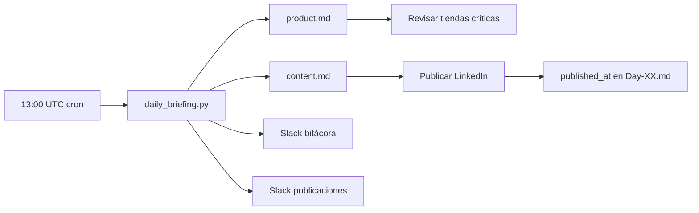

# Daily Briefing — automatización

Dos reportes markdown por día, generados desde producción y el calendario GTM en el repo.

## Qué genera

| Archivo | Contenido |
|---------|-----------|
| `ops/daily/YYYY-MM-DD-product.md` | KPIs collector, inflación, movers, store health, frescura, outreach (misma fuente que `ops/monday.py`) |
| `ops/daily/YYYY-MM-DD-content.md` | Post LinkedIn del día N, hooks, comentario, checklist, preview mañana, backlog sin `published_at`, gates |

Además actualiza `docs/metrics/price-pulse-YYYY-WW.md` cuando corre el bloque de producto.

## Ejecución local

```bash
pip install httpx
python3 ops/daily_briefing.py           # ambos reportes
python3 ops/daily_briefing.py --product # solo producto
python3 ops/daily_briefing.py --content # solo contenido / LinkedIn
python3 ops/daily_briefing.py --dry-run # sin Slack
```

## Variables de entorno

| Variable | Default | Uso |
|----------|---------|-----|
| `DASHBOARD_DATA_URL` | Railway prod `/dashboard/data` | Métricas producto |
| `SLACK_BOT_TOKEN` | — | Bot con `chat:write` (recomendado, un token → dos canales) |
| `SLACK_CHANNEL_BITACORA` | `C0B6V3Y9ZSP` | Canal bitácora producto |
| `SLACK_CHANNEL_PUBLICACIONES` | `C0B6ZJ1B9B8` | Canal publicaciones redes |
| `SLACK_WEBHOOK_BITACORA` | — | Alternativa: Incoming Webhook solo bitácora |
| `SLACK_WEBHOOK_PUBLICACIONES` | — | Alternativa: Incoming Webhook solo publicaciones |
| `LINKEDIN_CAMPAIGN_START` | `2026-05-01` | Día 1 del calendario 30d |
| `LINKEDIN_POST_UTC_HOUR` | `13` | Hora sugerida de publicación |

## Automatización (GitHub Actions)

Workflow: [`.github/workflows/daily-briefing.yml`](../../.github/workflows/daily-briefing.yml)

- **Cron:** `0 13 * * *` (todos los días 13:00 UTC)
- **Manual:** Actions → Daily Briefing → Run workflow
- **Commit automático** de `ops/daily/*.md` y price pulse semanal

## Slack (dos canales)

| Canal | ID | Qué recibe |
|-------|-----|------------|
| **Bitácora** | `C0B6V3Y9ZSP` | Status producto: KPIs, críticas, WARN, link al reporte |
| **Publicaciones redes** | `C0B6ZJ1B9B8` | Calendario del día: post, primer comentario, hashtags, checklist |

### Configuración recomendada (Bot Token)

> **No uses App ID / Client ID / Client Secret en el script.** Esos sirven para OAuth en apps web.  
> Para GitHub Actions y `daily_briefing.py` necesitás el **Bot User OAuth Token** (`xoxb-...`).

1. [api.slack.com/apps](https://api.slack.com/apps) → tu app → **OAuth & Permissions**.
2. **Bot Token Scopes:** `chat:write`, `chat:write.public` (si el bot aún no está en el canal).
3. **Install to Workspace** (o Reinstall) → copiar **Bot User OAuth Token** (`xoxb-...`).
4. En Slack, en cada canal: `/invite @nombre-del-bot`.
5. Guardar el token **solo** como secret (nunca en el repo ni en el chat):

```bash
# En tu máquina, con gh autenticado al repo Treevu-ai/cli-market-world
echo "xoxb-TU-TOKEN" | gh secret set SLACK_BOT_TOKEN --repo Treevu-ai/cli-market-world
```

6. Verificar (local, el token no se commitea):

```bash
export SLACK_BOT_TOKEN=xoxb-...
cd /ruta/al/repo && python3 ops/verify_slack.py --send-test
```

**No pegues Client Secret en issues, PRs ni en Cursor.** Si ya lo expusiste, revócalo en Slack → Basic Information → App Credentials → Regenerate.

Los IDs de canal ya están por defecto en el workflow; solo cambiarlos si movés los canales.

### Alternativa (webhooks)

Crear un Incoming Webhook por canal y guardar en secrets:

- `SLACK_WEBHOOK_BITACORA` → canal bitácora
- `SLACK_WEBHOOK_PUBLICACIONES` → canal publicaciones

No hace falta bot si usás webhooks (menos flexible).

## Flujo operativo recomendado



1. Leer `*-product.md` → priorizar tiendas 🔴 y WARN.
2. Leer `*-content.md` → copiar post + comentario.
3. Tras publicar, editar frontmatter: `published_at: 2026-05-29`.

## Relación con Monday Ops

| Script | Frecuencia | Salida principal |
|--------|------------|------------------|
| `ops/monday.py` | Lunes (GH Action) | `ops/reports/YYYY-MM-DD.md` |
| `ops/daily_briefing.py` | Diario | `ops/daily/YYYY-MM-DD-{product,content}.md` |

Ambos usan el mismo endpoint de dashboard. El reporte diario de producto es el playbook ops con título "Daily Product Status".

## Extender

- **Nuevo calendario** (DEV.to, Reddit): añadir parser en `build_content_report()` leyendo `docs/dev-calendar.md`.
- **Marcar publicado vía CLI:** futuro `python3 ops/daily_briefing.py --mark-published`.
- **Email:** enviar `*-content.md` con SendGrid/Resend en el workflow.

[[linkedin-calendar]] · [[linkedin/00-Index]] · [[linkedin/data-gate]]
