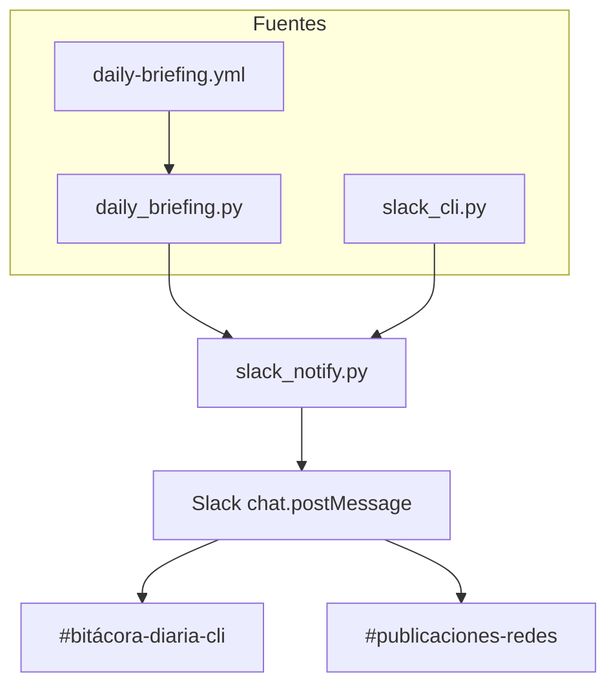

# Slack — configuración en cli-market-world

Guía de referencia para instalar, verificar y cambiar la integración Slack del repo **Treevu-ai/cli-market-world**. Para uso diario desde Cursor, ver también [[cursor-slack]].

## Estado revisado (2026-05-29)

| Elemento | Valor |
|----------|--------|
| Workspace | **climarketworspace** · `https://climarketworspace.slack.com/` |
| App / bot | `cli_market_dev_bot` |
| Bitácora producto | `#bitácora-diaria-cli` → `C0B6V3Y9ZSP` |
| Publicaciones redes | `#publicaciones-redes` → `C0B6ZJ1B9B8` |
| Envío automático | GitHub Actions `daily-briefing.yml` (13:00 UTC) + scripts locales |
| Último briefing en canales | 2026-05-29 (producto + contenido Día 1) |

Los IDs `C0B6V3Y9ZSP` y `C0B6ZJ1B9B8` son **específicos de este workspace**. Si creás canales nuevos o migrás de workspace, hay que actualizarlos en `.env` y en el workflow.

**No automatizado por el bot:** canales como `#revisiones-cursor` (`C0B723TQS78`) sirven para revisiones humanas / Cursor MCP; el bot no publica ahí salvo que uses `slack_cli.py post --channel C0B723TQS78`.

## Arquitectura



| Archivo | Rol |
|---------|-----|
| `ops/slack_notify.py` | Envío vía `SLACK_BOT_TOKEN` o webhooks por canal |
| `ops/verify_slack.py` | `auth.test` + prueba opcional en ambos canales |
| `ops/slack_cli.py` | CLI para Cursor (`briefing`, `post`, `verify`, `campaign`) |
| `ops/daily_briefing.py` | Genera `ops/daily/*.md` y publica resúmenes en Slack |
| `.github/workflows/daily-briefing.yml` | Cron diario + commit de reportes |
| `.env.example` | Plantilla de variables (no commitear valores reales) |

## Tres capas (no mezclar)

| Capa | Qué hace | Dónde configurar |
|------|----------|------------------|
| **Bot `SLACK_BOT_TOKEN`** | Publica briefings y posts vía scripts / GitHub Actions | [api.slack.com/apps](https://api.slack.com/apps) → Install → `xoxb-...` en `.env` y secret `SLACK_BOT_TOKEN` |
| **IDs de canal** | Destino de cada tipo de mensaje | `SLACK_CHANNEL_BITACORA`, `SLACK_CHANNEL_PUBLICACIONES` (defaults en código y workflow) |
| **Cursor MCP Slack** | Leer/buscar/enviar desde el agente en el chat | Cursor → Settings → MCP → Slack (usuario distinto del bot; no usa el token del repo) |

## Configuración inicial (paso a paso)

### 1. App en Slack

1. Ir a [api.slack.com/apps](https://api.slack.com/apps) → app de CLI Market (o crear una).
2. **OAuth & Permissions** → **Bot Token Scopes** (mínimo):
   - `chat:write`
   - Opcional: `chat:write.public` si no invitás el bot a canales privados.
3. **Install to Workspace** (o **Reinstall**) en **climarketworspace**.
4. Copiar **Bot User OAuth Token** (`xoxb-...`).  
   **No** uses Client Secret ni App-Level Token para estos scripts.

### 2. Canales e invitación

1. Usar (o crear) los canales de producto y redes.
2. En cada canal: `/invite @cli_market_dev_bot`
3. Obtener el ID del canal: clic derecho en el canal → *Ver detalles del canal* → al final aparece el ID, o desde la URL del canal (`C...`).

### 3. Variables locales

En la raíz del repo:

```bash
cp .env.example .env
# Editar .env:
# SLACK_BOT_TOKEN=xoxb-...
# SLACK_CHANNEL_BITACORA=C0B6V3Y9ZSP
# SLACK_CHANNEL_PUBLICACIONES=C0B6ZJ1B9B8
```

O exportar en la shell:

```bash
export SLACK_BOT_TOKEN=xoxb-...
```

### 4. Verificar

```bash
pip install httpx
python3 ops/verify_slack.py
```

Debe mostrar el workspace correcto (`climarketworspace`) y la URL. Luego:

```bash
python3 ops/verify_slack.py --send-test
```

Mensajes de prueba en bitácora y publicaciones.

### 5. GitHub Actions

En el repo **Treevu-ai/cli-market-world** → Settings → Secrets and variables → Actions:

| Secret | Obligatorio | Uso |
|--------|-------------|-----|
| `SLACK_BOT_TOKEN` | Sí (si querés Slack en CI) | Mismo `xoxb-...` del paso 1 |
| `SLACK_WEBHOOK_BITACORA` | No | Alternativa al bot solo para bitácora |
| `SLACK_WEBHOOK_PUBLICACIONES` | No | Alternativa al bot solo para publicaciones |
| `CLI_MARKET_CONTENT_DIR` | No | Ruta al repo privado de contenido, si el workflow lo necesita |

```bash
echo "xoxb-TU-TOKEN" | gh secret set SLACK_BOT_TOKEN --repo Treevu-ai/cli-market-world
```

Probar manualmente: Actions → **Daily Briefing** → **Run workflow**.

### 6. Primer briefing completo

```bash
python3 ops/slack_cli.py briefing
# o sin Slack:
python3 ops/slack_cli.py briefing --dry-run
```

## Variables de entorno

| Variable | Default en repo | Descripción |
|----------|-----------------|-------------|
| `SLACK_BOT_TOKEN` | — | Token bot `xoxb-...` |
| `SLACK_CHANNEL_BITACORA` | `C0B6V3Y9ZSP` | Canal bitácora producto |
| `SLACK_CHANNEL_PUBLICACIONES` | `C0B6ZJ1B9B8` | Canal publicaciones / LinkedIn |
| `SLACK_WEBHOOK_BITACORA` | — | Webhook opcional (sustituye bot en bitácora) |
| `SLACK_WEBHOOK_PUBLICACIONES` | — | Webhook opcional (sustituye bot en publicaciones) |

Defaults definidos en `ops/slack_notify.py` y repetidos en `.github/workflows/daily-briefing.yml`.

## Cambiar de workspace o cuenta

1. **Reinstalar la app** en el workspace destino → nuevo `xoxb-...`.
2. **Actualizar el token** en `.env` y en GitHub secret `SLACK_BOT_TOKEN`.
3. **Crear canales** e invitar `@cli_market_dev_bot`.
4. **Actualizar IDs** en `.env`, `daily-briefing.yml` (si no usás solo env), y opcionalmente los defaults en `slack_notify.py`.
5. **Verificar:** `python3 ops/verify_slack.py` (revisar nombre de workspace y URL) → `--send-test`.
6. **Cursor MCP:** si el agente “ve” otro Slack al leer canales, desconectar y reautorizar Slack en Cursor MCP (independiente del bot).

## Comandos útiles

```bash
python3 ops/slack_cli.py verify --send-test
python3 ops/slack_cli.py briefing
python3 ops/slack_cli.py post --bitacora "Resumen manual"
python3 ops/slack_cli.py post --publicaciones --file ops/daily/2026-05-29-content.md
python3 ops/slack_cli.py campaign status
```

## Qué no hace el bot hoy

- No lee mensajes del canal (no hay Events API).
- No ejecuta órdenes escritas en Slack (“publicá día 2”) — hay que pedirlo en Cursor o correr el CLI.
- No publica en `#revisiones-cursor` por defecto.

## Troubleshooting

| Síntoma | Causa probable | Acción |
|---------|----------------|--------|
| `invalid_auth` | Token revocado o incorrecto | Reinstall app → nuevo `xoxb-...` |
| `not_in_channel` | Bot sin invitar | `/invite @cli_market_dev_bot` |
| `channel_not_found` | ID de otro workspace o canal borrado | Alinear `SLACK_CHANNEL_*` con el workspace del token |
| `missing_scope` | Falta `chat:write` | OAuth → añadir scope → Reinstall |
| Workspace incorrecto en `verify_slack` | Token de otra org | Reinstall en workspace correcto |
| CI no postea | Falta secret o workflow sin token | Revisar `SLACK_BOT_TOKEN` en GitHub Secrets |
| Cursor MCP vs bot | Dos autenticaciones distintas | MCP = tu usuario; scripts = bot token |

## Referencias

- [[cursor-slack]] — pedir envíos desde Cursor
- [[daily-briefing]] — contenido de los reportes diarios
- `AGENTS.md` — comandos rápidos para agentes
- `.cursor/rules/slack-ops.mdc` — regla para el agente en el IDE
