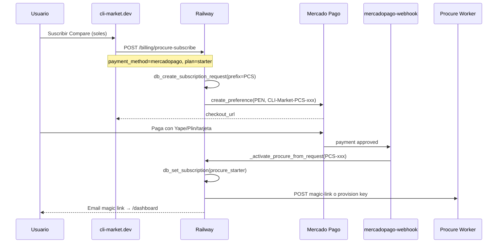

# Plan técnico: `procure-subscribe` + Mercado Pago (Perú / LATAM)

**Objetivo**: permitir suscripción Procure Compare/Ops/Scale con los mismos rieles que Build Pro (MP, Yape/Plin vía MP, PayPal, manual), activando tiers `procure_*` vía webhook.

**Orden de release** (cross-repo): **core → backend → world → procure-copilot**

---

## 0. Estado actual (baseline)

```
Landing Procure modal
  └─ POST /billing/procure-subscribe { email, username, plan }
       └─ _start_procure_subscription() → PayPal REST Subscription only
            └─ billing_pending.kind = procure_starter|procure_pro|procure_builder
            └─ webhook PayPal → activate_paypal_subscription()

Build Pro (referencia)
  └─ POST /billing/pro-checkout { payment_method }
       ├─ paypal → _start_paypal_subscription()
       ├─ mercadopago|yape|plin → _start_pro_mercadopago_checkout()
       │    └─ create_preference(PEN) external_ref CLI-Market-PRO-xxx
       └─ yape|plin + manual_transfer → _start_pro_qr_checkout()
            └─ webhook MP → _parse_pro_request_ref → _activate_pro_from_request() → tier "pro" ONLY
```

**Gaps a cerrar**:

1. `procure-subscribe` no acepta `payment_method`.
2. `_parse_pro_request_ref` solo matchea `PRO-`; Procure usa `PCS-` / `PCP-` / `PCB-`.
3. `_activate_pro_from_request` hardcodea `tier = "pro"`.
4. Modal Procure: copy y UX "PayPal only".
5. Worker `/procure`: CTAs ventas, sin deep link.

---

## 1. Arquitectura objetivo (Fase 1)



---

## 2. Cambios por repo

### 2.1 cli-market-core

| Archivo | Cambio |
|---------|--------|
| `market_billing.py` | Constantes `PROCURE_PLAN_PRICES_USD`, helper `procure_price_pen(plan_slug)` |
| `market_connectors/email_outbound.py` | `send_procure_payment_email()`, `send_procure_activation_email()` con magic link |
| `market_connectors/mercadopago_payments.py` | (opcional) helper `external_ref_for_subscription(request_id)` |

**`procure_price_pen(plan_slug)`**:

```python
def procure_price_pen(plan_slug: str) -> float:
    from procure_billing import PROCURE_PLANS  # o duplicar en core sin import world
    amount_usd = float(PROCURE_PLANS[plan_slug]["amount"])
    pen_per_usd = float(os.getenv("PROCURE_PEN_PER_USD", os.getenv("PRO_PEN_PER_USD", "3.75")))
    return round(amount_usd * pen_per_usd, 2)
```

Montos PEN esperados (FX 3.75): Compare S/ 108.75 · Ops S/ 296.25 · Scale S/ 558.75.

### 2.2 cli-market-world (+ mirror backend)

#### A. `procure_billing.py`

Añadir a cada plan:

```python
"mp_title": "Procure Copilot Compare",  # por slug
```

Sin cambio de slugs ni tiers.

#### B. `routers/billing/activation.py`

**1. Parser de refs unificado**

```python
_SUB_REF_RE = re.compile(
    r"CLI-Market-(?P<prefix>PRO|PCS|PCP|PCB)-(?P<suffix>[A-Z0-9]+)", re.I
)

def _parse_subscription_request_ref(external_reference: str) -> str | None:
    m = _SUB_REF_RE.search(external_reference or "")
    if not m:
        return None
    return f"{m.group('prefix').upper()}-{m.group('suffix').upper()}"

# Alias backward compat
def _parse_pro_request_ref(external_reference: str) -> str | None:
    rid = _parse_subscription_request_ref(external_reference)
    return rid if rid and rid.startswith("PRO-") else (
        rid if rid and rid.startswith(("PCS-", "PCP-", "PCB-")) else
        (_PRO_REF_RE.search(external_reference or "") and ...)  # legacy
    )
```

**2. Activación Procure desde request**

```python
_PROCURE_PREFIX_TO_TIER = {
    "PCS": "procure_starter",
    "PCP": "procure_pro",
    "PCB": "procure_builder",
}

def _activate_procure_from_request(request_id: str, *, source: str, force: bool = False) -> list[str]:
    req = db_find_subscription_request(request_id=request_id)
    # ... mismas validaciones que _activate_pro_from_request ...
    prefix = request_id.split("-", 1)[0]
    tier = _PROCURE_PREFIX_TO_TIER.get(prefix)
    if not tier:
        return [f"unknown_procure_prefix:{prefix}"]
    db_set_subscription(username, tier)
    db_mark_subscription_request_activated(request_id, username)
    # funnel: procure_activated
    # email: send_procure_activation_email + magic link
    # slack: _slack_notify_subscription(tier=..., payment_method=...)
    return actions
```

**3. Router en webhook MP** (`routers/checkout/webhooks.py`)

```python
sub_request_id = _parse_subscription_request_ref(ext_ref)
if status == "approved" and sub_request_id:
    if sub_request_id.startswith("PRO-"):
        actions.extend(_activate_pro_from_request(sub_request_id, source="mercadopago_webhook"))
    elif sub_request_id.startswith(("PCS-", "PCP-", "PCB-")):
        actions.extend(_activate_procure_from_request(sub_request_id, source="mercadopago_webhook"))
```

#### C. `routers/billing/routes.py`

**1. Constantes**

```python
_PROCURE_BILLING_METHODS = frozenset({"paypal", "mercadopago", "yape", "plin"})
```

**2. Nuevo handler** `_start_procure_mercadopago_checkout`

Espejo de `_start_pro_mercadopago_checkout` con diferencias:

| Campo | Build Pro | Procure |
|-------|-----------|---------|
| `amount_pen` | `_pro_price_pen()` | `procure_price_pen(plan_slug)` |
| `prefix` | `PRO` (default) | `PCS` / `PCP` / `PCB` from `procure_plan_config` |
| `title` | "CLI Market Pro" | `cfg["label"]` e.g. "Procure Copilot Ops" |
| `success_url` | `?mp=success&ref=...#pricing` | `?mp=success&audience=procure&ref=...#procure` |
| Activación | `_activate_pro_from_request` | `_activate_procure_from_request` |
| `funnel_source` | `landing_pro_checkout_*` | `landing_procure_checkout_*` |

**3. Extender `billing_procure_subscribe`**

```python
@router.post("/billing/procure-subscribe")
async def billing_procure_subscribe(body: dict, ...):
    method = (body.get("payment_method") or "paypal").strip().lower()
    plan_slug = (body.get("plan") or "pro").strip().lower()
    # ... email, username (igual) ...

    if method == "paypal":
        return await _start_procure_subscription(...)

    manual_transfer = bool(body.get("manual_transfer")) and wallet_manual_fallback_enabled()
    if method in ("yape", "plin") and manual_transfer:
        return _start_procure_qr_checkout(...)  # nuevo, espejo _start_pro_qr_checkout

    if method in ("yape", "plin", "mercadopago"):
        wallet = method if method in ("yape", "plin") else ""
        return await _start_procure_mercadopago_checkout(
            username, email, plan_slug=plan_slug, lang=lang,
            funnel_source=f"landing_procure_checkout_{method}",
            wallet_method=wallet,
        )

    raise HTTPException(400, detail=f"payment_method must be one of: ...")
```

**4. `_start_procure_qr_checkout`** (manual)

- Mismo patrón que `_start_pro_qr_checkout`: ref `PCS-`/`PCP-`/`PCB-`, `auto_activate: false`, Slack pending.
- Ops: extender `ops/activate_pro.py` → `activate_procure.py` o flag `--product procure --plan pro`.

#### D. Landing (`cli-market-world/landing`)

| Archivo | Cambio |
|---------|--------|
| `BillingCheckoutModal.tsx` | Procure: step 1 = método de pago (reusar `PRO_PAYMENT_OPTIONS` + `defaultProPaymentMethod()`); submit según method |
| `ProcureSubscribeButton.tsx` | Label neutro: "Suscribir →" (no solo PayPal) |
| `ProcurePricingPanel.tsx` | Feature copy: "PayPal · Mercado Pago · Yape/Plin" en suscripción |
| `PaymentReturnBanner.tsx` | Soporte `?mp=success&audience=procure&ref=PCS-xxx` |
| `lib/billingCopy.ts` | Textos PEN por plan |

**Submit Procure (nuevo branch en modal)**:

```typescript
if (kind.type === "procure") {
  const apiMethod = apiPaymentMethod(paymentMethod); // soles → mercadopago
  const { ok, data } = await postCheckout("/billing/procure-subscribe", {
    ...payload,
    plan: kind.plan,
    payment_method: apiMethod,
    ...(paymentMethod === "soles" && WALLET_MANUAL_FALLBACK
      ? { payment_method: "yape", manual_transfer: true }
      : {}),
  });
}
```

#### E. procure-copilot (sibling repo)

| Archivo | Cambio |
|---------|--------|
| `app/procure/page.tsx` | CTA primario `Suscribir` → `https://cli-market.dev/?audience=procure&plan={slug}#pricing` |
| `app/dashboard/page.tsx` | Ruta `/dashboard?token=` — validar HMAC con `PROCURE_MAGIC_SECRET` |
| `lib/auth.ts` | Bind `sk-` from token payload |

**Magic link contract**:

```
GET https://procure-copilot.../dashboard?token=<jwt>
JWT payload: { sub: username, sk_preview: "sk-...abc", tier, exp: +15min }
```

Generado en `_activate_procure_from_request` post-activación.

---

## 3. API contract (actualizado)

### `POST /billing/procure-subscribe`

**Request**:

```json
{
  "email": "maria@restaurant.pe",
  "username": "maria-rest",
  "plan": "starter",
  "payment_method": "mercadopago",
  "lang": "es",
  "manual_transfer": false
}
```

**Response (MP)**:

```json
{
  "ok": true,
  "request_id": "PCS-A1B2C3D4",
  "procure_plan": "starter",
  "tier": "procure_starter",
  "payment_method": "mercadopago",
  "payment_rail": "mercadopago",
  "amount_usd": 29,
  "amount_pen": 108.75,
  "currency": "PEN",
  "checkout_url": "https://www.mercadopago.com.pe/...",
  "auto_activate": true
}
```

**Response (PayPal)** — sin cambio estructural.

### Webhook MP — sin cambio de URL

`POST /checkout/mercadopago-webhook` — lógica interna extendida para PCS/PCP/PCB.

---

## 4. Tests (obligatorios antes de merge)

| Test | Archivo |
|------|---------|
| `procure-subscribe` MP devuelve checkout_url + prefix PCS | `tests/test_server.py` |
| Webhook MP con `CLI-Market-PCP-xxx` activa `procure_pro` | `tests/test_server.py` |
| Webhook MP con `CLI-Market-PRO-xxx` sigue activando `pro` (regresión) | `tests/test_server.py` |
| `procure-subscribe` paypal sin regresión | existing + extend |
| Dedupe MP procure (mismo email <24h) | mirror test_pro_checkout dedupe |
| E2E | `ops/payments_e2e.py --procure-billing` |

```bash
# Sandbox
python3 ops/payments_e2e.py --base https://cli-market-production.up.railway.app
# Añadir caso:
# POST /billing/procure-subscribe { plan: starter, payment_method: mercadopago }
```

---

## 5. Env vars

| Variable | Uso |
|----------|-----|
| `MERCADOPAGO_ACCESS_TOKEN` | Ya existe |
| `MERCADOPAGO_WEBHOOK_SECRET` | Ya existe |
| `PROCURE_PEN_PER_USD` | FX Procure (fallback `PRO_PEN_PER_USD`) |
| `PROCURE_SUBSCRIBE_RETURN_URL` | Ya existe (PayPal) |
| `PROCURE_MP_SUCCESS_URL` | `https://cli-market.dev/?mp=success&audience=procure&ref={ref}#procure` |
| `PROCURE_MAGIC_SECRET` | JWT magic link (32+ bytes) |
| `PROCURE_APP_URL` | Dashboard base |
| `WALLET_MANUAL_FALLBACK` | Ya existe |
| `YAPE_PLIN_NUMBER` | Ya existe |
| `PROCURE_MP_CHECKOUT` | Feature flag `1`/`0` — rollback |

---

## 6. Ops y runbook

### Activación manual Procure (Yape/Plin)

```bash
# Nuevo o extendido
python3 ops/activate_procure.py --request PCP-XXXXXXXX --confirm
python3 ops/slack_cli.py activate-procure --request PCP-XXXXXXXX
```

### Slack

Extender `ops/billing_slack.py`:

- `[REVENUE] pending` con `product=procure method=mercadopago plan=ops`
- `[REVENUE] activated` con tier `procure_pro`

### Checklist pricing

Añadir a `ops/PRICING-CHANGE-CHECKLIST.md` §6 Procure:

- [ ] `routers/billing/routes.py` — `_start_procure_mercadopago_checkout`
- [ ] `landing/components/BillingCheckoutModal.tsx` — Procure payment picker
- [ ] `procure-copilot/app/procure/page.tsx` — CTA Suscribir

---

## 7. Fases de implementación

### Sprint 1 — Backend + webhook (shippable sin UI)

1. `_parse_subscription_request_ref` + `_activate_procure_from_request`
2. Webhook MP routing PCS/PCP/PCB
3. `_start_procure_mercadopago_checkout` + extend `procure-subscribe`
4. Tests unitarios + sandbox MP
5. Deploy Railway con `PROCURE_MP_CHECKOUT=0` (dark)

### Sprint 2 — Landing + flag on

1. Modal Procure payment picker
2. `PaymentReturnBanner` audience=procure
3. `PROCURE_MP_CHECKOUT=1` en prod 20% (header/cookie o query `?mp_procure=1` para beta)
4. Actualizar `ops/CLIENT_PAYMENT_JOURNEY.md`

### Sprint 3 — Worker + onboarding

1. Worker CTAs deep link
2. Magic link JWT + dashboard bind
3. Email templates Procure activation
4. E2E full path + GA 100%

### Fase 2 (backlog técnico) — Recurrencia MP

Opciones evaluadas:

| Opción | Pros | Contras |
|--------|------|---------|
| **MP Preapproval API** | Recurrente nativo PEN | Integración nueva; no existe en core hoy |
| **Job mensual + preference** | Reusa `create_preference` | Churn si no pagan; ops overhead |
| **Solo PayPal recurrente + MP one-shot** | Híbrido | Mensaje complejo |

**Recomendación PM**: Fase 1 explicita "primer mes vía MP"; email D-25 con link renovación; Fase 2 spike MP Preapproval (3–5 días eng).

---

## 8. Estimación de superficie (diff)

| Repo | Archivos | LOC est. |
|------|----------|----------|
| cli-market-core | 2–3 | ~80 |
| cli-market-world | 6–8 | ~350 |
| cli-market-backend | mirror | ~350 |
| procure-copilot | 2–3 | ~120 |
| tests | 2 | ~150 |
| **Total** | ~15 | **~1,050** |

---

## 9. Definition of Done

- [ ] Usuario en Lima puede suscribir Procure Compare con MP/Yape sin PayPal
- [ ] Webhook activa `procure_starter` en <5 min p95 (sandbox + prod smoke)
- [ ] Cero regresiones Build Pro MP (`PRO-` refs)
- [ ] `ops/payments_e2e.py` verde con caso Procure MP
- [ ] Worker CTA "Suscribir" lleva a checkout con plan preseleccionado
- [ ] Docs: PRD + CLIENT_PAYMENT_JOURNEY + BILLING_MANUAL actualizados
- [ ] Feature flag probado (`PROCURE_MP_CHECKOUT=0` rollback <5 min)
- [ ] Slack revenue notifications con product=procure

---

## 10. Referencias de código actual

| Concepto | Path |
|----------|------|
| Pro MP checkout | `routers/billing/routes.py` → `_start_pro_mercadopago_checkout` |
| Pro activation | `routers/billing/activation.py` → `_activate_pro_from_request` |
| MP webhook | `routers/checkout/webhooks.py` → `mercadopago_webhook` |
| Procure PayPal | `routers/billing/routes.py` → `_start_procure_subscription` |
| Plan config | `procure_billing.py` |
| Modal | `landing/components/BillingCheckoutModal.tsx` |
| Peru default | `landing/lib/checkoutLocale.ts` |
