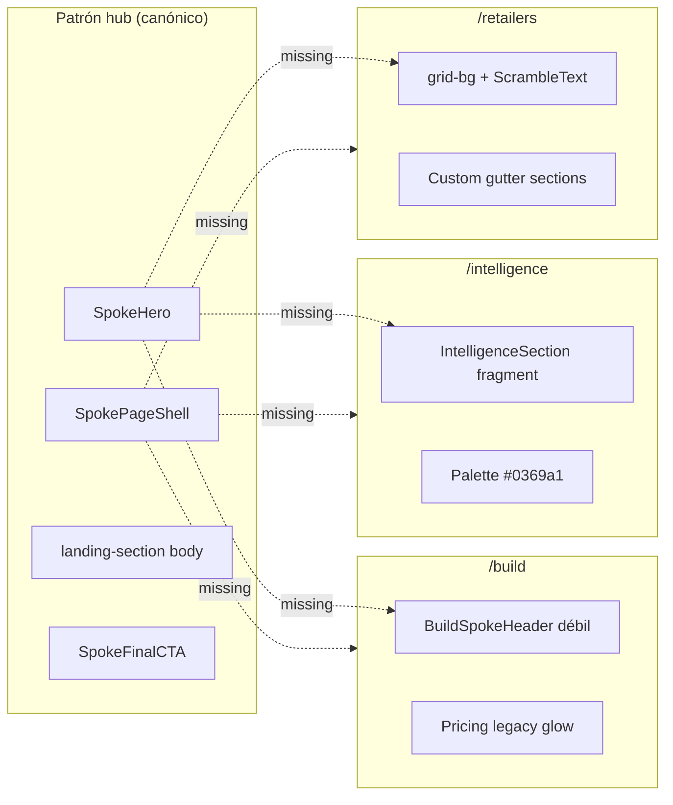

# PRD: Spoke Design System — homologar `/build`, `/intelligence`, `/retailers` al hub

**Prioridad:** P0 (pre-merge) · **Repo:** `cli-market-world` → `landing/` · **Bloquea:** merge de PR #434 (hub ICP Fase 1+2)

## Resumen ejecutivo

La reorganización ICP (PRD hub) separó rutas correctamente, pero **cada spoke implementó su propio dialecto visual**. El hub (`/`) establece un patrón canónico (hero Garamond/Geist, `HeroBackground`, `landing-section`, proof chips, naranja+m mint). Los tres spokes **rompen** ese patrón de formas distintas:

| Spoke | Severidad | Problema principal |
|-------|-----------|-------------------|
| `/build` | Media | Hero reducido a `section-title`; sin fondo ni shell de página |
| `/intelligence` | Alta | Paleta azul `#0369a1` fuera de `BRAND.md`; sección inline como página |
| `/retailers` | Crítica | Página legacy pre-hub: `grid-bg`, `ScrambleText`, padding/gutter custom, steps distintos |

**Decisión:** definir un **Spoke Design System** derivado del hub — mismos primitives, variante por ICP (Terminal vs Operations), sin reescribir contenido de negocio.

**No es:** rediseño de marca ni cambio de copy GTM. Es **unificación estructural y de componentes**.

---

## 0. Patrón canónico del hub (referencia)

Fuente de verdad post Fase 1+2: `landing/app/page.tsx` + `Hero.tsx` + `globals.css`.

### 0.1 Page shell

```tsx
<main id="main-content" className="relative min-h-screen bg-[var(--cm-background)]">
  {/* Ambient glow — NO grid-bg */}
  <div className="fixed inset-0 pointer-events-none z-0" aria-hidden>
    <div className="absolute top-1/4 left-1/2 -translate-x-1/2 w-[min(100vw,500px)] h-[min(100vw,500px)]
         rounded-full bg-[var(--cm-brand-accent)]/5 blur-[120px]" />
  </div>
  <Navbar />
  <ErrorBoundary>
    <div className="relative z-10">{children}</div>
  </ErrorBoundary>
</main>
```

| Token / clase | Hub | Build | Intelligence | Retailers |
|---------------|-----|-------|--------------|-----------|
| Ambient orange glow | ✅ | ❌ | ❌ | ❌ |
| `grid-bg` overlay | ❌ | ❌ | ❌ | ✅ (legacy) |
| `ErrorBoundary` | ✅ | ✅ | ✅ | ❌ |
| `pt-16` / `pt-24` hack en wrapper | ❌ | ✅ (`pt-24` header) | ✅ (`pt-16`) | ✅ (`pt-28`) |

### 0.2 Hero (above the fold)

| Elemento | Clase / componente | Especificación |
|----------|-------------------|----------------|
| Fondo decorativo | `HeroBackground` | Imagen retail + gradientes `--cm-background` |
| Eyebrow categoría | `stripe-tag-soft` | Pill uppercase mint, borde naranja sutil |
| H1 | `hero-garamond-headline` | Geist display, clamp 2.2–4rem, acento `text-gradient-orange` |
| Subhead | `text-base sm:text-lg` + `--cm-on-surface-variant` | max-w ~540px, centrado |
| Proof | Chips `rounded-full` mono | Métricas o integraciones ICP-específicas |
| CTAs | `btn-mint` + `btn-outline` | Nunca botones custom con `shadow-lg` |
| Contenedor | `landing-container-wide` + `landing-section#hero` | Padding hero vía CSS (`globals.css` L352–380) |
| Animación | framer-motion fade | Entrada escalonada eyebrow → h1 → chips |

**Anti-patrones detectados en spokes:**

- `section-title` como `<h1>` (Build) — escala menor, sin acento naranja
- `section-eyebrow` naranja como eyebrow de página (Build/Intelligence) — reservado a **secciones body**, no hero
- `font-display` + `ScrambleText` (Retailers) — efecto único, no reutilizable
- Eyebrow mint custom 11px (Retailers) — duplica `stripe-tag-soft` con otro estilo

### 0.3 Secciones body

| Elemento | Patrón hub |
|----------|------------|
| Wrapper | `landing-section` (+ opcional `landing-section-alt` zebra) |
| Contenedor | `landing-container-wide` (nunca solo `px-[var(--cm-gutter)]`) |
| Header bloque | `landing-section-header text-center` |
| Eyebrow sección | `section-eyebrow` — mono 11px, **naranja `#ea580c`**, uppercase |
| Título sección | `section-title` — `<h2>`, clamp 1.875–2.75rem |
| Intro | `section-intro` — max-w 42rem, centrado |
| Cards | `card-cyber rounded-2xl p-6` — radius 24px (`--cm-radius-lg`) |
| Steps numerados | Círculo naranja gradiente + título inline (`SolutionSection`) |
| Separadores | `border-top: var(--cm-hairline-soft)` vía `.landing-section` |

### 0.4 Componentes compartidos hub

| Orden hub | Componente | Rol |
|-----------|------------|-----|
| 1 | `Hero` | Router ICP |
| 2 | `TrustBar` | Marquee integraciones |
| 3 | `SolutionSection` | 3 pasos genéricos |
| 4 | `MetricsSection` | Data moat |
| 5 | `Footer` | Links por producto |

---

## 1. Gap analysis por spoke

### 1.1 `/build` — Developer spoke

**Archivos:** `app/build/page.tsx`, `BuildSpokeHeader.tsx`, `Pricing.tsx`, `FAQ.tsx`, `FinalCTASection.tsx`

| Dimensión | Hub/canónico | Build hoy | Gap |
|-----------|--------------|-----------|-----|
| Shell página | Glow blob | Sin glow | Visual “plano” vs hub |
| Hero | `HeroBackground` + garamond H1 | `BuildSpokeHeader`: solo texto, `section-eyebrow` | No feels like same product |
| H1 tipografía | `hero-garamond-headline` | `section-title` (~2.75rem max) | Jerarquía incorrecta |
| Proof chips | MCP, precios, retailers | Ninguno | Falta credibilidad above fold |
| Navbar offset | Hero CSS padding | `pt-24` manual en header | Fragile, inconsistente |
| Body stack | Secciones alternadas | Pricing (`landing-section-glow`) → FAQ → FinalCTA naranja | Mezcla 3 sub-estilos legacy |
| Breadcrumb | — | No “← CLI Market” | Usuario atrapado en spoke |
| Brand mode | Terminal (default) | Terminal implícito | OK — solo falta shell |

**Severidad:** Media. Contenido correcto; estructura y hero desalineados.

### 1.2 `/intelligence` — Analyst spoke

**Archivos:** `app/intelligence/page.tsx`, `IntelligenceSection.tsx`

| Dimensión | Hub/canónico | Intelligence hoy | Gap |
|-----------|--------------|-------------------|-----|
| Página | Hero + secciones | Solo `IntelligenceSection` (diseñada como `<h2>` inline en home) | No hay página — hay fragmento |
| Shell | Glow + ErrorBoundary | `pt-16` wrapper | Hack layout |
| Paleta acento | `--cm-mint` + `--cm-signal` (BRAND) | **`#0369a1` azul**, `#64748b` slate | **Fuera de tokens** — parece producto distinto |
| Pilot tier cards | `card-cyber` mint/orange | `border-[#0369a1]/15` | Colores light-mode en canvas oscuro |
| Checkmarks lista | Mint (`--cm-mint`) | Azul `#0369a1` | Inconsistente |
| Hero | Garamond + gradient orange | Título en `section-title` con orange span | Sin fondo, sin chips |
| Pricing block | Integrado en flujo spoke | Tiers embebidos en sección | OK contenido; mal contenedor |
| Final CTA | Banda con gradient naranja suave | CTAs inline al final de sección | Falta cierre spoke |
| FAQ / contact path | Spoke-specific | Solo links a contact | Falta sección FAQ analista |

**Severidad:** Alta. La paleta azul contradice `docs/BRAND.md` matriz Intelligence (`--cm-signal` en gráficos, `--cm-data` en UI).

### 1.3 `/retailers` — Supply-side spoke

**Archivos:** `app/retailers/page.tsx` (290 LOC monolito client)

| Dimensión | Hub/canónico | Retailers hoy | Gap |
|-----------|--------------|---------------|-----|
| Arquitectura | Composable sections | Monolito inline | Imposible mantener paridad |
| Fondo | Glow + optional HeroBackground | **`grid-bg` fixed 40%** | Patrón docs/account legacy |
| Hero contenedor | `landing-section#hero` | `py-24 px-[var(--cm-gutter)]` + `bg-[var(--cm-surface-low)]` | Band full-width distinta |
| H1 | `hero-garamond-headline` | `font-display clamp(1.75rem,5vw,3rem)` | Escala y familia distintas |
| Animación hero | motion fade | **`ScrambleText`** en headline | Efecto billboard — rompe calma hub |
| Eyebrow | `stripe-tag-soft` | Custom mint 11px mono | Duplicado divergente |
| CTA hero | `btn-mint` | Custom `rounded-[10px] shadow-lg` | Botón no estándar |
| Stats | `MetricsSection` card-cyber blocks | Grid 4 cols números mint 3xl | Segundo sistema de métricas |
| Benefits | `card-cyber rounded-2xl` | `card-cyber header-strip` | Clase única retailers |
| Steps | Orange circle 1/2/3 | **`01/02/03` mint 2xl** | Tercer patrón de steps |
| Extra | — | `ActiveBrandTicker` | Componente no usado en hub/spokes |
| Brand mode | Hub Terminal | Mezcla terminal + operations sin clase | Debería ser `brand-mode-operations` explícito |
| SEO inline | layout metadata | JSON-LD inline en page | Mover a layout o lib |

**Severidad:** Crítica. Es la página más alejada del hub — parece microsite anterior al ICP hub.

---

## 2. Matriz de divergencia (resumen)



| Primitive | Hub | Build | Intelligence | Retailers |
|-----------|:---:|:-----:|:------------:|:---------:|
| `SpokePageShell` | N/A | ❌ | ❌ | ❌ |
| `SpokeHero` | ✅ Hero | ❌ | ❌ | ❌ |
| `HeroBackground` | ✅ | ❌ | ❌ | ❌ |
| `hero-garamond-headline` | ✅ | ❌ | ❌ | ❌ |
| `stripe-tag-soft` | ✅ | ❌ | ❌ | ❌ |
| `landing-section` | ✅ | parcial | parcial | ❌ |
| `landing-container-wide` | ✅ | ✅ | ✅ | ❌ |
| `section-eyebrow` (body) | ✅ | mal uso en hero | mal uso | ❌ |
| `card-cyber rounded-2xl` | ✅ | ✅ pricing | parcial | parcial |
| `SolutionSteps` pattern | ✅ | ❌ | ❌ | ❌ |
| `btn-mint` / `btn-outline` | ✅ | ✅ parcial | ✅ | ❌ hero |
| BRAND tokens only | ✅ | ✅ | ❌ azul | ⚠️ mix |
| Hub breadcrumb | — | ❌ | ❌ | ❌ |

---

## 3. Spoke Design System (target)

### 3.1 Componentes nuevos (mínimos)

```
landing/components/spoke/
├── SpokePageShell.tsx      # glow + Navbar + ErrorBoundary + Footer slot
├── SpokeHero.tsx           # props: icp, eyebrow, title, accent, subhead, chips, ctas
├── SpokeSection.tsx        # wrapper landing-section + header opcional
├── SpokeStepsSection.tsx   # 3 pasos — reutiliza patrón SolutionSection
├── SpokeProofStrip.tsx     # stats compactos o TrustBar variant
├── SpokeFinalCTA.tsx       # parametrizado por ICP (reemplaza FinalCTASection genérico)
└── SpokeHubLink.tsx        # "← CLI Market" / "Elegir otro perfil"
```

**Config por ICP:** `landing/lib/spokeConfig.ts`

```typescript
export type SpokeIcp = "build" | "intelligence" | "retailers";

export type SpokeConfig = {
  id: SpokeIcp;
  brandMode: "terminal" | "operations";
  hero: { eyebrow_es; eyebrow_en; title; accent; subhead; chips; primaryCta; secondaryCta };
  accentToken: "mint" | "signal"; // NO hex sueltos
};
```

### 3.2 Plantilla de página spoke

Todas las rutas ICP siguen la **misma estructura** (contenido variable):

```
SpokePageShell (brandMode)
├── SpokeHero (config ICP)
├── SpokeHubLink
├── [Body 1] SpokeSection — valor / features
├── [Body 2] SpokeSection — cómo funciona (SpokeStepsSection)
├── [Body 3] SpokeSection — pricing o pilot tiers
├── [Body 4] SpokeSection — FAQ (opcional)
├── SpokeProofStrip (compact metrics o trust — opcional)
├── SpokeFinalCTA (config ICP)
└── Footer
```

**Hub** mantiene su variante especial (3 puertas en hero). Spokes usan **hero single-ICP** con la misma forma visual.

### 3.3 Reglas de variante por ICP (`docs/BRAND.md`)

| ICP | `brandMode` | Acento hero | Acento gráficos | Glow |
|-----|-------------|-------------|-----------------|------|
| **Build** | `terminal` | mint + orange gradient | `--cm-data` | 100% |
| **Intelligence** | `terminal` | mint + orange gradient | **`--cm-signal`** (inflación) | 100% |
| **Retailers** | **`operations`** | mint (menos orange) | `--cm-data` | **35%** (`--cm-glow-strength`) |

**Prohibido en código nuevo:**

- Hex sueltos `#0369a1`, `#64748b` en Intelligence
- `grid-bg` en spokes marketing
- `ScrambleText` en heroes spoke (reservado a campañas GTM externas si acaso)
- `px-[var(--cm-gutter)]` sin `landing-container-wide`
- `section-title` como `<h1>` de página

### 3.4 Migración de componentes existentes

| Componente actual | Acción |
|-------------------|--------|
| `BuildSpokeHeader` | **Deprecar** → `SpokeHero` icp=build |
| `IntelligenceSection` | **Split**: hero → `SpokeHero`; body → `SpokeSection`; retokenize colors |
| `retailers/page.tsx` | **Refactor** a composición spoke; extraer secciones |
| `FinalCTASection` | Generalizar → `SpokeFinalCTA` con props ICP |
| `SolutionSection` | Reutilizar lógica en `SpokeStepsSection` (parametrizable) |
| `ActiveBrandTicker` | Mantener solo retailers body si aporta; estilar como `TrustBar` cousin |

### 3.5 Intelligence — retokenización (obligatoria)

| Antes | Después |
|-------|---------|
| `text-[#0369a1]` eyebrow/tier | `text-[var(--cm-signal)]` o `text-[var(--cm-mint)]` |
| `border-[#0369a1]/15` | `border-[var(--cm-signal)]/20` |
| `#64748b` muted text | `text-[var(--cm-on-surface-variant)]` |
| Checkmark azul | `stroke="var(--cm-mint)"` |

---

## 4. Wireframes target (estructura unificada)

### Build `/build`

```
┌─ SpokeHero ─────────────────────────────────────────┐
│ [CLI BUILD] stripe-tag-soft                       │
│ Inteligencia de retail programable (garamond H1)  │
│ chips: MCP · 63K+ precios · Free tier            │
│ [Get API Key] [Quickstart]                        │
├─ SpokeHubLink: ← CLI Market                       │
├─ Pricing (landing-section, section-eyebrow PLANES)│
├─ FAQ (landing-section-alt)                        │
└─ SpokeFinalCTA build                              │
```

### Intelligence `/intelligence`

```
┌─ SpokeHero ─────────────────────────────────────────┐
│ [INTELLIGENCE] stripe-tag-soft                      │
│ Señales de retail antes del IPC (garamond + orange) │
│ chips: spreads · inflación · canasta · pilot $300+  │
│ [Solicitar piloto] [One-pager]                      │
├─ CommercePulseEmbed                                 │
├─ Features + Pilot tiers (card-cyber, signal accent) │
├─ FAQ analista (nuevo, compact)                      │
└─ SpokeFinalCTA intelligence                         │
```

### Retailers `/retailers`

```
┌─ SpokeHero (brand-mode-operations, glow reducido) ──┐
│ [PARA RETAILERS] stripe-tag-soft                    │
│ Tus productos donde compran los negocios (garamond) │
│ chips: gratis · sin código · 41 retailers           │
│ [Listar mi tienda]                                  │
├─ ActiveBrandTicker (opcional, estilo TrustBar)      │
├─ SpokeStepsSection (3 pasos — patrón hub naranja)   │
├─ Benefits grid (card-cyber rounded-2xl)             │
├─ Stats strip (reuse MetricsSection compact)         │
└─ SpokeFinalCTA retailers                            │
```

---

## 5. Implementation phases

### Fase A — Primitives (bloqueante merge)

- [x] `SpokePageShell` + `SpokeHero` + `SpokeHubLink`
- [x] `landing/lib/spokeConfig.ts` con configs build / intelligence / retailers
- [x] Documentar en `landing/DESIGN-SPOKE.md`

**Gate:** 3 spokes usan `SpokePageShell` + `SpokeHero`. ✅ 2026-06-27

### Fase B — Build homologation

- [x] Reemplazar `BuildSpokeHeader` por `SpokeHero`
- [x] Añadir glow shell a `/build`
- [x] Ajustar `Pricing` section header a patrón `section-eyebrow` consistente
- [x] `SpokeFinalCTA` icp=build

### Fase C — Intelligence homologation + retokenize

- [x] Split `IntelligenceSection` → hero + body sections
- [x] Eliminar todos los `#0369a1` / `#64748b`
- [x] Añadir FAQ compacto analista
- [x] `SpokeFinalCTA` icp=intelligence

### Fase D — Retailers refactor

- [x] Eliminar `grid-bg`, `ScrambleText`, gutter-only sections
- [x] Aplicar `brand-mode-operations` en shell
- [x] Unificar steps → `SpokeStepsSection`
- [x] Mover JSON-LD a `retailers/layout.tsx`
- [x] Reducir `page.tsx` a composición (<80 LOC)

### Fase E — QA visual

- [x] Screenshot diff hub vs 3 spokes (desktop + mobile)
- [x] Lighthouse / a11y: un solo H1 por página, contraste tokens
- [x] `npm run build` + revisión manual 4 rutas

---

## 6. Acceptance criteria (Definition of Done)

### Cross-spoke (obligatorio)

- [x] Las 3 rutas usan `SpokePageShell` idéntico al glow del hub
- [x] Cada spoke tiene exactamente **un** `<h1>` con clase `hero-garamond-headline`
- [x] Eyebrow hero = `stripe-tag-soft` en todas
- [x] CTAs hero = solo `btn-mint` / `btn-outline`
- [x] Body sections = `landing-section` + `landing-container-wide`
- [x] Cero hex hardcoded fuera de `globals.css` en spokes
- [x] Link `← CLI Market` visible en desktop above fold del body
- [x] `ErrorBoundary` en las 3 rutas

### Per spoke

**Build**

- [x] Proof chips: MCP + precios verificados + tier Free
- [x] Pricing + FAQ conservan funcionalidad checkout

**Intelligence**

- [x] Cero referencias `#0369a1`
- [x] Pilot tiers usan `card-cyber` + tokens signal/mint
- [x] Commerce Pulse embed intacto

**Retailers**

- [x] Cero `grid-bg`, cero `ScrambleText`
- [x] `brand-mode-operations` aplicado
- [x] Modal apply retailer funcional
- [x] Steps usan círculos naranja (patrón SolutionSection)

### Visual regression

- [ ] Side-by-side: hero hub card vs hero spoke mismo ICP — misma escala tipográfica ±5%
- [ ] Footer idéntico en las 4 rutas

---

## 7. Non-goals

- Cambiar copy de negocio o pricing
- Rediseñar `HeroBackground` image
- Unificar `/docs`, `/contact`, `/tools` (scope futuro — usan `grid-bg` legacy)
- Migrar Procure (dominio externo)
- Nuevo modo brand más allá de Terminal / Operations

---

## 8. Risks

| Risk | Impact | Mitigation |
|------|--------|------------|
| Refactor retailers rompe modal/SEO | Med | JSON-LD en layout; test E2E form |
| Intelligence pierde “look financiero” al quitar azul | Low | `--cm-signal` amarillo en charts cumple BRAND |
| Scope creep a todo el site | High | Solo 3 spokes ICP; docs queda Fase 5 |
| Duplicación SpokeHero vs Hero hub | Med | Hero hub extiende SpokeHero con `variant="hub-doors"` |

---

## 9. Open questions

| # | Pregunta | Owner | Default si no hay respuesta |
|---|----------|-------|---------------------------|
| 1 | ¿Retailers mantiene `ActiveBrandTicker`? | PM | Sí, estilizado como TrustBar |
| 2 | ¿Intelligence hero incluye `HeroBackground`? | Design | Sí, misma imagen con overlay más denso |
| 3 | ¿Build incluye mini TrustBar MCP? | PM | Sí, chips suficientes; TrustBar opcional |
| 4 | ¿Unificar `FinalCTASection` copy hub-centric en build? | PM | SpokeFinalCTA copy por ICP |

---

## 10. Relación con PRD hub

| PRD Hub Fase | Este PRD |
|--------------|----------|
| Fase 1 Hub slim | ✅ Done |
| Fase 2 Spokes rutas | ✅ Done — **sin design parity** |
| Fase 3 Polish GTM | **Reemplazado por Fase A–E aquí** |
| Merge PR #434 | **Bloqueado** hasta Fase A+B mínimo |

**Orden recomendado:** Fase A → B → merge build → C → D en PRs incrementales.

---

## Appendix A — Inventario de archivos a tocar

| Archivo | Fase | Acción |
|---------|------|--------|
| `landing/components/spoke/*` | A | Crear |
| `landing/lib/spokeConfig.ts` | A | Crear |
| `landing/app/build/page.tsx` | B | Usar shell |
| `landing/components/BuildSpokeHeader.tsx` | B | Deprecar |
| `landing/components/IntelligenceSection.tsx` | C | Split + retokenize |
| `landing/app/intelligence/page.tsx` | C | Composición |
| `landing/app/retailers/page.tsx` | D | Refactor mayor |
| `landing/app/retailers/layout.tsx` | D | JSON-LD |
| `landing/app/globals.css` | A | Solo si faltan tokens signal en cards |

## Appendix B — Evidencia código (líneas clave)

**Hub shell** — `landing/app/page.tsx` L12–16 (glow blob)

**Build gap** — `BuildSpokeHeader.tsx` L11–14 (`section-eyebrow` + `section-title` como hero)

**Intelligence azul** — `IntelligenceSection.tsx` L90, L110–116 (`#0369a1`, `#64748b`)

**Retailers legacy** — `retailers/page.tsx` L79 (`grid-bg`), L154–159 (`ScrambleText`), L145 (`px-[var(--cm-gutter)]`)

**BRAND Intelligence** — `docs/BRAND.md` L94: `--cm-signal` en gráficos, no azul Bloomberg-like hex

---

**Status:** Shipped (Phase A–E) · **QA:** `landing/QA-SPOKE-E.md` · **Merge:** PR #438

---

## Estado v1.0 — 2026-06-29 — P0 URGENTE

**Bloquea:** merge PR #434 (hub ICP Fase 1+2)

**Gaps críticos a resolver antes del merge:**
- `/retailers`: página legacy completa — reescribir con `SpokePageShell` + `SpokeHero`
- `/intelligence`: paleta azul `#0369a1` → naranja + mint de `BRAND.md`
- `/build`: agregar `HeroBackground` + `hero-garamond-headline`
- Todos los spokes: `pt-16`/`pt-24` hacks → `SpokePageShell` padding canónico

**Componentes a crear:**
- `SpokePageShell` — wrapper con padding + `ErrorBoundary`
- `SpokeHero` — `HeroBackground` + Garamond headline + eyebrow + chips

**Owner:** Eng + Design · **Deadline:** antes de merge PR #434
