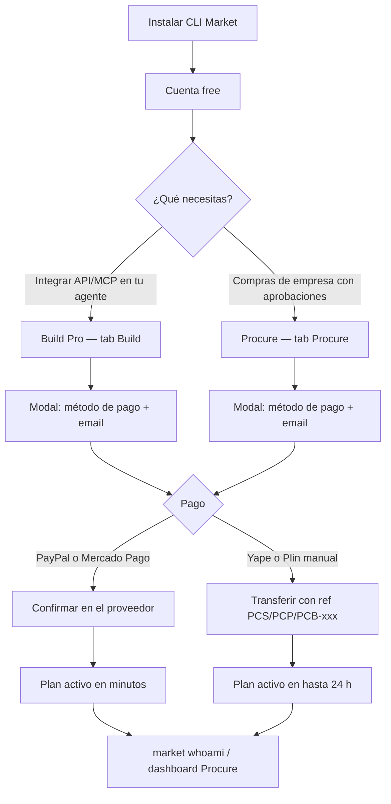

# Journey de pago — versión cliente

Texto listo para pegar en emails, `#contact` o confirmación post-pago. Sin pasos internos de ops.

---

## Diagrama (cliente)



---

## Paso a paso — Build Pro (desarrolladores / agentes)

### 1. Instalar y crear cuenta

```bash
python -m pip install cli-market-world
market init           # registra cuenta + primera búsqueda guiada
market whoami         # tier: free · copia username
```

### 2. Suscribirse en la web

1. Abre [cli-market.dev/#pricing](https://cli-market.dev/#pricing) → tab **Build**
2. **Configurar Pro** → paso 1: elige método de pago y acepta términos
3. Paso 2: email + **usuario CLI** (el de `market whoami`)
4. Sigue las instrucciones en pantalla

### 3. Pagar

| Método | Qué haces tú |
|--------|----------------|
| **PayPal** | Clic en «Ir al pago» → aprueba la suscripción en PayPal |
| **Mercado Pago** | Redirige a MP → paga en soles (PEN) |
| **Yape / Plin** | Abre la app → transfiere al número indicado → monto exacto → mensaje: `PRO-XXXXXXXX` |

### 4. Confirmación

| Método | Cuándo está activo |
|--------|-------------------|
| PayPal / Mercado Pago | Unos minutos (automático) |
| Yape / Plin | Hasta 24 h hábiles tras confirmar el pago |

Verifica:

```bash
market whoami    # tier: pro
```

### 5. Usar Pro

```bash
market search "arroz" --country PE
market account                 # tier, uso y API keys
market checkout --payment yape # checkout retail (Pro)
```

MCP: `market-mcp` con `MCP_TOOL_PROFILE=default` — ver [cli-market.dev/docs](https://cli-market.dev/docs)

---

## Paso a paso — Procure (equipos de compras)

1. [cli-market.dev/#pricing](https://cli-market.dev/#pricing) → tab **Procure** → elige plan → **Suscribir**
2. Modal: elige **soles (Mercado Pago)** o **PayPal (USD)** · email + usuario CLI (opcional)
3. Completa el pago en el proveedor (o transfiere Yape/Plin con ref `PCS-` / `PCP-` / `PCB-` si aplica)
4. Revisa tu email: incluye un **enlace mágico** al dashboard Procure (API key precargada, válido 15 min, un solo uso)
5. Si el enlace expiró: `market account` → copia `sk-…` y pégala en el [dashboard Procure](https://procurecopilot.com/dashboard)

También puedes suscribir desde el Worker `/procure` → **Suscribir** (deep link al mismo checkout).

No necesitas Build Pro aparte: la API va incluida en Procure Pro+.

---

## Email post-pago — Yape/Plin (copiar/pegar)

**Asunto:** CLI Market Pro — recibimos tu solicitud (`PRO-XXXXXXXX`)

Hola,

Gracias por tu pago con Yape/Plin. Para activar **Build Pro**:

1. Confirma que transferiste **S/ [monto]** con referencia **`PRO-XXXXXXXX`** en el mensaje.
2. Cuando activemos tu cuenta (≤24 h hábiles), corre:

```bash
market whoami
```

Deberías ver `tier: pro`. Luego:

```bash
market search "leche" --country PE
market checkout --payment yape
```

Si aún no tienes cuenta:

```bash
pip install cli-market-world
market init
```

Usa el mismo **usuario CLI** que indicaste al suscribirte (`market whoami`).

¿Dudas? Responde a este email con tu ref `PRO-XXXXXXXX`.

— CLI Market · hello@cli-market.dev

---

## Email post-pago — PayPal / Mercado Pago (copiar/pegar)

**Asunto:** CLI Market Pro — suscripción confirmada

Hola,

Tu suscripción **Build Pro** debería estar activa en minutos.

Verifica:

```bash
pip install cli-market-world
market init
market whoami
```

`tier: pro` → listo para API, MCP y checkout.

Documentación: [cli-market.dev/docs](https://cli-market.dev/docs)

— CLI Market · hello@cli-market.dev

---

## FAQ rápido (cliente)

**¿Necesito Build Pro y Procure?**  
Solo si eres developer *y* operador de compras. Procure Pro+ ya incluye la API.

**¿Dónde pago Procure con Yape?**  
Con `PROCURE_MP_CHECKOUT=1`: soles / Mercado Pago / Yape / Plin en el modal Procure (mismo flujo que Build Pro).

**¿Stripe?**  
No disponible aún. Usa PayPal, Mercado Pago o Yape/Plin (Build).

**¿Olvidé mi usuario CLI?**  
El email de confirmación y la ref `PRO-xxx` vinculan tu pago. Escribe a hello@cli-market.dev.