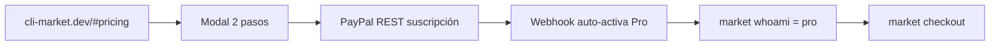

# E2E client journey — CLI Market Pro

Checklist para el **primer cliente** de punta a punta, sin fricción.

## Journey del cliente



### 1. Descubrimiento
- Landing Build: [cli-market.dev/#pricing](https://cli-market.dev/#pricing)
- Landing Procure: [cli-market.dev/#procure](https://cli-market.dev/#procure)
- O CLI: `python -m pip install cli-market-world && market hello`

### 2. Cuenta free (recomendado antes de pagar)
```bash
python -m pip install cli-market-world
export MARKET_API_URL=https://cli-market-production.up.railway.app
market login          # elige username — úsalo en el paso 2 del modal
market search "leche" --country PE
market whoami         # tier: free
```

### 3. Solicitar Pro (web)
1. Tab **Build** → **Configurar Pro** (modal 2 pasos)
2. Paso 1: método de pago (PayPal auto · MP auto · Yape/Plin manual ≤24 h) + legal
3. Paso 2: email + **usuario CLI** (el de `market whoami`)
4. Respuesta: enlace PayPal o QR + ref `PRO-XXXXXXXX`

**CLI (con sesión):**
```bash
market login
market upgrade          # POST /billing/paypal — mismo rail PayPal REST
```

### 4. Pagar
- **PayPal / Mercado Pago:** confirmar en proveedor → Pro se activa en segundos (webhook)
- **Yape / Plin:** escanear QR → activación manual ≤24 h (`ops/activate_pro.py`)
- Tras PayPal, la landing muestra banner en `?sub=success#pricing`

### 5. Confirmación
- **Automática (PayPal/MP):** webhook `BILLING.SUBSCRIPTION.ACTIVATED` → `db_set_subscription(username, "pro")`
- **Manual (Yape/Plin / fallback hosted button):** email a `hello@cli-market.dev` + ops:
```bash
python3 ops/slack_cli.py activate-pro PRO-XXXXXXXX --bitacora
# o: python3 ops/activate_pro.py USERNAME --request-id PRO-XXXXXXXX
```

### 6. Cliente verifica
```bash
market whoami              # tier: pro
market checkout --payment yape   # ya no 403
```

### Procure Copilot (tab Procure)
1. Modal → PayPal → vuelve a `cli-market.dev/?sub=success&audience=procure#procure`
2. `market register` (si nuevo) → `market keys` → pegar `sk-…` en dashboard Procure
3. No requiere Build Pro aparte (API incluida en Procure Pro+)

---

## Pre-flight (antes del primer cliente)

### Railway (API)
- [ ] `SMTP_*` configurado — ver `.env.example`
- [ ] PayPal REST (`PAYPAL_CLIENT_ID`, `PAYPAL_CLIENT_SECRET`, plan IDs)
- [ ] `PRO_SUBSCRIBE_RETURN_URL=https://cli-market.dev/?sub=success#pricing` (opcional)
- [ ] `BILLING_FROM_EMAIL=hello@cli-market.dev`
- [x] Test: `curl -X POST .../billing/pro-checkout -d '{"email":"test@you.com","payment_method":"paypal"}'`

Ver también: [`docs/ops/database-migration.md`](../docs/ops/database-migration.md)

### Cloudflare Pages (landing)
- [ ] `NEXT_PUBLIC_API_URL` apunta a Railway
- [ ] Deploy landing tras cambios (`npx wrangler pages deploy`)

### Smoke test (5 min)
```bash
# API
curl -s https://cli-market-production.up.railway.app/ | jq .status

# Pro checkout (forma de respuesta — no completes pago Live)
curl -s -X POST https://cli-market-production.up.railway.app/billing/pro-checkout \
  -H "Content-Type: application/json" \
  -d '{"email":"smoke@test.com","lang":"es","payment_method":"paypal"}' | jq .

python ops/payments_e2e.py

# CLI
market login && market whoami
```

---

## Troubleshooting

| Síntoma | Causa | Fix |
|---------|-------|-----|
| "Revisa email" pero no llega | SMTP no configurado | Railway env SMTP_*; el modal muestra enlace "Ir al pago" |
| Pro no activa tras PayPal | Username incorrecto | Cliente debe indicar `market whoami` en paso 2 del modal |
| Link duplicado | Mismo email reciente | Botón "Reenviar enlace" en modal o `resend: true` en API |
| `checkout` 403 | Sigue en free / webhook pendiente | Esperar ~30 s; `market whoami`; ops si Yape/Plin |
| Procure checkout 403 | Tier Starter en Worker | Upgrade a Procure Pro; header `x-plan: pro` en E2E |
| Rate limit 429 | Muchos requests mismo día | Reenviar con `resend: true` |

---

Ver también: [BILLING_MANUAL.md](./BILLING_MANUAL.md) · [PAYPAL_SANDBOX.md](./PAYPAL_SANDBOX.md)