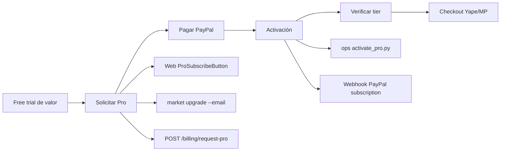

# Mapa de onboarding — CLI Market

Documento de trabajo para alinear estrategia, touchpoints y gaps.  
**Versión:** 2026-06-06 · **Fuentes:** landing, CLI, API, ops, PAM, `E2E_CLIENT_JOURNEY.md`

---

## 1. Métrica norte por persona

| Persona | Job-to-be-done | Éxito en sesión 1 | Métrica |
|---------|----------------|-------------------|---------|
| **Dev / agent builder** | Conectar API o MCP y obtener precios reales | Primer `search` o tool MCP con resultados | TTFV (install → primer resultado) |
| **Usuario free** | Probar sin pagar | `whoami` + search en país correcto | Activation rate D0 |
| **Cliente Pro** | Pagar y desbloquear checkout/intel | `whoami` tier `pro` + checkout sin 403 | TTC (request-pro → activado) |
| **Retailer** | Entrar al índice | Apply enviado + ref `RET-*` | Time-to-ack (24h SLA) |
| **Business / Intel** | Evaluar datos comerciales | Waitlist enviada | Lead response time |
| **Ops** | Cumplir SLA sin fricción | Pro activado ≤24h | Manual touch rate |

**Persona primaria hoy (recomendación):** dev/agent builder — el producto se vende como infraestructura para agentes.

---

## 2. Journey maps

### 2.1 Dev / agent builder (canal principal)

```mermaid
flowchart LR
  A[Descubrimiento] --> B[Install PyPI]
  B --> C[Auth]
  C --> D[Primer valor]
  D --> E[Integración MCP/API]
  E --> F[Profundidad / Pro]

  A --> A1[cli-market.dev]
  A --> A2[README / PyPI]
  A --> A3[llms.txt / mcp.json]

  B --> B1[pip install cli-market-world]
  B --> B2[market hello]

  C --> C1[market login]
  C --> C2[POST /auth/register oculto]

  D --> D1[market search]
  D --> D2[market compare / basket]

  E --> E1[/tools en landing]
  E --> E2[Cursor / Claude MCP]

  F --> F1[market upgrade]
  F --> F2[checkout / export]
```

| Paso | Touchpoint | Estado | Owner |
|------|------------|--------|-------|
| Descubrimiento | `Hero`, `HowItWorks`, README | ✅ Existe | Marketing |
| Install | PyPI `cli-market` | ✅ | Product |
| Orientación | `market hello` | ⚠️ No emite API key; stats a veces stale | CLI |
| Auth | `market login` | ⚠️ Requiere credenciales conocidas; register no visible en UX | API + CLI |
| Aha | search → compare → basket | ✅ PAM tier 1 PASS | Product |
| MCP | `/tools`, `mcp.json` | ⚠️ Comando inconsistente (`market-mcp` vs `python -m market_mcp`) | DX |
| Docs | `DocsPage`, `demo-walkthrough.md` | ⚠️ Alerts en demo vs límites tier; refresh 4h vs 8h | Docs |
| Upgrade | `market upgrade`, Pricing Pro | ⚠️ Manual post-pago | Billing + Ops |

### 2.2 Cliente Pro (monetización)



| Paso | Touchpoint | Estado | SLA |
|------|------------|--------|-----|
| Cuenta previa | `market login` + username | ✅ Recomendado en E2E | — |
| Request | `PRO-XXXXXXXX` + email | ✅ API + landing | — |
| Pago | PayPal hosted button | ✅ | — |
| Activación | `activate_pro.py` | 🔴 **Manual** | ≤24h hábiles |
| Alternativa auto | `BILLING.SUBSCRIPTION.ACTIVATED` | 🟡 Requiere webhook go-live | — |
| Verificación | `market whoami` | ⚠️ No muestra tier | CLI |
| Checkout | `market checkout` | ✅ Tras Pro activo | — |

**Referencia ops:** `ops/E2E_CLIENT_JOURNEY.md`, `docs/ops/GO-LIVE-CHECKOUT.md`

### 2.3 Retailer (Puerta B)

```mermaid
flowchart LR
  A[RetailersSection] --> B[Apply]
  B --> C[Validación humana]
  C --> D[Indexación]

  B --> B1[/retailers + RetailerApplyForm]
  B --> B2[UnifiedContactForm topic=retailer]
  B --> B3[POST /v1/retailers/apply]

  C --> C1[ops approve_retailer.py]
```

| Paso | Touchpoint | Estado |
|------|------------|--------|
| CTA landing | `#contact-retailers` | 🔴 Anchor vacío — scroll a nada |
| Form dedicado | `/retailers` | ✅ |
| API | `RET-*` ref | ✅ PAM `public.retailer_apply` |
| Fulfillment | Aprobación manual 24h | 🟡 Concierge |

### 2.4 Starter / Builder / Enterprise

| Tier | Touchpoint | Estado |
|------|------------|--------|
| Starter | `FreeSignupModal` → contact | 🟡 Lead only — sin checkout self-serve |
| Builder | `#contact-general` | 🟡 Sales-assisted |
| Enterprise | Contact form | 🟡 Sales-assisted |
| Intelligence | `IntelligenceSection` waitlist | 🟡 Producto no shipped |

---

## 3. Inventario de touchpoints

Leyenda: ✅ OK · ⚠️ Fricción · 🔴 Roto / ausente · 🔵 Manual ops

### Descubrimiento y confianza

| ID | Archivo / URL | Persona | Estado | Notas |
|----|---------------|---------|--------|-------|
| T-01 | cli-market.dev Hero | All | ✅ | CTA PyPI + retailers + intelligence |
| T-02 | `HowItWorks.tsx` | Dev | ✅ | 6 pasos; link demo-walkthrough |
| T-03 | `Pricing.tsx` | All | ⚠️ | Starter “trial” → formulario, no cuenta |
| T-04 | `FAQ.tsx` | All | ✅ | Checkout autónomo en roadmap |
| T-05 | `llms.txt` / `mcp.json` | Agent | ⚠️ | Inconsistencia comando MCP |
| T-06 | README.md | Dev | ✅ | Quick start alineado en general |
| T-07 | `docs/use-cases.md` | All | ✅ | 3 perfiles |
| T-08 | `landing.visual` (PAM) | Ops | ✅ | Stats vs `/dashboard/data` |

### Install y CLI

| ID | Comando / archivo | Persona | Estado | Notas |
|----|-------------------|---------|--------|-------|
| T-10 | `pip install cli-market-world` | Dev | ✅ | PyPI |
| T-11 | `market hello` | Dev | ⚠️ | Panel orientación; no API key |
| T-12 | `market login` | Free | ⚠️ | Sin registro guiado en web |
| T-13 | `market search` (vacío) | Free | ⚠️ | Banner con stats desactualizados |
| T-14 | `market whoami` | All | ⚠️ | No muestra tier/subscription |
| T-15 | `market share` | Free | ✅ | Referral |
| T-16 | `docs/demo-walkthrough.md` | Dev | ⚠️ | Paso alerts vs tier; “API key ready” |

### Auth API

| ID | Endpoint | Persona | Estado | Notas |
|----|----------|---------|--------|-------|
| T-20 | `POST /auth/login` | Free | ✅ | Bootstrap admin si DB vacía |
| T-21 | `POST /auth/register` | Dev | 🔴 | **No en landing/docs** — solo API/PAM |
| T-22 | `GET /auth/subscription` | Dev | ✅ | Tier y límites |
| T-23 | API keys CRUD | Pro | 🟡 | Escritura gated por tier |

### MCP

| ID | Archivo | Persona | Estado | Notas |
|----|---------|---------|--------|-------|
| T-30 | `landing/app/tools` | Dev | ✅ | Snippets Cursor/Claude/VS Code |
| T-31 | `mcp.json` (repo) | Dev | ⚠️ | `market-mcp` sin env |
| T-32 | `.vscode/mcp.json` | Dev | ⚠️ | `python -m market_mcp` — distinto |
| T-33 | `server.json` | Dev | ⚠️ | Registry schema |
| T-34 | PAM `mcp.cursor` | Ops | 🔵 Manual tier 1 |
| T-35 | PAM `mcp.full_suite` | Ops | 🔵 Manual tier 3 |

### Billing Pro

| ID | Touchpoint | Persona | Estado | Notas |
|----|------------|---------|--------|-------|
| T-40 | `ProSubscribeButton` | Pro | ✅ | request-pro + PayPal |
| T-41 | `market upgrade` | Pro | ✅ | Mismo flujo |
| T-42 | `ops/activate_pro.py` | Ops | 🔵 | Manual fulfillment |
| T-43 | PayPal webhook | Pro | 🟡 | Path auto si go-live completo |
| T-44 | SMTP billing emails | Pro | 🟡 | Degrada a links sin SMTP |
| T-45 | PAM `billing.pro` | Ops | 🔵 Manual tier 3 |

### Retailer

| ID | Touchpoint | Persona | Estado | Notas |
|----|------------|---------|--------|-------|
| T-50 | `RetailersSection` | Retailer | ⚠️ | CTA anchor roto |
| T-51 | `/retailers` form | Retailer | ✅ | |
| T-52 | `POST /v1/retailers/apply` | Retailer | ✅ | |
| T-53 | `ops/approve_retailer.py` | Ops | 🔵 | |

### Verificación automatizada (PAM)

| Tier PAM | Qué valida onboarding | Frecuencia |
|----------|----------------------|------------|
| 1 | API, landing, user, auth register | Nightly |
| 2 | Extended user, admin read-only, post 38/38 | Nightly |
| 3 | Destructive admin, manual pagos/MCP | Semanal |

**Gap:** PAM no mide funnel humano (signup web, TTFV, TTC Pro).

---

## 4. Matriz dolor × canal

| Dolor | CLI | MCP | Web | Email/Ops |
|-------|-----|-----|-----|-----------|
| No sé cómo crear cuenta | ⚠️ login opaco | — | 🔴 signup no crea user | — |
| Primer search falla (país/tienda) | ⚠️ | ⚠️ | — | — |
| MCP no conecta | — | 🔴 comando inconsistente | ⚠️ snippets distintos | — |
| Pagué Pro y sigo free | — | — | ⚠️ | 🔴 activate manual |
| Retailer CTA no lleva a form | — | — | 🔴 anchor vacío | — |
| Demo promete más que el tier free | ⚠️ | — | ⚠️ docs | — |
| Starter “14 días” sin self-serve | — | — | 🔴 lead only | 🔵 sales |

---

## 5. Backlog priorizado

### P0 — Quick wins ✅ (2026-06-06)

| # | Acción | Estado |
|---|--------|--------|
| 1 | MCP unificado: `market-mcp` + `MARKET_API_URL` en manifests y `/tools` | ✅ |
| 2 | Retailer CTA → `/retailers` + bloque en `#contact-retailers` | ✅ |
| 3 | `market whoami` con tier + límites | ✅ |
| 4 | `market register` + `hello` actualizado | ✅ |
| 5 | `demo-walkthrough.md` alineado (alerts → appendix Starter+) | ✅ |

### P1 — Onboarding v2 core (dev en 5 min garantizado) ✅ (2026-06-06)

| # | Acción | Persona | Estado |
|---|--------|---------|--------|
| 6 | Flujo `market init` o `market register` — crea user + muestra `sk-` una vez | Dev | ✅ CLI + hello + demo-walkthrough |
| 7 | Documentar `/auth/register` en DocsPage + QuickstartAPI | Dev | ✅ `/docs#auth`, `#quickstart`, `#doctor` |
| 8 | MCP “starter 5 tools” en `/tools` (search, compare, cart, whoami, stats) | Dev | ✅ ToolsPage con descripciones |
| 9 | `market doctor` — URL, auth, país, tier, MCP command check | Dev | ✅ readiness % + fila País |
| 10 | FreeSignupModal: honest UX si no crea cuenta (o conectar a register) | Free | ✅ dev-fast path + copy Starter |

### P2 — Monetización self-serve

| # | Acción | Persona | Esfuerzo |
|---|--------|---------|----------|
| 11 | Auto-activate Pro vía PayPal webhook como path principal en landing | Pro | ✅ paypal-subscribe + upgrade CLI |
| 12 | Email transaccional post-pago con estado + ETA si manual | Pro | M |
| 13 | Starter checkout self-serve o quitar “14 días gratis” del CTA | Starter | L |
| 14 | Dashboard cliente: usage, tier, próximo paso upgrade | Pro | L |

### P3 — Instrumentación

| # | Acción | Esfuerzo |
|---|--------|----------|
| 15 | Eventos: install, login, register, first_search, request_pro, activated | M |
| 16 | Funnel dashboard (TTFV, TTC, drop-off por paso) | L |
| 17 | PAM tier 1.5: synthetic `market init` journey en CI | M |

---

## 6. Onboarding MVP (propuesta próxima release)

**Promesa:** *“De `pip install` a precios reales en 5 minutos — sin email a ops.”*

**Scope mínimo:**

1. `market register` (o mejorar hello + docs) → API key visible una vez  
2. Comando MCP único documentado + snippet copy-paste probado  
3. `market whoami` con tier  
4. Quickstart en landing = mismo que PAM `cli.journey` tier 1  
5. Retailer CTA arreglado  

**Fuera de scope MVP:** auto-activate Pro, Starter checkout, Intelligence product.

**Criterio de éxito MVP:**

- PAM manual `cli.journey` + `mcp.cursor` completables sin soporte  
- TTFV mediana < 5 min en prueba con 3 devs externos  
- 0 tickets “no puedo crear cuenta” en primera semana  

---

## 7. Agenda workshop (90 min) — usar este doc

| Bloque | Pregunta | Decisión esperada |
|--------|----------|-----------------|
| 0–15 | ¿Persona #1 en Q3? | Dev vs Pro vs Retailer |
| 15–40 | Walkthrough en vivo journey 2.1 + 2.2 | Lista fricciones validada |
| 40–55 | Revisar tabla §3 — ¿estado correcto? | Correcciones |
| 55–70 | Priorizar P0–P1 | Top 5 para sprint |
| 70–85 | ¿Onboarding MVP §6 OK? | Sí / ajustar scope |
| 85–90 | Owner + métrica baseline | Quién instrumenta §6 P3 |

---

## 8. Comandos de verificación (ops)

```bash
# Journey dev (PAM tier 1 manual)
python ops/production_acceptance.py --phase manual --tier 1

# Journey Pro (tier 3 manual)
python ops/production_acceptance.py --phase manual --tier 3

# Salud touchpoints API + landing
python ops/production_acceptance.py --phase public,landing,user --tier 1
```

---

## Changelog

| Fecha | Cambio |
|-------|--------|
| 2026-06-06 | Versión inicial — mapa 4 journeys, 53 touchpoints, backlog P0–P3 |