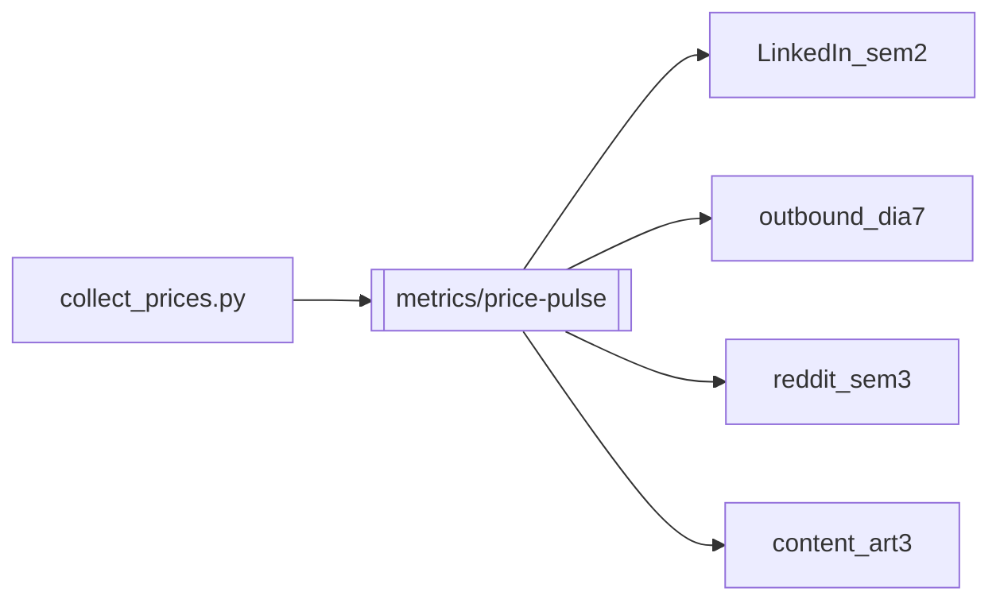

# CLI Market — GTM Hub

Punto de entrada del vault Obsidian. Todo el paquete GTM vive en `docs/` junto al código en [`/home/acuba/Proyectos/nuevo`](../).

**Producto:** [cli-market.dev](https://cli-market.dev) · **Repo:** [Treevu-ai/cli-market-world](https://github.com/Treevu-ai/cli-market-world)

---

## Paquete de documentos

| Doc | Estado | Agente Agency | Enlace |
|-----|--------|---------------|--------|
| PRD v2 | `draft` | Product Manager | [[cli-market-prd-v2]] |
| Growth channels | `ready` | Growth Hacker | [[growth-channels]] |
| SEO audit | `ready` | SEO Specialist | [[seo-audit]] |
| Content strategy | `ready` | Content Creator | [[content-strategy]] |
| LinkedIn 30d | `ready` | LinkedIn Content Creator | [[linkedin-calendar]] · [[linkedin/00-Index]] |
| Outbound sequences | `ready` | Outbound Strategist | [[outbound-sequences]] |
| Reddit strategy | `ready` | Reddit Community Builder | [[reddit-strategy]] |

| DX audit | `shipped` | Developer Advocate + MCP Builder | [[dx-audit]] |
| AEO baseline | `baseline` | AI Citation Strategist | [[aeo-citation-baseline]] |
| DEV calendar | `ready` | Growth Hacker + Content Creator | [[dev-calendar]] |
| Alpha gates | `executed` | Product Manager | [[alpha-gates-2026-06-01]] |
| Data gate (LI sem 2) | `active` | API Tester | [[linkedin/data-gate]] |
| Data moat strategy | `active` | Product + Collector | [[data-moat-strategy]] |
| Data moat reporting | `active` | Product + Content | [[data-moat-reporting]] |
| Repurpose top 5 | `ready` | Content Creator | [[linkedin/repurpose-top5]] |
| Obsidian vault | `shipped` | — | [[obsidian-vault]] · `.obsidian/` |

**Ops:** [[../ops/HN_POST|HN post (ops/)]] · Landing [[../landing/README|landing/]] · Benchmark [[../ops/benchmark_api.py]]

---

## Mensaje público acordado (usar en todos los canales)

> Antes de publicar LinkedIn, outbound, Reddit o DEV, alinear copy con esta fila. Actualizar aquí primero.

| Concepto | Mensaje acordado (canónico: `landing/lib/marketStats.ts`) | Landing pública (verificar) |
|----------|-------------------------------------------|-----------------------------|
| Retailers | 68 en catálogo (38 verificados activos) | ✅ 68 / 38 |
| Plataformas | 4 (VTEX · Shopify · Magento · WooCommerce) | ✅ 4 |
| Países | 8 | ✅ 8 |
| MCP tools | 22 curated (46 legacy) | ✅ 22 + `/tools` |
| Precios indexados | 51,000+, refresh 4h | ✅ |
| Pitch | Commerce infrastructure for AI agents · `pip install cli-market-world` | ✅ |

> **PyPI dual-package:** `cli-market-world` es el CTA developer (incluye `cli-market-core` automáticamente). No cambiar pitch a `cli-market-core`. Ver `docs/PYPI-PACKAGE-MODEL.md`.

> Fuente única: `python3 ops/sync_market_stats.py` regenera `landing/lib/marketStats.ts`. Alinear copy a esos valores.

Si un post contradice esta tabla → **no publicar** hasta actualizar tabla o producto.

---

## Launch calendar (PRD v2)

| Fase | Fecha | Marketing activo | Gate producto |
|------|-------|------------------|---------------|
| **Alpha** | 2026-06-01 | LinkedIn sem 1 · outbound piloto 3 partners | Billing manual Pro (email + link) · form `/retailers` |
| **Beta** | 2026-06-08 | HN · waitlist · Reddit W1–2 · SEO fixes | 10 self-serve retailers |
| **GA** | 2026-06-15 | LinkedIn sem 4 CTA · outbound escalado · DEV Art. 1–2 | 10 retailers/sem · path $500 MRR |

### Checklist Alpha (antes del 1 jun)

- [x] Billing manual Pro — SMTP Railway + PayPal Hosted Button ([[../ops/BILLING_MANUAL|BILLING_MANUAL.md]], [[../ops/E2E_CLIENT_JOURNEY|E2E_CLIENT_JOURNEY.md]])
- [x] Self-serve en [cli-market.dev/retailers](https://cli-market.dev/retailers) — form + `POST /v1/retailers/apply`
- [ ] Collector ≥ 80% store success — **51.6%** (31 activos, 16 healthy) — ver [[alpha-gates-2026-06-01]]
- [x] SEO críticos: [[seo-audit#Critical Fixes (This Week)]] — ✅ 2026-05-28
- [x] Mensaje 60/30/8/3/36/43K alineado en landing, llms.txt, Telegram bot, server.json
- [x] PyPI: `market hello` + README quick start ([[growth-channels#Channel 1: PyPI as Growth Engine]])
- [x] MCP: `/tools` configs + descriptions mejoradas ([[dx-audit]])
- [x] LinkedIn D1–30 en `ready` ([[linkedin/00-Index]]) — sem 2 requiere [[linkedin/data-gate]]
- [x] Agency Cursor rules instaladas (184 rules en `.cursor/rules/`)
- [x] API benchmark baseline: `python3 ops/benchmark_api.py` (p95 ~4.3s live — target 2s)

---

## Cadena de contenido (una fuente de datos)



1. Exportar cifras verificables → `docs/metrics/price-pulse-YYYY-WW.md`
2. Reutilizar en LinkedIn días 8–14, outbound día 7, Reddit sem 3, Artículo 3
3. Revisar claims de inflación (no implicar índice oficial INEI/INDEC)

---

## Prioridad RICE (growth)

Ver [[growth-channels#RICE Priority]]:

1. **PyPI activation** (2 días)
2. **MCP directories** (3 días)
3. **Agent-first SEO** (5 días, compuesto)

---

## Agentes Cursor (agency-agents)

Instalar en repo:

```bash
cd /home/acuba/Proyectos/nuevo
/home/acuba/Proyectos/agency-agents/scripts/install.sh --tool cursor
```

| Tarea | @agente |
|-------|---------|
| Expandir post LinkedIn día N | `linkedin-content-creator` |
| Borrador artículo DEV | `content-creator` |
| Fixes SEO landing | `seo-specialist` |
| Review MCP tools | `mcp-builder` |
| Secuencia outbound | `outbound-strategist` |
| Post Reddit | `reddit-community-builder` |
| Citas en ChatGPT/Claude | `ai-citation-strategist` |

---

## KPIs (30 días GTM)

| Área | Métrica | Target |
|------|---------|--------|
| LinkedIn | Impresiones / semana por pilar | Baseline +20% W2 |
| LinkedIn | DMs retailers (sem 4) | 5+ |
| Outbound | Reply rate DM | 15–20% |
| Outbound | Retailers onboarded | 3–5 / mes |
| PyPI | Installs / semana | 50 |
| MCP | Nuevas conexiones activas | 20 en 30d |
| Producto | Self-serve onboardings / sem | 10 (60d) |
| Revenue | MRR | $500 (90d) |

Registrar semanalmente en [[metrics/README]].

---

## Enlaces rápidos

- API: `https://cli-market-production.up.railway.app/docs`
- llms.txt: `https://cli-market.dev/llms.txt`
- Telegram: [@climarketbot](https://t.me/climarketbot)

### Billing manual Pro (default)

Guía: [[../ops/BILLING_MANUAL|BILLING_MANUAL.md]]

```bash
PRO_PAYMENT_URL=https://www.paypal.com/paypalme/.../49USD
BILLING_FROM_EMAIL=hello@cli-market.dev
SMTP_HOST=... SMTP_USER=... SMTP_PASSWORD=...
```

Tras confirmar pago: `python3 ops/activate_pro.py <username>`

### PayPal REST (opcional — automatización futura)

Guía paso a paso: [[../ops/PAYPAL_SANDBOX|PAYPAL_SANDBOX.md]]

```bash
export PAYPAL_CLIENT_ID=... PAYPAL_CLIENT_SECRET=... PAYPAL_SANDBOX=true
python3 ops/paypal_sandbox_setup.py check
python3 ops/paypal_sandbox_setup.py create-plan
python3 ops/paypal_sandbox_setup.py register-webhook https://cli-market-production.up.railway.app/checkout/paypal-webhook
```

### PayPal live (Railway env vars)

```bash
PAYPAL_CLIENT_ID=...
PAYPAL_CLIENT_SECRET=...
PAYPAL_SANDBOX=false
PAYPAL_WEBHOOK_ID=...          # from PayPal Developer → Webhooks
PAYPAL_PLAN_ID=...             # optional; reuse plan instead of creating each upgrade
CHECKOUT_WEBHOOK_SECRET=...    # optional; secures POST /checkout/webhook manual confirm
YAPE_PLIN_NUMBER=...           # optional; real Yape QR payload
```

Webhook URL: `https://cli-market-production.up.railway.app/checkout/paypal-webhook`

Events: `CHECKOUT.ORDER.APPROVED`, `PAYMENT.CAPTURE.COMPLETED`, `BILLING.SUBSCRIPTION.ACTIVATED`, `BILLING.SUBSCRIPTION.CANCELLED`

---

## Notas

- Vault Obsidian = raíz `Proyectos/nuevo` (incluye código; colapsar `landing/.next` en el file explorer).
- Submódulos en `docs/agency-agents/` están en `.gitignore` — usar repo hermano `agency-agents` para agentes.
